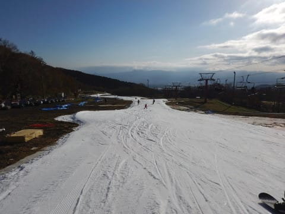
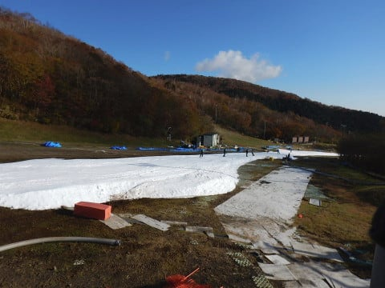

# 11月5日（日）のイエティ詳細レポート…例年よりマシだったけど，混んでた日曜

📅 投稿日時: 2017-11-07 01:01:05

えー．

本日も帰宅が遅く．

そして，なぜか明日は朝5時前に家を

出なくてはならないため（涙）

もう，4時間も寝てられません（泣）．

だもんで．日曜のイエティ詳細レポート．

写真たっぷり，コメント短めでお送りします…

まず．

朝イチは…

御殿場近辺から，もう富士山がすっきり見える晴天！

今日は一日，いい天気になるはず！

…と信じてやってきた，イエティですが．

朝8時の到着時点で第2駐車場がいっぱいで．

オープン前に待っている人の列もあり…

…今日は混みそうな予感…

でも．

朝イチは人も少なく，

気温も冷えて．

すっきり晴天で…

こ，これはいいじゃないですか！

富士山もすっきり見えるし．

コース幅も，これまでに比べ広がった感じで…

そして，硫安も結構効いた締まったバーンで…

いいじゃないですか！！

そして，朝イチはリフト飛び乗り！

いやーーー．

久しぶりに太陽のもと滑れて．

そして，気温も低めで雪も締まってて，

それでリフト待ちが少ないなんて…

これは，今日は良さそうだっ！！

…と，思っていたのもつかの間．

おりょ？？？

あれだけすっきり晴れていたのに，

わずか1時間でモクモクと雲が出てきましたよ…

そして，ぞくぞくと人が出てきましたよ…

って，なんだ～！

このコース上の人口密度は…（涙）．

まだ，午前10時にもなっていないというのに．

例年のこの時期定番の人口密度になってきたよ…

…まだ，コース幅がこれまでより広めだからいいけど．

今シーズン，これまでそれほど混雑しなかったので．

久々のこの人口密度は，ちょっと…（涙）．

で．

午前中のリフト待ちはこのくらいだったものの…

昼間を過ぎると，だんだん人が増えていき…

今シーズン最高のリフト待ちに（泣）．

でも．

まだ，並行するペアリフトを動かさなかったので．

例年に比べれば，まだ混んでなかったということか…

午後になると，リフト待ちは3～5分程度に伸びたものの．

並行するペアリフトが動かなかったので．

ゲレンデには，クワッドリフト1本分で

輸送できる人しかおらず．

まぁ，ゲレンデ混雑は，午前中とほとんど

変わらないままですか…

そして．

時折うっすらと日が射したものの．

基本的には曇り空だったこの日．

強い太陽光線でゲレンデの雪が緩むことがなく．

午後まで硫安が効いた，しっかり締まった

感じの雪だったのが，救いかな…

気温も，ジャケットを着ていても寒さを感じるほどの

冷え込みで，雪もそれほど解けることなく，

夕方までコースに穴が開いたりせず．

しっかり板が走ってくれたので．

まぁ，良かったということにしておこう←だから，なぜ上から目線？

ってことで．

しっかり16時のコース整備タイムまで滑ったあとは…

はい．そうです．

17時のコース整備後の再オープン後のコースに飛び込みっ！！

うほーーーーー！

シマシマっ！！

そして，私が一番っ！

前に誰もいないっ！！

…久々の，フラット＆クリアラップを

いただきました…（堪能）．

あぁ…この1本だけで，今日来た甲斐があった…

ってことで．

気持ちいいナイターの1本を滑りましたが…

このあと，すぐにゲレンデの人が増え始め…

そして，アイスクラッシュの雪を新たに投入した

コースは，ちょっと柔らかめだったので，

凸凹がかなり出てきて…

さらに，リフト待ちも結構出てきたので．

18時過ぎには，あっさり切り上げました…

うーん．

なんて大人の判断！←朝8時から午後6時まで滑ってる段階で，大人とは言えないと思う

ということで．

今シーズン，なぜかガラガラが続いていたイエティですが．

これまでが恵まれすぎてたのか．

今週はちょっと残念な混雑状況でしたが…

これからもっと混み始めるのかな～．

…そして．

あっさりコメントのつもりが．

いつも通りの分量のレポートを書いてしまっていた，

Skier_Sだったのでした…

明日朝，ちゃんと起きられるかな…？？

## 💬 コメント一覧

### 💬 コメント by (はなげ親分)
**タイトル**: 月曜日のナイター
**投稿日**: 2017-11-07 01:43:16

天気と諸般の事情で、出勤率(？)が悪く2回めのイエティナイターとなりました。

月曜ナイターらしく滑走者が少なく、コース幅いっぱい使って滑ることが出来、まともに滑ることが出来なかった鬱憤を解消しました♪

ところで、志賀高原シーズン券の申し込み書の注意書を読んでみると、ゲートカメラで顔認証するようですけど、ゲートカメラって有りましたっけ？

### 💬 コメント by (ほっぽ)
**タイトル**: Unknown
**投稿日**: 2017-11-07 06:41:46

11/5、オープンには出遅れてナイター出撃しましたが、Ｓさんとyamaさん、お二人とも発見できませんでした。

で、昨夜もナイターに出撃してきましたが、空いててかっ飛ばせました。

今週末も日曜ナイターに行こうかと思っています。

### 💬 コメント by (Skier_S)
**タイトル**: 平日スキー，うらやましい…
**投稿日**: 2017-11-08 02:07:10

＞はなげ親分さま

月曜ナイターに行ってきたのですね．

今週末は混んだので，行かなくて正解です…

いいなぁ…

志賀高原のシーズン券，そんな注意書き

ありましたっけ？？？

少なくとも昨シーズンまで，ゲートカメラ

なんてなかったです…

ただ，シーズン券でゲートを通過すると，

ゲート係員用のモニタに

顔写真が画面いっぱいの拡大で

写るのを見てびっくりした思い出がありますが…

ゴーグルとかしてたら，ゲートカメラの

意味がないので，実際にカメラ着けても

顔認証できないと思います（笑）

＞ほっぽさま

あ，日曜も来てらしたんですね！

こちらも，ナイタースタートのゲート前で

探してたのですが…

yamaさんと「今日は確実にいないねぇ」

と話してました．

遅れて来てらしたとは…

あのスキー場，タイミングがずれると

会うことができませんよね（笑）．

### 💬 コメント by (ほっぽ)
**タイトル**: 無限ループ
**投稿日**: 2017-11-09 11:55:32

Sさん

そうなんです。イエティって、似たような滑走ペースの人だと、例えリフト上から滑ってる姿を見かけても、合流することが不可能なんです。

気づいたらどちらか待ってれば、という話しですが、私のイエティつながりの知り合いも皆、待つという単語を知らない方ばかりなので、結局会えずに終わるパターンです。(^_^;)

### 💬 コメント by (Skier_S)
**タイトル**: ほっぽさま
**投稿日**: 2017-11-10 02:40:07

ふふふ．

確かに，私の知り合いも

「待つ」

ということを知らない人ばかりです…

というか，激烈にマイペースな人ばかりです．

＃そして，そのマイペースが異常に速い

