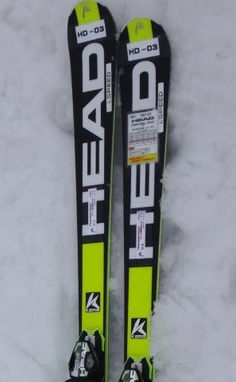
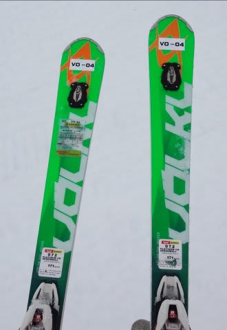

# そしてまだ続く．2016シーズンスキー板試乗レポート，さらに17機種追加だよっ！

📅 投稿日時: 2015-04-10 01:06:21

🏷️ カテゴリ: [スキー板試乗](c0bd8048615710cee890e403a36cc9a2b.md)

えー．

というわけで．

この週末も志賀高原だったわけですが…

はい．

そうです．

実は．

またまた行ってきました～！

試乗会．

一の瀬ダイヤモンドスキー場で開催された，

アルペン主催のスキー試乗会です．

試乗コンディションですが，

土曜は晴れ，日曜は曇りで．

雪質は，2日ともかなりザブザブした，

足元が崩れていくような，気温の高い

春の雪…（涙）．

…んだもんで．

固い板，強い板はその本領を発揮できず，

どちらかと言えば柔らかめの板のフィーリングが

よく感じるかな～，ってコンディションでした．

今回試乗してきたのは，以下の機種です～

○ROSSIGNOL DEMO ALPHA SOFT TPX 167cm

○FISCHER RC4 Worldcup SC Racetrack 165cm

○ATOMIC BLUESTER SL PRO 165cm

○ATOMIC BLUESTER Doubledeck3.0 SX X12VAR 165cm

○OGASAKA TRIUN SL + GR585 165cm

○ELAN Race SLX FUSION 165cm

○HEAD i.Supershape Magnum 163cm

○SALOMON X-MAX 170cm

○NORDICA SPITFIRE EVO EDT 168cm

○NORDICA DOBERMANN SLR EVO 165cm

○BLIZZARD SRC Racing 165cm

○HEAD i.Supershape Speed 170cm

○VOLKL PLATINUM CD Speedwall 171cm

○HART C9.2ST VFS 165cm

○FISCHER PROGRESSOR F19 TI Racetrack 170cm

○ARMADA TST 183cm

○ARMADA INVICTUS 178cm

以下は，前回の試乗板と被ります

○OGASAKA TC-SR + GR585 165cm

○ATOMIC BLUESTER Doubledeck3.0 SX X12TL 165cm

…って感じで．

今回も，2日間で乗りに乗ったり19機種！

…ただ，うち2機種は，前回乗った板と被っているので．

追加で乗ったのは，17機種になります…

とりあえず．

テククラも指導員も何も持っていない，

単なるレジャースキーヤーによる

独断と偏見試乗インプレッション．

まだまだ続きますので，お楽しみに！
