# 2013年7月　子連れ座間味ダイビング旅行記ファイナル…そして，帰宅

📅 投稿日時: 2013-08-26 00:36:12

ってことで．

長らくに渡った座間味旅行記も，これがファイナルっ！

---

最終日の朝．

今日は，朝に宿を出て帰宅するだけの一日です．

…[去年と違い](edcda8f84cb51ffcca8cb97912c33cc74.md)，今年は無事．

最終日まで，予定通り滞在できたな～(良かった)．

ってことで．

朝8時から，最後の晩餐ならぬ，最後の朝食…

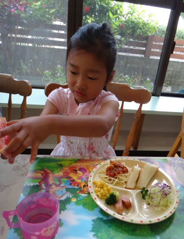

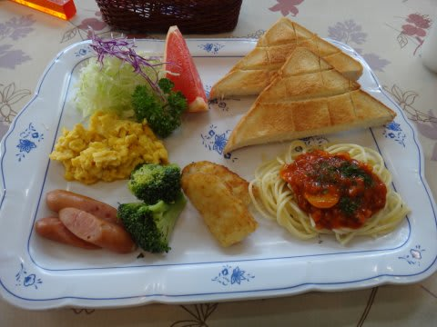

ここは，パンと和食の朝ごはんが一日交互で出ますので．

今日はパンの日です…

で．

朝食を食べた後．

干してあったダイビング器材を取り込み．荷物を片付けていると．

もう，帰りの船の時間．

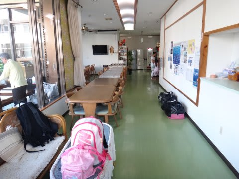

お世話になりました～．

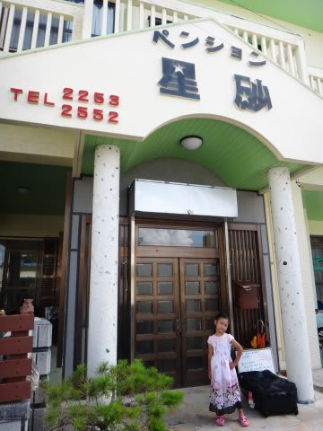

…今年も，娘へのお土産に，揚げたてのサーターアンダーギーを

持たせてくれました．

そして，港に向かい…

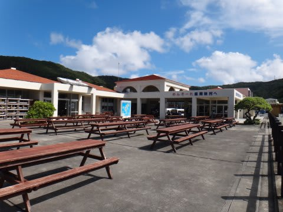

10時発の高速船を待ちます．

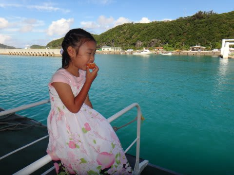

昨日まで，ダイビングボートに乗るために，毎日通った港ですが．

帰るためにやってきた港は，ちょっと悲しい．

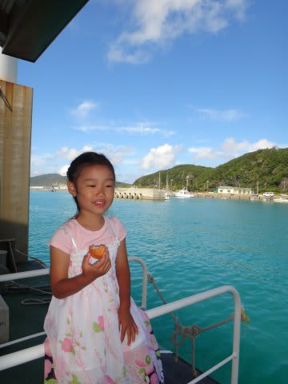

…娘は早速，さっきもらったばかりのサーターアンダーギーを

食べて「おいしい～」

…どうやら娘は，旅行が終わった悲しみより，これから船に乗って

飛行機に乗れることがどうやら楽しみなようで…

んで，高速船に乗り込み…

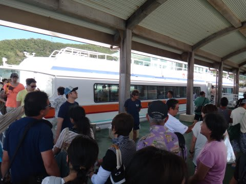

ダイビングショップの奥さんをはじめとする，みんなに見送られて，出航．

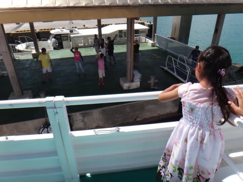

「さようなら～！」

船は，港を離れ…

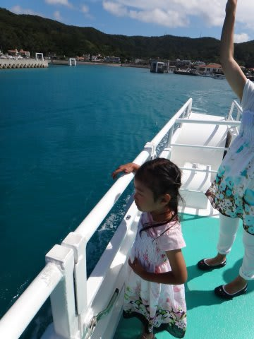

慶良間の海を進んでいきます．

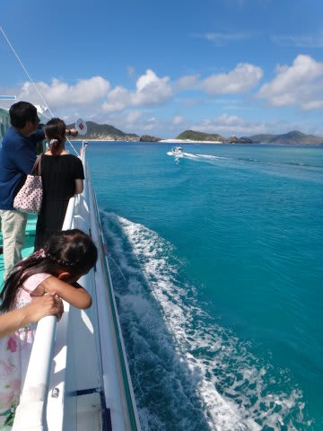

そしてかれこれ1時間の航海で…

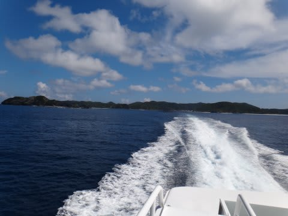

那覇へ到着．

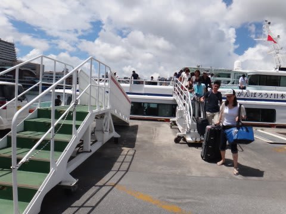

あとは，空港へ移動して…

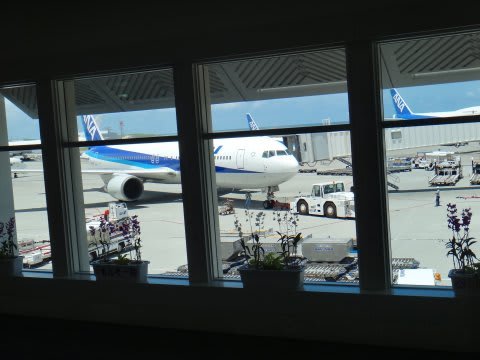

昼過ぎの飛行機に乗り込みます．

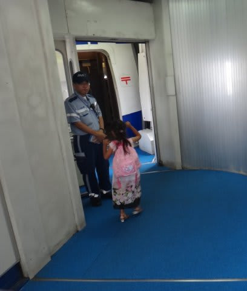

…自分は，「あぁ．この飛行機に乗ったら，もう東京の現実世界に戻っちゃうのね…」

って感じですが．

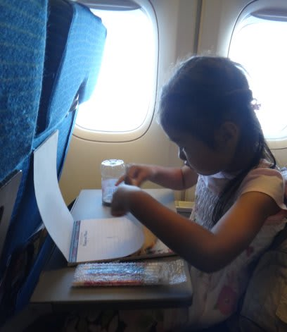

…娘はいつもどおり，大好きな飛行機に乗れて喜んでました…

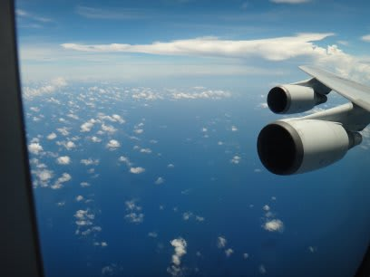

そして．

2時間半の飛行で，羽田空港へ到着．

…あぁ．戻ってきてしまった…(涙)．

娘は．

飛行機でのハイテンションはどこへやら．

自宅へ向かう車に乗ったとたん，即落ちしてました．

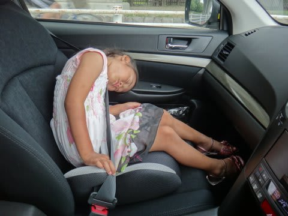

…ってことで．

レポートは長かったですが．

自分たちにとっては短かった慶良間旅行．

ついに終わってしまったのでした…．

(Fin)

## 💬 コメント一覧

### 💬 コメント by (KENKEN)
**タイトル**: 座間味旅行記お疲れ様でした
**投稿日**: 2013-08-26 22:52:41

今回も楽しく拝読させて頂きました。

自分もそうですが、ダイビング旅行ではいつも帰る時が

一番憂鬱ですね。

さらに追い討ちをかけるのが、戻って仕事に行くと

山のように積もった書類と数百の未読メールです。

この瞬間に一気に現実に戻されます。

しかし娘さんの車での寝相はすごいですね。(特に首が・・・）

9月？のダイビング旅行記も楽しみにしています。

### 💬 コメント by (Skier_S)
**タイトル**: KENKENさま
**投稿日**: 2013-08-27 01:32:36

長期間休みから戻った後，リハビリしたいのに

いきなり容赦なく仕事が降ってくるのは，

まぁ現実に帰るための儀式でしょうか(笑）．

娘ですが，車に乗ったときはいつも不思議な寝相で

寝ています…

いや，布団でも寝相が悪いですが．

また，9月のダイビング旅行記をお楽しみに～．

