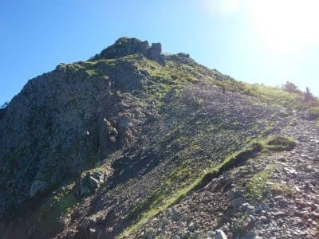
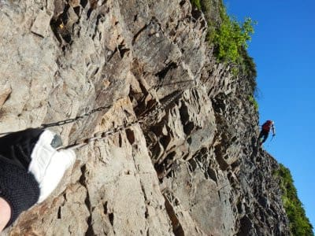
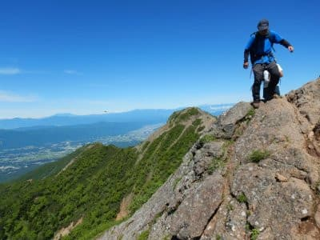
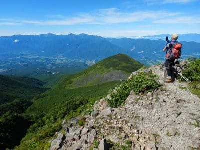
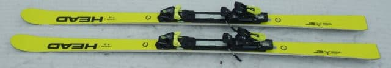
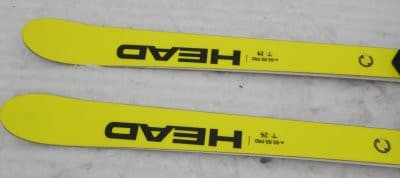
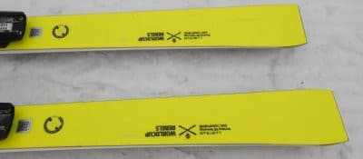
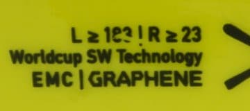
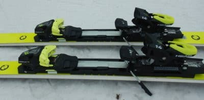

# 2022シーズンモデルのスキー板，試乗レポートその23…HEAD e-GS RD PRO

📅 投稿日時: 2021-07-19 05:06:26

この週末ですが…

先週，山歩きで試した膝サポーターの

調子が悪くなかったので．

今度は本格的な登山でテストして

きました～！！

いや．

いきなり本格的な山でテストして

来たわけですが…

果たして，膝サポーターの効果や

いかに？？

また追ってレポートします！

ということで，まだ続く2022シーズン

スキー板の試乗レポート．

基本的には，4月熊の湯のALPEN試乗会で

乗った板は，もう全てレポートが

終わったのですが…

実は，試乗会とは別にエキップさんから

貸しだしてもらった板があって．

焼額で履いてみたので，そのレポートを

書いてみようと思います．

借りた板は，ヘッドのGS板2種類．

今回は，e-GS RD PROの試乗レポートです．

では，どうぞ～！

○HEAD Worldcup REBELS e-GS RD PRO 183cm

非FIS規定GS競技用，基礎大回り用

HEADの非FISのGS用板は，e-GS RDと

e-GS RD PROの2種類がありますが．

こちらは「PRO」の方になります．

PROの有り無しに関わらずどちらも

プレートはWCR14プレートだし，

PROじゃないやつと何が違うのか…？

と思ったら．

サイドカーブが違って，PROの方が

センター幅が広めのようです…

（PROはセンター幅68mm，PROじゃないのは65mm）

ということで，今回試乗したPROは，

長さ183cmでR＞23mという表記ですが，

カタログを見てみると，R=25.3mらしいです．

滑ってみたところ…

いや，R=25mというサイドカーブから

想像するよりは，良く曲がる！

角づけをした瞬間から，サイドカーブに

乗って，強いエッジグリップで

回っていきます．

結構張りが強いのに，不思議なくらい

良く回る板．

たわみが出て回るというより，サイド

カーブに乗って曲がっていくように感じます．

フレックスは結構しっかりしてます．

低速ではたわみを出しにくいですが，

硬すぎるというわけではなく，返りも

GS板らしくゆっくりと返ってくるので，

しっとりとした踏み応えでたわんで行く

感じ．

整地での高速耐性はかなりいいです！

どこまでスピードを上げても板が

負ける気配はなく，しっかりグリップして

「まだまだスピード上げても大丈夫！」

という安心感がある板ですね…

荒れた斜面でもずっしりとした安定感が

あり，そこそこの対応性を見せますが…

どちらかと言えばガッツリグリップ系で，

板を振り回す自由度は無いので，

やはり整地を滑るのが楽しい板です．

ただ，整地であれば，R=25mという

数字より良く回ってくるように感じる

ので，整地メインの大回りベースの

オールラウンドとして行けそうな感じ…

かなり飛ばす，アベレージ滑走スピードが

高い人が，整地メインで使うには

いいんじゃないでしょうか？
