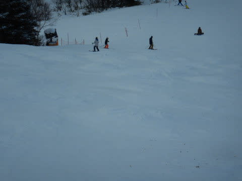

# 2020/1/3(金)，3が日ラストの志賀高原・焼額山スキー場は…天気は曇り一瞬晴れ時々雪がぱらつく．気温は冷え冷えながらも積雪がなくブッシュが増え，そして混み気味

📅 投稿日時: 2020-01-04 00:58:55

🏷️ カテゴリ: [2020スキー滑走日記](c282e9230de179e245c7334eabeb0a3b3.md)

ということで．

ここしばらく，毎日ぶっ続けで続いている

志賀高原レポート．

読者の皆様も，

「一体いつまで続くんだ？？」と．

そろそろ思いっきり飽きてきたころだと

思うのですが．

…読者の都合にお構いなしに，本日も

志賀高原スキー場レポートです！

えー．本日の朝も．

…読者の皆さんは飽きてると思いますが．

私は飽きていない焼額山の朝イチゴンドラで

スタート！

あさイチの山頂の気温は-8℃と，

結構な冷え冷え！！

で，雪がぱらつく天気ながらも…

昨晩からの積雪は，ほぼ0なんですが（涙）

…そろそろ積雪が欲しいのですが…

とはいえ．

しっかり冷えて，いい感じで締まった

朝イチシマシマっ！

圧雪かけたての完全フラットバーン，

ガッツリエッジが食い込み，

ガシガシ気持ちよく自由落下！！

うほーーー！

今日も最高っ！

なれど…

積雪がないので．

そろそろGSコースも，ところどころ

ブッシュが出始めてきてます…

そして，人工降雪がない白樺コースは，

かなりのブッシュで，滑るのがかなりつらいレベル…

あぁ…もう一降りほしい…（全力での祈り）

天気はうっすら雪降りなのに．

全然積もる気配がないのが

悲しいところ…

で．

さすが正月三が日．

ゲレンデの人口密度は昨日と同様に高めです(涙）

気持ちよくかっ飛ばすのは難しく，

そして．

うぎゃーーーー！！

午前10時ごろには，ゴンドラも最大7～8分待ちに

伸びちゃったのですが…！（泣）

第2高速リフトも，最大5分程度の待ちまで

伸びたようです…

(この写真だと3分待ち程度)

しいて言えば．

第3高速リフトは，待ちがせいぜい2-3分で

すんだのが救いですか…

ってな感じで．

ゲレンデ混雑，ブッシュが出てくる…

という，悲しい状況の中．

10時ごろから10:30ごろまで，一瞬晴れ間が！

晴れた中，雪は冷え冷えで．

多少ブッシュがあるエリア以外は，

かなりいい雪質で．

やっぱり，晴れた中のスキーは気持ちいいっ！！

…でも．

正直．

晴れなくていいから，どか雪来て…

…

…

と思っていた思いが，どうやら中途半端に伝わったようで．

晴れ間は一瞬で終わり．

すぐに曇り空に戻り，雪がぱらつき，

ゲレンデの凸凹が見えづらい状態に…（涙）

だのに．

雪が積もるほどではないので．

ゲレンデは，昨日にましてブッシュエリアが

広がってきたし．

そして．

下地の硬い雪が，そこかしこに顔を出して

きました…（残念）

ゴンドラ待ちは，午前11時半ごろには

ゲート内に収まる，せいぜい1-2分待ちに

なってきましたが．

午後になっても，人口密度は相変わらず

高め（涙）

曇り空でゲレンデコンディションが見にくい中，

人口密度も高く．

さらに，ブッシュがところどころにあり，

硬い下地の雪もところどころ顔を出し．

ううーーーん．

すっきり晴れるか，

ドサドサ雪が積もるか，どっちかにしてほしい（泣）

中途半端に雪がぱらついて，雪面が

見にくいのに，全然雪が積もらなくて．

何かの嫌がらせか…？？？

…でも．

志賀高原の他のスキー場は．

まだ全然雪が足りなくて，ブッシュどころか

圧雪すらできないようなバーンが多数ある中．

ほぼゲレンデ全面真っ白で，白樺とオリンピックコース以外．

きれいに圧雪がかかっている焼額は．

志賀高原の中でも，かなり恵まれているほうかと…

ってな感じで．

人工降雪機がある，パノラマーサウスコースや

唐松コースはまだ全然大丈夫ですが．

GSコースや白樺コース，オリンピックコースなどは，

ブッシュ危険エリアが結構拡大し．

さらに急斜面部分は，夕方には

結構凸凹になってきました…

…あぁ…

もう一降り．

いや，あと二降りほしい…（懇願）

と，全身全霊で祈りながら．

今日はいろんな事情で，ゴンドラ営業がまだ45分残っている

15:00に早上がりとなったのでした…

…

しかし．

12月30日から1月3日までの5日間，

放置しておいた車に積もった雪が，

たったのこれだけ．

5日間での積雪は，わずか4-5cm（涙）

ダメだ…

これは，どうやら．

皆さんの冷え冷え降れ降れ踊りの

真剣さが足りないようです．

まだ，祈りが足りないと神がおっしゃっているようです．

とりあえず．

信心深いこのBlogの読者におかれましては．

これから眠らず，休まず．

ひたすら情熱的に踊り続けてくださいますよう，

お願い申し上げます…
