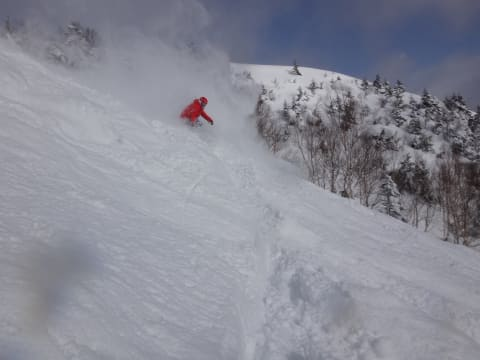

# 1月3日の志賀高原は…予想通り，雪のち晴れ！昼前からピカピカ晴天！

📅 投稿日時: 2015-01-03 21:18:07

ということで．

志賀高原滞在もあと残すところは明日のみとなってしまった，

Skier_Sです．

本日の朝は，すごい積雪で，

強風で焼額第2ゴンドラも，奥志賀ゴンドラも

朝イチは営業を見合わせるという，

荒れ気味の天気で始まりましたが．

大雪で，営業開始が10分遅れた第1ゴンドラで

山頂に出ると…

降ってますね～．

昨晩からの積雪は，40cm以上か？？

昨日より，積雪は多いよ！

ってことで．

ここは当然，深雪狙いでしょっ！

と，オリンピックコースへ飛び出すと…

これは…

うはぁっ！胸パフっ！

口の中にまでパウダーが飛び込む，

激烈ディープパウダーっ！！

これは…

元日よりすごかったかも…

この幸せオリンピックコースを数本滑ると…

なんと．

9時半ごろには，うっすらと太陽がっ！！

早朝まで新雪がドサドサ積もって，午前中に太陽が

出てくるなんて，最高のパターンではないかっ！

と，気持ちよくオリンピックコースの新雪を数回滑っていると…

うむ．さすがに10時近くには，コースはあれちゃいましたね～

で．

ちょうどそのとき．

ナイスタイミングで，非圧雪エリアのエキスパートコースを

オープンしようとしているパトロールさん発見！

私「これからオープンですか～？」

パトロール「そうです～」

ってことで．

パトロールさんのうしろについて，

まだ誰も入っていないコースへ…

パトロール「では，どうぞ！」

…じゅるるるるる（よだれがあふれ出る音）

いただきますっ！

ぶはーーーー！

ディープパウダーっ！

最高！

いやーー．

このころには，「午後には晴れてくる」という予想通り，←昨日は予想はずしちゃったので，ここはあえて強調しておく

太陽がサンサンと輝き．

この後の2ランほどは，極楽でした…

ただ．

強風のため（風はそんなになかった気がするけど…）

第2ゴンドラが午前中は動かなかったあおりで，

第1ゴンドラは，15分以上待ち（涙）

そして，いつもなら11時過ぎにはがら空きになるゴンドラも，

12時近くまで，ゴンドラ待ちがありました…

12時前に，第2ゴンドラが動き出したので，

午後はいつもどおり待ち時間ほとんどなしの第1ゴンドラ

に戻りましたが…

とりあえず．

お昼以降も，快適晴天が続き．

気温も低く，雪質は最高のまま！

これぞ志賀高原，という気持ちよい雪質の

ゲレンデを堪能しますが…

やはり，今日も人がそこそこ多かったので…

やはり，2時過ぎには，だんだんゲレンデが荒れ始め，

圧雪バーンもコブ斜面化していったのが，ちと残念か…

でも．

この日も，日が暮れる時間まで滑り続け．

ナイター照明がついて，真っ暗になってからも…

「帰りたくない～！まだ滑る～！！！」

という，『誰に似たんだか…』とため息をつきたくなるような

娘につき合わされ．

夜までひたすら滑り続けた，Skier_Sなのでした．

…で。

気になる明日の天気は。

まあ、基本的には晴れそうかな～

時折雪雲が流れてきて、雲がかかる

タイミングもありそうだけど…

## 💬 コメント一覧

### 💬 コメント by (KENKEN)
**タイトル**: あけましておめでとうございます
**投稿日**: 2015-01-03 21:44:03

志賀高原の雪質は最高のようでうらやましいです。

当方年末にわざわざ北海道に行ったのですが、天候と雪質はかなり残念でした。

おまけに妻はぎっくり腰で一日も滑れず、娘は最終日インフルエンザと当初予定4日スキーのうち2日しか滑れずと散々でした。

(誰かの日頃の行いが悪かったに違いない←自分だ）

今年もちょくちょくコメントしますので、宜しくお願いします。

### 💬 コメント by (Skier_S)
**タイトル**: KENKENさま
**投稿日**: 2015-01-03 22:49:44

明けましておめでとうございます～

ちょっと残念な北海道でしたね…

こちらは、この時期の志賀としては

晴れ間も多く、よかったです。

また、今年もコメントよろしくお願いします！

### 💬 コメント by (いか)
**タイトル**: Unknown
**投稿日**: 2015-01-03 23:40:41

あけましておめでとうございますー

パウダーいいですねー、ファットならもっといいですよー( 'θ' )

パウダーばっかり滑りすぎると、整地滑れない「パウダー病」にかかりますが…(遠い目

### 💬 コメント by (れお)
**タイトル**: 木島平もなかなか♪
**投稿日**: 2015-01-04 06:03:32

年始は木島平に来てるんですが、標高の低い木島平でも、パウダー深雪でした～♪

でも、志賀高原の雪はもっと軽くて、Ｓさんは、うひょひょ～♪とか、わはは～とか言って滑ってるんだろうな～と思いながら、志賀の山々を見てました(^∇^)

娘さん、ナイターもやっちゃんですね♪

ところで、今年のスキー場、結構混んでませんか？ スキー人口が増えるのは良いんですが…。

こちらも、近年稀に見る人の多さでした～。

### 💬 コメント by (Skier_S)
**タイトル**: いろいろありました…
**投稿日**: 2015-01-05 01:27:40

＞いかさま

あけましておめでとうございます～

ファットスキー，行ってしまおうかという

誘惑もあるのですが…

ロング・ショート・ファットと3種類板を

持ち歩くようになったら，もう終わった人に

なりそうで，自制しています．←まだ終わってないつもりか？

＞れおさま

木島平でパウダーですか！

志賀は，予想よりちょいと重めの雪でしたが，

でもあのディープさは最高でした…

志賀は，それほど人が増えていない気がします．

…やっぱり，いろいろお値段が高いからでしょうか？？

今年の混雑は，例年並みかそれ以下だったと

思います…

### 💬 コメント by (れお)
**タイトル**: 確かに木島平は
**投稿日**: 2015-01-05 10:28:07

安いので、それで、私も含めて行っている人が多いのかも…。小学生無料とかですし。

昨日最後にあった残念なことが致命的で無いことを祈ってます!!

### 💬 コメント by (Skier_S)
**タイトル**: れおさま
**投稿日**: 2015-01-05 19:38:41

志賀も、ヤケビは小学生無料なんですが。

なんてったって全山共通一日券5000円ですから…

このデフレ時代にありえないお値段かと。

最後にあった残念なことは…

まぁ、私が直接被害にあったわけではないのですが。

かなりがっくりな感じです（涙）

またぼちぼち書いていきます…

