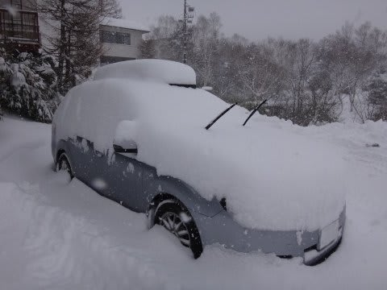
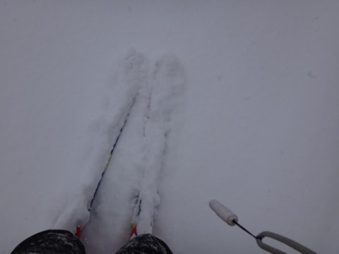
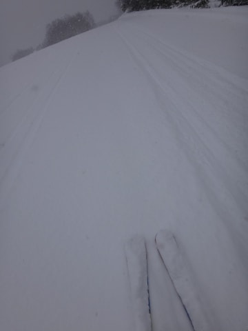
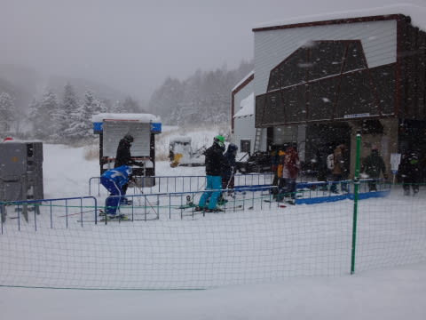
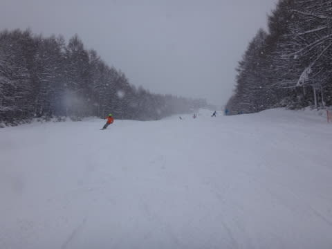
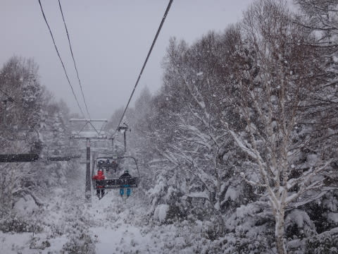
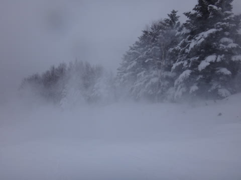

# 12月11日（日）の志賀高原のゲレンデ状況，速報モード…一日中激寒の雪降りだったよ

📅 投稿日時: 2016-12-12 01:08:45

ということで．

つい先ほど，志賀高原から帰ってきましたが．

いやーーー．

帰ろうと思ったら，志賀高原に登る道路が，

上林チェーンベースのあたりで事故のため，

午後5時半ごろまで通行止め（涙）

だもんで．帰宅が遅くなってしまったので．

今日も日曜夜恒例，速報モードです…

えー．

雪降りで始まった本日．

昨日の夜からの積雪は…

ををを！

昨日の夜中は全然降ってなかったのに．

20cmくらいかな？意外と積もってるよ！

これは，焼額のゴンドラが動くのでは…っ！？？

と，期待して焼額へいったものの．

…残念ながら，ゴンドラは動かず（涙）．

あとわずか，積雪が足りなかったのか…

でも．

朝イチのゲレンデは…

圧雪の上に，フワフワ新雪じゃないですかっ！

これは…最高！

いやーーー．

冬らしくなってきましたよ～！！

リフト待ちもこの程度で，それほど待つこともなく．

ゲレンデも，それほど混まず．

混雑的には，結構快適だったかな～．

でも．

今日は．

誰かが

日曜の天気は曇りのち晴れ間も．

時折雪雲が飛んできて雪がぱらつくタイミングも…

と書いたはずなのに．

全く晴れ間は無く．

終日冷え冷えの，雪が降りつづける一日でした…

かなり寒かったよっ！！

ということで．

また明日，詳細レポートやります～！

＃しかし．

＃思ったより上空の寒気が強く．かつ風向きが北寄りに回った…

＃ということで，天気予想…外しました（涙）．

＃まさか，朝あんなに積もっているとは…

＃そして，一日中降り続けるとは…
