# 2022/12/30(金)の志賀高原焼額山詳細レポート！…天気は雪のち曇り時々晴れ．雪質最高だけどもう一降り欲しい．ゲレンデは混んだよ(泣)

📅 投稿日時: 2023-01-01 04:28:49

🏷️ カテゴリ: [2023スキー滑走日記](cd943df30cfcc3d0896469e2ff98720cd.md)

みなさま，どうやら明けておめでたい

ようですね…

普通はおめでたいのかもしれませんが．

大変悲しいことに，私にとっては

今年の正月休みはスキー場でゆっくりする

余裕はなく（泣）

とりあえず．子供のころから続いていた

正月の志賀高原滞在が，実に約30年

ぶりに途切れたのでした…（涙）

で．

私がスキーに行ってない本日も，

スキー場は無情にも営業を続けており．

特派員から大晦日のレポート写真が

届きました…

焼額は，朝方は曇っていたものの，

昼間は晴天！

残念ながら，積雪の積み増しは無かった

ようです…

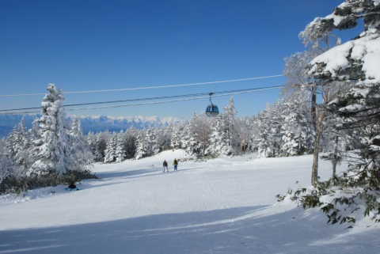

でも，気温は冷え冷えで雪は良かった

みたいですね．

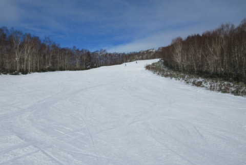

焼額の第1ゴンドラも，そこまでひどく

混まなかったみたいですね…

午前のピークの10:30頃でも，相乗り

レーンはほぼ待ちなしで乗れた

みたいです！

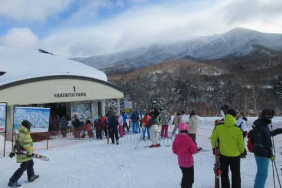

焼額以外の報告も次々届き，

サンバレーやブナ平は人も少なく，

意外なことに，雪が薄くなってヤバそうな

ところも無かったようです…

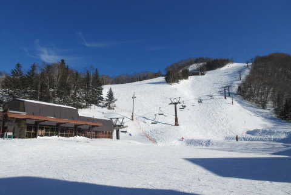

昨日からオープンの寺小屋も，

晴天で雪質は良かったようですが．

なぜか寺小屋のレストランが

開いておらず，トイレが使えないという

悲劇もあったようです…

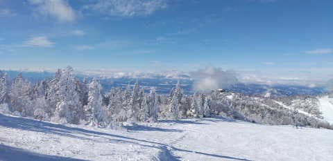

ジャイアントや西舘も，大みそかというのに

かなり人が少なく．

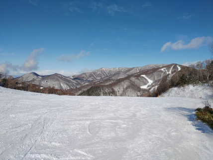

ジャイアントは結構雪が良かった

ようですが，西舘上部はまだ

雪が薄かったとのこと…

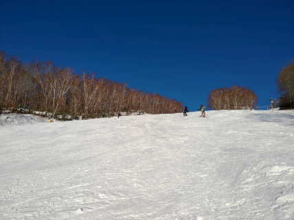

全体的に，雪質は良かったようですが，

やはりもう一降り欲しいところ…

でも．

次に降るのは1日の夜~2日の朝，

そして3日にちょっと積もるくらいで．

ドサドサパウダー大量供給にはならない

感じ…

いや．1日夜から3日にかけて冷え

るんですが．

また，志賀高原殺しの西風になりそう

です（泣）

あぁ．

志賀で太ももパフやら腰パフが楽しめるのは，

いつの日か…

ってなことで，本題へ．

12月30日の志賀高原焼額山，

詳細レポートです～！！

えー．

まず．

前日29日から焼額第1ゴンドラにて，

7:50スタートのファーストトラック

営業が始まりました～！

今後，3月いっぱいまで．

1月3日までの正月休み期間と土日祝は

ファーストトラックの営業（＠1500円）

が行われます…

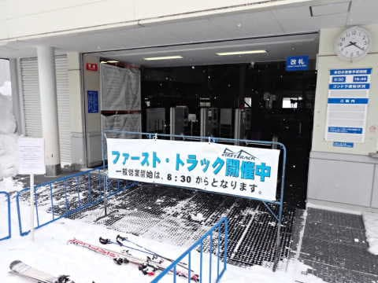

ファーストトラック営業中に，8:30の

通常営業開始待ちの人が並びますが…

今日はかなり列が長くて，混みそうな

予感…

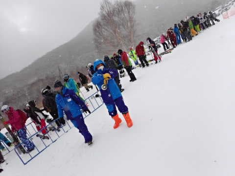

朝イチゴンドラで山頂に上がると…

気温は-9℃と，そこそこの冷え込んで

ますよ…

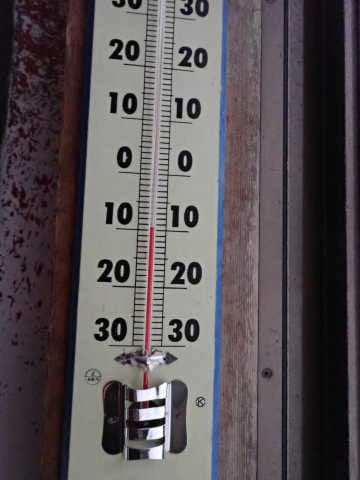

あさイチは雪がそこそこ強く降り，

積もりそうな勢いでしたが…

さっき降り出したばかりのため，

昨晩からの積雪はわずか2-3cm程度．

バーンは圧雪の上に1cm程度の積雪が

乗っている感じで，かなり滑りやすい

雪質！！

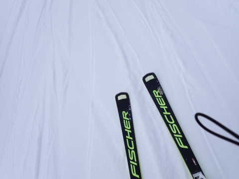

ただ，コースの人が少なかったのも

営業開始から30分ちょいだけで．

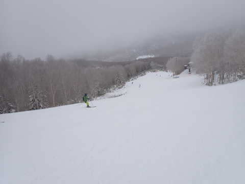

その後は，コース上の人も増えていき…

なんだか，滑りにくい人口密度になって

来ましたよ…（泣）

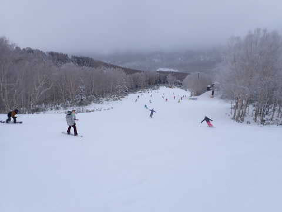

そして，ゴンドラの待ち時間も伸びて…

第1ゴンドラは最大7-8分待ち（涙）

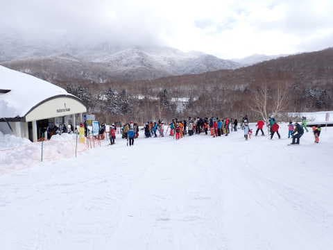

ただ，今日もゴンドラは相乗りレーンが

準備されていて．

混んでくると，5-6人まで乗り合わせるよう

誘導されたので，列の長さの割に待ち

時間は短くて済みました…

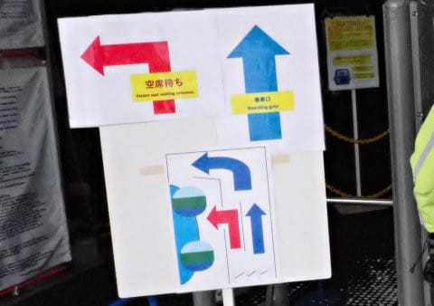

でも，朝10時過ぎの段階で，

第1ゴンドラ10分待ち，

第2ゴンドラ15分待ちとの

掲示が…（泣）

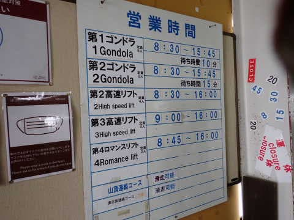

そして．

第2高速リフトの待ちもゲートの外まで

伸びちゃったし…

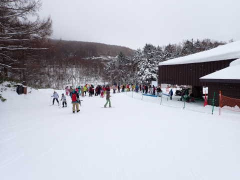

さらには，普段は滅多に混まない第3

高速リフトまで，ゲートの外に人がはみ出す

ほど並んでました…（涙）

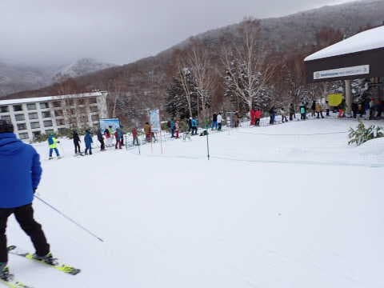

その結果，サウスコースとGSコースの

人口密度は，ここ数年見たことないレベルの

混雑っぷりになってます（泣）

ただ，昼を過ぎるとゴンドラ待ちは

短くなったし…

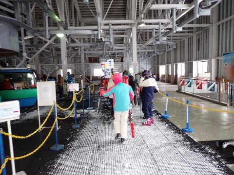

リフトの待ち時間も短くなったけど．

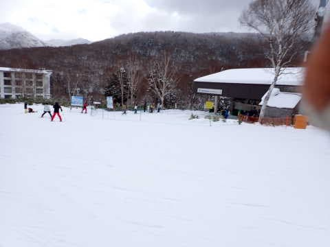

でも，第1ゴンドラが相乗りOKとなり，

人を効率よく運ぶようになったから，

ゴンドラ待ちはそれほど長くなくても，

ゲレンデに送り出す人が増えて…

コース上の人口密度は，午後になっても

すごい高いまま（涙）

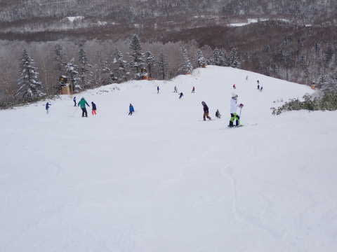

さらに，人工降雪がないGSコースや

白樺コースは雪が薄いため，午後は

ちょっと雪が剝げて下地が見えかけて

いたところも出てきました…（泣）

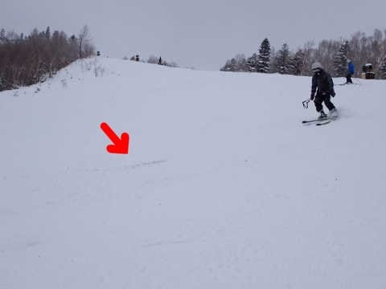

そして．

今日オープンになったSGSコースも

見に行ってみましたが．

こちらも一見，新雪が積もって良さそうな

感じですが…

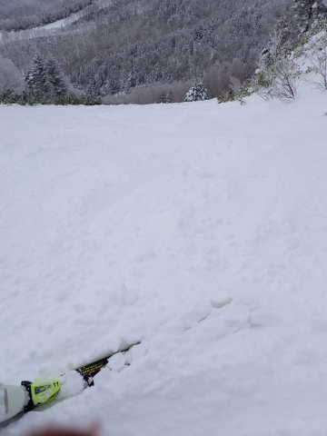

コース上は，隠れきってない草のてっぺんが，

あちこち雪から飛び出している状況（涙）

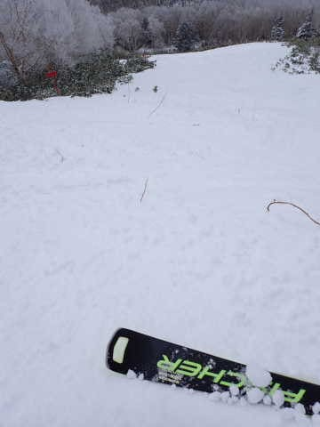

うーん．

朝方は短期間，積もりそうな雪が降った

ものの．

すぐに止んで，昼間は日も射す時も

あるくらいだったので…

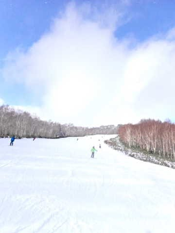

晴れなくていいから，雪よ降ってくれ

と祈る気分でした…

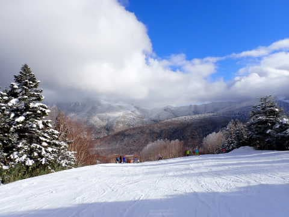

でも．

人が多かった本日，午後はバーンが

凸凹してきましたけど．

ここ数日新雪が積もっておらず，バーンが

締まり気味だったため，そこまでひどい

凸凹にならなかったのが救いかな…

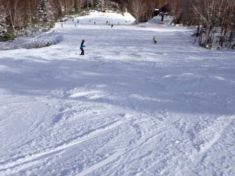

ってなことで．

今日は営業終了の頃まで，ゲレンデ上の

人口密度が高い一日でしたが…

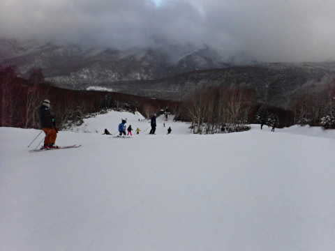

16時の営業ラストまで，冷え冷えで

雪質もかなり良かったし．

比較的フラットで大回り板を履いてても

大丈夫な感じで．

ところどころ雪が薄いところがあった以外は，

バーンのコンディションは比較的良かった

一日だったのでした…

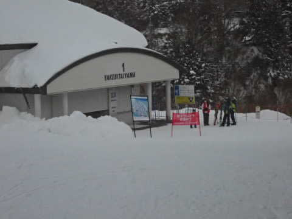

…が．

終わりませんよ～！

まだ終わりじゃないですよ！！

今日は自宅に帰る日というのに．

無謀にも，18時からのナイター参戦！！

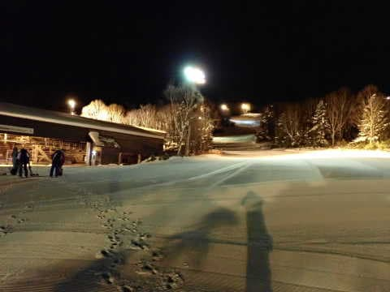

まだシュプールがついてない，

ピカピカのファーストトラック，

いただきま～す！！！

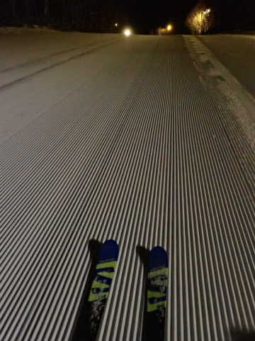

うはははっは！

これだ！

これが焼額クオリティーの，最高級

ピカピカ圧雪ナイターだ！！！

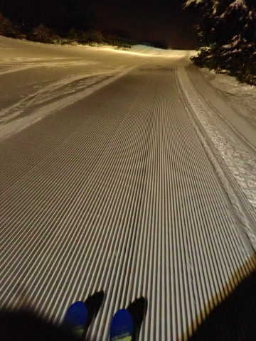

ってな感じで．

昼間は人口密度が高くてかっ飛ばせなかった

フラストレーションを，

ガラガラの最高シマシマバーンをひたすら

2時間全力で滑り続けることで，

しっかり解消できたのでした…

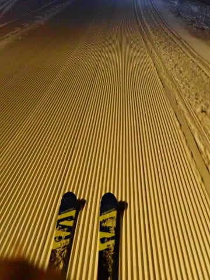

いや～．

もう．

ナイターは人も少ないし．

リフト待ちもなく雪もいいし．

これを滑らないなんて，勿体ない！！！！

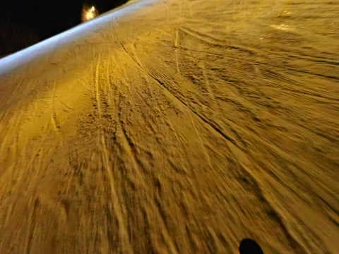

…と．

滑っている時はシアワセいっぱいで，

8時のナイター営業終了まで楽しんだけど．

…その後．

5時間近くかけて300km運転して帰っている

時には．

「帰らなきゃいけない日に，ナイターまで

滑るもんじゃないな…（泣）」

と，眠さと疲れで半分泣きながら

運転をしていた，Skier_Sだったの

でした…

## 💬 コメント一覧

### 💬 コメント by (大阪のK)
**タイトル**: Unknown
**投稿日**: 2023-01-01 16:25:53

明けましておめでとうございます❗

今年も焼額山でお会いできると思いますので、よろしくお願いします🎵

### 💬 コメント by (けんた)
**タイトル**: Unknown
**投稿日**: 2023-01-01 16:54:26

あけましておめでとうございます。

初めまして。

私も志賀高原が好きでいつも拝見させてもらっています。

私も片道5時間近くかかるので、朝イチからナイターまで滑って運転する徒然スキーヤーさんには頭が下がります。

1/3に焼額山に行く予定です。

3が日最終日の混雑具合いはいかがでしょうか？

もし滑っているのを見かけたら声をかけてもいいですか？

よろしくお願いします。

### 💬 コメント by (Skier_S)
**タイトル**: スキーシーズンの休みに家にいるとは…（涙）
**投稿日**: 2023-01-02 02:53:25

＞大阪のKさま

今年もよろしくお願いします～！

新年はいつから志賀高原参戦ですか？？

＞けんたさま

始めまして～！

コメントありがとうございます！

3が日は混みますが，年始休み最終日の3日は，午後になればガラガラになると思いますよ…

残念ながら3日は滑りに行けなさそうですが，それ以外の日で見かけたら

お声がけいただいて大丈夫です～！！

