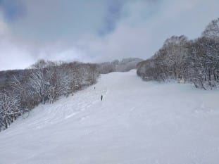

# 2021/1/9(土)，3連休初日の志賀高原スキー場，特派員からの情報…時折晴れ間もある雪降り，気温冷え冷え！

📅 投稿日時: 2021-01-10 12:44:13

スキーに行けないショックから立ち直れず．

昨日もBlog更新できなかったSkier_Sです…

今日も起きたら昼…(涙）

ちょっと疲れが溜まってたのかな．

ということで．

昼間更新になってしまいましたが．

大変ありがたいことに，私が現地に行かずとも，

優秀な特派員の皆様が，志賀高原の写真を

私のもとに届けてくださるので．

特派員の写真とレポートを基に，

3連休初日の志賀高原がどんなだったか

見てみましょう…

まず，朝イチの積雪は，20~40cm程度．

概ね予想通りか，予想よりちょい多い程度．

駐車場もガラガラですね…

朝の天気は，曇~雪がぱらつく程度ながら．

薄っすら日が射すこともある，予想よりいい天気で…

ゲレンデの非圧雪バーンは新雪！

圧雪バーンも新雪が乗っていたようで…

気温も-15℃と冷え冷えだったので，

雪質もよく，最高だったようです…

西館・東館は時折日も射すいい感じの天気で…

東館オリンピックコースも，雪不足は

解消したみたいですね！

ただ，3連休中日というのに，

ジャイアントも人が少なく，ガラガラですね…

さすが，この3連休は外出を控えた人が多いのか…

寺子屋方面の標高が高いところは，ちょっと雲が

かかっていたみたいだけど．

雪質は冷え冷えですごく良かったみたいで…

一の瀬ファミリーも，ガラガラ！

見たところ，雪質も最高じゃないですか！！

そして．

わがホームの焼額は．

午後にも晴れ間が出る，いい天気だったらしく…

…総合的に言って．

冷え冷え雪，雪質最高，時折晴れ間も

という，すごくいいコンディションだったようです…

あぁ．

なぜ，こんなトップシーズン最高の時期に

緊急事態宣言…

昨シーズンも，緊急事態宣言が出てからの

4月の方が，雪不足の3月までよりコンディションが

よく．

スキーのコンディションが良くなる次期を

狙うかのような，このバッドタイミング…（泣）

ということで．

私は遠く自宅から志賀高原に思いを馳せてますので．

志賀高原在住の皆さま，引き続き写真＆レポート

お待ちしています…

## 💬 コメント一覧

### 💬 コメント by (スキー好き)
**タイトル**: Unknown
**投稿日**: 2021-01-10 12:56:04

こんにちは

自宅待機しているスキーヤーさんを支持します。

安心しました。

こんなコメントをすると

自粛しない人達から攻撃されそうですが

スキー大好きなスキーヤーさんが

我慢していると事実。

それだけでホッとしております。

### 💬 コメント by (真美子)
**タイトル**: Unknown
**投稿日**: 2021-01-10 15:59:31

買い物に来ていますが、お店は緊急事態宣言が出ているとは思えないくらい人がいます。

なので、スキーヤー様、行ってしまうというの出来ないのですか?

こんなことを言う私は、悪魔かな。

### 💬 コメント by (レインボー73)
**タイトル**: Unknown
**投稿日**: 2021-01-10 17:09:03

日曜日の志賀高原情報

湯田中は2センチほどしか積もってないのに、ニゴンに着いてビックリ！　そしてゴンドラに乗ってビックリ嬉しすぎる悲鳴？　昨日よりも積もってる！　

朝一はファーストで踏まれているオリンピックは避けて無難にＳＧＳにしたら、新雪50は間違いなくあるけど昨日までよりかなり重く、最後に前に転倒。ストックは底まで届かないし、脱出に5分以上かかりました。

１ゴン下もすごく積もって、気持ちよく滑れました。

係員さんによると、朝の３時くらいから強く降り出して、圧雪した上にもどんどん積もって大変です、とのことでした。

どこもかしこもボコボコで、楽に滑れる状況じゃなく、足は疲れるけど、ふかふか楽しく頂きました。

10時過ぎに行ったミドルは、既に売り切れでした。

私の悲劇はこの後です。ダイヤモンドを楽しんだあとファミリーから高天のgo to eat 対応のダケカンバへ向かう途中、タンネに入ったら後ろから『タンネを一本滑ってから行きましょう』との悪魔のささやきが！

名案だ、と思ったバカな私は、すぐに右折して新雪に飛び込んだところ、だんだん斜度がなくなり、ストップ！　漕いで漕いで、板を担いで、本日二度目の汗かき。老人にはこれが最もこたえます。

昼食のあと、昨日いい思いをした寺子屋へ皆んなを案内したのですが、リフト下の非圧雪に入ろうとしたら、あまりに雪が深すぎてストップ。入れない。あーあ、今日の私はだめです。

レインボー（２時まで）超過の掟破りが4日間続きました。

3時過ぎのサウスは、ボコボコ最低バーンになっており、心置きなくフィニッシュできました。

### 💬 コメント by (我慢のスキーヤーを支持します)
**タイトル**: Unknown
**投稿日**: 2021-01-10 19:51:12

緊急事態宣言に従い涙をのんで自粛している方も多いのに、長野県は来訪お断りとは言ってないという勝手な解釈で県を跨ぐ移動を行いスキーに行く事を正当化をする人がいて驚きました。切迫している医療体制に関して、どのように考えられているのでしょうか。自分が気持ちよくスキーが出来れば関係無いのですか。強制力が無いので最終的にはマナーやモラルの問題になりますが、このような時に人間性が問われると思います。ブログ主の方はファンも多いようなので影響力も大きいでしょうし、かなり悩まれているのではないてしょうか。話の雰囲気を壊して申しわけありませんが、先ずは緊急事態を脱する事が重要で地方経済への貢献はその後でも出来ます。

### 💬 コメント by (Skier_S)
**タイトル**: 私をスキーに誘うコメントはいろいろ論争を巻き起こしそうなので控えていただけると…
**投稿日**: 2021-01-10 21:04:56

＞スキー好きさま

応援ありがとうございます～！

でも，私も自ら高い意識で自粛しているというより，緊急事態宣言が出て社会的にやむを得ず…

という判断なので，そんなに安心されるようなことではないのかも…

＞真美子さま

私もスキーしたいところですが，まぁ買い物は許されても，

関東在住の私としては緊急事態宣言が出ている間は自粛しておきます…

＞レインボー73さま

え？湯田中は2cmしか積もってなかったんですか！？？

新潟はすごい雪だったようですが…

積雪50cm！？？そんなに積もったんですね．

でも，重かったんですか…

かなりゴキブリホイホイ状態だったんですね(笑)．

でも，レインボー越えが続いている状態，いいコンディションの日々が続いているようですね…

明日もまたレポートお願いします！

＞我慢のスキーヤーを支持しますさま

あ，私はあんまり悩んでません．

緊急事態宣言が出たら来ないです…と焼額常連さんには前から言ってあったので(笑)．

まぁでも，私も緊急事態宣言が出なければスキーに行ってたわけで，

そういう意味で私もモラルが無い人間の一人なので，

あんまり偉そうなことは言えないのですが…．

で，私は論争や争いが好きじゃない人間なので，このコメントはコメントとして残しておきますが，

皆さん，こういうコメントもあると受け取っていろいろ気を付けて行動いただき，

特に議論，反論せず平和に終わっていただけると嬉しいです…

あ，でも．私のBlogにそんないっぱいファンがいて影響力があるかどうか

イマイチ自信は無いのですが…(笑)．

### 💬 コメント by (Skier_S)
**タイトル**: ＞スキーヤーさんファンの1人さま
**投稿日**: 2021-01-10 23:50:42

いつも読んでいただきありがとうございます～！

応援コメント，ありがとうございます．

私個人に充てて応援していただいたということで，私のみ読める設定として読ませていただきました．

これからもコメントよろしくお願いします～！

### 💬 コメント by (ほっぽ)
**タイトル**: 年始のご挨拶
**投稿日**: 2021-01-10 23:55:29

Ｓさん

すっかり遅くなってしまいましたが、明けましておめでとうございます。

今日で志賀高原２日目の私、多くの常連さんにお会いしてご挨拶させて頂きました。

Ｓさんには直接ご挨拶することなく緊急事態になってしまい大変残念ですが、またヤケビでお会いした際にはよろしくお願いします。

私も社会的にはＳさんに近い立場で仕事しています。

家族との生活を維持するため、小さいながらも背負っているものがあります。

そして会社でそれなりの立場であれば、このご時世に自由に行動することが非常に難しいことも理解しています。

私も今後在住県がどのような対応をするのか、注視しています。

さて、話変わって長野県知事は一都三県からの来県はご配慮いただきたいとのコメントを出していましたので参考までにURLを貼っておきます。

https://www.nikkei.com/article/DGXZQOFB088D40Y1A100C2000000?fbclid=IwAR1Ra_zC3Llu5OkjUmY6DJyOlFcZZQ_ASwrG7YvnG9VlTC2U1r83xV3RR_o

### 💬 コメント by (Skier_S)
**タイトル**: ＞ほっぽさま
**投稿日**: 2021-01-11 03:47:27

明けましておめでとうございます．

今シーズン，志賀では一度もお会いできていませんね…

緊急事態宣言が落ち着いたらお会いしたいですね．

