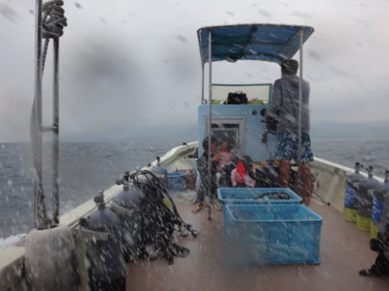
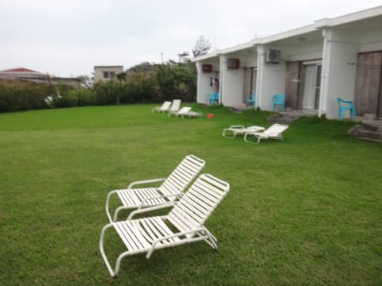

# 2015年10月　子連れで西表へダイビング旅行その6…なんと，午後のダイビングキャンセル！

📅 投稿日時: 2016-08-30 01:55:44

そういえば．

昨日話題にした焼額ですが．

営業終了が4月2日という情報以外にも．

　営業開始時間は8:30．

　ナイターは12月23日～3月4日の土曜日と休前日，

　18:00～20:00まで，

…ってゆー情報が出てましたね．

しかし…ナイターは今シーズンも，第4ロマンスと

第3高速の2本動かしてくれるのかな～？？

うーむ．

他のスキー場と同じく，せめて9時までやってほしいところ…

という，スキーネタをやったところで．

今日はまた，ダイビング旅行記へ，Go!

---

ということで．

元気なサンゴいっぱいの，満足なダイビングが終わったあと．

ボートへ戻ったわけですが…

超残念なことに．

海の上に出ると．

天気は相変わらず悪いまま…（涙）．

強い北風が吹き付けて寒いボートの上に，

雨が降りこむだけじゃなく…

高い波のしぶきが，ざっぱんざっぱん

注ぎ込むんですけどっ！？？

…これは，たまらんっ！

10月上旬というのに．

5mmのウエットスーツを着ていても．

船の上で耐えられないくらい寒いのですがっ！？？（涙）

ということで，

本日は一旦港に戻ってお昼ご飯の後，

午後も引き続きダイビングの予定

だったところ…

あまりの寒さと．

海が荒れてて娘も泳げず，船の上で雨に濡れて

待つだけ…

という状況なので．

我が家の歴史として初めての

午後ダイビングキャンセル

ということにしたのでした…（涙）

いや．

ホントに．

これまで，ダイビング長いことやっていて．

「潜れる限り潜る！」

という感じだった我が家が．

ダイビングをキャンセルしたのは

初めてじゃなかろうか…

ということで．

ダイブショップの車に乗って，

宿に送ってもらいます．

今回泊まった宿は…

「コーラルガーデン」さん．

この後ろに見えるのは，食堂がある建物で．

実際の宿泊棟はこんな平屋の建物．

部屋の中はこんな感じで…

部屋はそこそこ広いかな！

各部屋に大きなバスタブがあって．

お風呂もちゃんと入れます．

水周りは，きれいでしたよ～．

部屋の前は，芝生のお庭で…

天気が良いと気持ちよさそうなんだけど…

うーむ．

つくづく，残念な天気だ…（涙）

ってことで．

ダイブショップが準備してくれたお昼のお弁当を

持ち帰ったのを，ホテルの部屋で食べるわけですが…

本来であれば，ダイビングの合間に．

景色のいい海の上か，

バラス島で食べたはずなんだけどなぁ…

と，ちょっと寂しく思ったSkier_Sなのでした．
