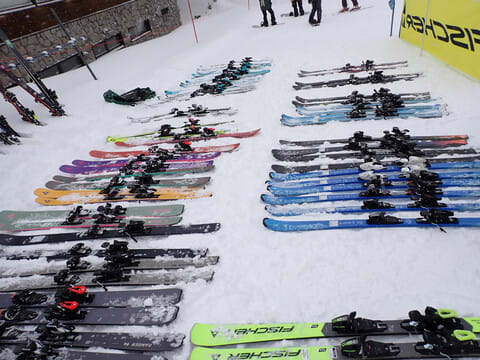

# 3月12日の志賀高原スキー場は特派員によるとよかったみたい．そして13日(水)にかけてかなり積もるよ！…そして2025シーズンモデルスキー板を試乗してきた

📅 投稿日時: 2024-03-13 01:49:35

🏷️ カテゴリ: [日記](cc4b5682fb7b8b144980957a978653fb0.md)

えー．

本日も，志賀高原特派員から写真が

送られてきたわけですが…

写真を見てみると…

ふぎゃー！！

今日もいい感じ…！！

昨日みたいな晴天じゃなく，

曇り空で，朝の気温は-4℃と

高めだけど…

でも．

週末に降った雪がピカピカに圧雪

された，締まった圧雪バーン！！！

焼額は全山どこも，いい感じに

締まった気もちいい圧雪バーンで，

ゲレンデもガラガラだったみたいです…

うらやましい…

そして昼過ぎの1時ごろから，細かい雪が

降り始めてきて…

午後3時ごろには，かなり湿った，

重くていかにも積もりそうな雪が

降ってきたようです…

そして．

3月12日深夜…というか，13日(水)に

日付が変わった深夜1時現在．

志賀高原ではかなりドサドサ積もって

ます！！

麓の上林でも，短時間で10～20cmくらい

積もっているみたいに見えますね～！

（[北信建設事務所道路気象状況カメラ](http://hokushin.pref-nagano-roadcamera.jp/)より)

これは…

明日の朝までにかなり積もります！！

水曜朝の積雪は，40～50㎝くらい

行ってるかも？？

気温が高めなので，かなり重い雪ですが…

でも，重い分しっかり積もる雪なので，

ゲレンデの積雪積み増しをかなり

期待できる雪です…！！

この雪は，明日水曜の朝までかなり強く

降り続け，水曜の昼前には弱まり

そうですが…

水曜一日降り続けます！！

そして，14日の木曜は．

大雪の後の晴れ間で，すごいいい

一日になるかも…！！

ただ，日差しで雪が緩むかも．

その後，15日(金)から17日(日)の週末に

かけて，気温が上がって天気がよさそう

なので…

朝は硬めのバーンでコロコロ発生，

昼間は日差しでしっとりした雪になる，

春スキーっぽい3日間でしょうか…

ただ，18日から冷える！！！

いい感じに冷える！！

そして，雪が降りそう！！

ってな感じで．

週明けから雪が降るのはちょいと

惜しい感じがあるけど．

たぶん，週明けの18，19日は2月並みに

冷え込み，冷え冷えの雪がそこそこ

降りそうな感じ…

来週20日の祭日，さらには23，24日の

週末も，今週よりさらに雪が増えた状態で

迎えられそう…！！

うむ．

2月はダメダメだったけど．

3月は今のところいい感じ…！

…今週末も，気温が上がらないで冷えて

くれるといいんだけどなぁ…

とりあえず，明日また週末の詳細天気予想

やります～！！

…そして．

話題は変わりますが．

勘のいい方は，この週末のレポートに

知らない板が写っていたのですでに

お気づきになっていたと思います…

実はこの週末．

エキップさん主催の2025シーズンモデルの

スキーの試乗会に参加してきました～！！

2024シーズンは円安もありスキー板が

一気に値上がりしましたが，

2025シーズンモデルは大体2024シーズン

モデルと同じくらいの値段でしたね…

参考までに，一部スキー板の写真を載せておきますね～！

HEAD REBELS e-SL

 

HEAD Supershape e-SPEED

FISCHER THE CURV GT 80

FISCHER THE CURV GT 85

FISCHER THE CURV

FISCHER RC4 SL

FISCHER RC4 GS Master

FISCHER RANGER 102

VOLKL RACETIGER SC

VOLKL RACETIGER SL

VOLKL PEREGRINE 82

…このほかにもまだ何種類か乗って

きました～！

とりあえず…試乗したバーンは，うっすら

新雪が積もったバーンってこともあったけど，

VOLKLのPEREGRINE82と

FISCHERのTHE CURV GT 85．

この2機種が良かったかな～．

この2種類とも，来シーズンから登場の

ニューシリーズの板です！

また，試乗レポートやりますので，

お楽しみに…！！←だからいつも言ってるけど，

こんな素人レポート楽しみにしている人いるのか…？？

## 💬 コメント一覧

### 💬 コメント by (カンタロス)
**タイトル**: Unknown
**投稿日**: 2024-03-13 06:45:33

Sさま、こんにちは。

試乗レポート、楽しみにしているものです(笑)

来シーズン、テールのフレックスの調整が入る模様の

S9FIS M を試乗する機会があればよろしくお願いします!

### 💬 コメント by (新米パパ)
**タイトル**: Unknown
**投稿日**: 2024-03-13 07:56:53

いつも楽しみに拝見しております。

Sさま、月末30.31日は志賀高原の予定キャンセルしちゃったんですが、これ、まさかの復活でいけちゃったりしますかね？？

完全に2月末は諦めモードでしたが、こんな年もあるんですねー。

### 💬 コメント by (スシネコ)
**タイトル**: Unknown
**投稿日**: 2024-03-13 08:55:26

自分の乗った感想とSさまの解説を答え合わせするのが楽しみです 　((o(´∀｀)o))ﾜｸﾜｸ.

最近ようやくマニアックな違いが分かるような「気が」してきました 　 (｀・ω・´)

### 💬 コメント by (おおすぎ)
**タイトル**: Unknown
**投稿日**: 2024-03-13 10:53:22

少し前までは、NEWスキー板情報にワクワクしたものですが・・・

昨今の物価高に物欲が湧きませぬ・・・

### 💬 コメント by (副院長)
**タイトル**: Unknown
**投稿日**: 2024-03-13 12:37:52

S様試乗レポート、いつも物欲がほかに向かってる時期に掲載されるんですよね、待ってます。ブーツもヘタって来てるし、S様のフォーミングブーツを拝見し、うらやましいし、来期は冬タイヤも必須だし。悩ましい。

志賀は今回で終了でしたが、これからの春スキーレポートうらやましく拝読させていただきます。

### 💬 コメント by (Skier_S)
**タイトル**: 来季の板はやっぱり気になる
**投稿日**: 2024-03-14 02:22:52

＞カンタロスさま

ATOMICはエキップさん試乗会には出てこないので…

またほかの試乗会に参加したら乗ってみます！

＞新米パパさま

30，31日はどんな天気になるかわかりませんが…

雪は余裕でもちそうな感じになってきました．

むしろ今週よりも雪が多くなってても不思議じゃないくらいです．

＞スシネコさま

試乗レポート，とりあえず昨年同様に急ぎ速報版を書こうかと思ってます．

書く時間があるかなぁ…

＞おおすぎさま

20万越えですからね…今の板(涙）

私もそうそう買えません．

型落ちとか試乗会落ちしか買ってない今日この頃です

＞副院長さま

フォーミングインナーはいいですよ~！

私のような足形がおかしい人は，かなり救われた感じがします．

ブーツを買うなら，長岡まで行くことを本気でおススメしておきます…

