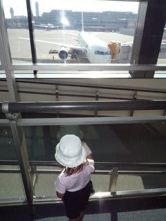
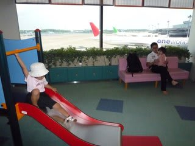
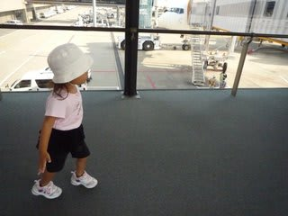

# コドモとコモド！子連れダイブクルーズ1

📅 投稿日時: 2011-07-04 01:16:26

…ということで．

コモドダイビングクルーズ日記が始まるわけですが．

まず．

旅行出発前．

日程は，9月の連休がらみの週と決まっていたので．

連休がらみで混むだろうから，早めに抑えるか…と．

正規の値段が出る前の5月下旬．

まだスキーシーズンが終わってないけど，なんとか

頭をダイビングモードに切り替えて，予約の問い合わせのTEL.

＃休みの日にスキー場から電話したのは言うまでも無い

クルーズ船の方は

「おまちしておりましたっ！！！！」

という感じで，完全にノープロブレムで予約OK．

んで，飛行機を押さえようとすると…

ツアーの正規出発日である土曜出発のバリ行きの飛行機は

SQ,GA,JLともに．

非情な「満席」の報告が．

がががーーーーん！

これは，かねてからの計画だった子供とコモド，

あきらめないとダメかっ！！！？

旅行社が抑えている席があるんじゃないかと，

いくつかの旅行社に相談してみたところ，

「残念ながら，その日は連休がらみなので全て満席ですけど…」

と，「当たり前だろ～が」という感じのお返事．

がががががーーん！！！！

これは，やっぱり無理か…

とあきらめかけたその瞬間．

某旅行者の担当者さんが，

「9月18日の土曜発は無理ですが，一日早めて17日の金曜日の

出発でしたら空いてます」

とのステキな提案をしてくれました．

さらにありがたいことに…

「土曜出発より，金曜出発のほうが飛行機が安いので，

金曜一泊の宿代が増えても，ツアー代金は同じになります」

…ナヌ？一日余計に観光できて，料金一緒だと？

…これは．

…判断に悩むことはないよな…

仕事より休みを優先する不良社員の私．

会社のOKを取る前に，強引に前の週の金曜から休みを取る

ことを決めて速攻予約！！！

…しかし，子供料金という設定が無いサザンスタークルーズ．

いろいろ受け入れ態勢に悩んだのか，最終的なツアー総額が

確定したのは7月半ばに入ったころでしたが…

というわけで．

出発日の9月17日．

成田空港へ向かいます．

飛行機は9月で終了してしまい，今は無くなってしまった

JALデンパサール直行．

前日は，一週間休むための仕事をこなし，ほとんど寝れず．

激ねむ状態で成田空港に昼ごろ到着．

チェックインの後，出国手続きをして，まず向かうは

キッズスペース．

キッズスペースで遊ばせることで，娘を昼寝させずに疲れさせて，

飛行機でぐっすり眠らせようといういつもの作戦です．

半分眠りかけてた娘は，大好きな滑り台を見ると

興奮して遊びまくります．

むふふ．

大人の思うツボにはまるとは，まだ子供じゃのお…

んで，搭乗時間．

「早く飛行機のろうよ～！！！！！」

と，乗り物大好きな娘に引っ張られるようにして

飛行機に乗ると…

そう．娘はもう2歳．

国内線はタダだけど，国際線は有料．

すなわち，初めて自分の座席が準備されているわけで．

初めて，自分一人の席に座って大喜び．

しばらく後．

飛行機は，われわれ一家の期待を乗せて．

バリの空に向かって離陸したのだった…

（続く）
