# 2023/24シーズンモデルのスキー板，20万越えはFISCHERとNORDICAくらいだけど…でも他社もトップモデルはだいたい20万円近いよ(涙)

📅 投稿日時: 2023-04-12 13:16:31

🏷️ カテゴリ: [スキー雑談](c1f9d2cb7478308da16419928ea3945e9.md)

ってなことで．

昨日も帰宅が遅く，Blogを更新する気力・体力が

なかったのですが…

今日は珍しいことに昼休みというものが取れた

ので，昼に更新！←昼休みがあるのが普通だよ

で．

前回，[フィッシャーとノルディカの板のトップモデルが
22万円くらいだという話](e61bd38b414c00bd10c2bf61de1ef2070.md)をしましたが…

この週末，アルペン・スポーツデポの試乗会に

参加して，他社の板の価格もだいたい分かり

ました～！

サロモンやアトミック，フォルクルと言った

メーカーはトップモデルでも20万円を

越えなさそうです…！

が，だいたい20万円に近い感じ(涙)

まずはSALOMONですが…

さすがにプレミアムクラスのトップモデル，

S/RACE PRIMEだと，ビンディング込み

20万を越えますが…

フィッシャーやノルディカみたいに22万という

金額では無いですね．

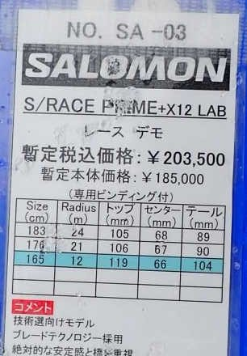

S/RACEのSL PROだと，19万2500円ということで，

ギリギリ20万を切ります…

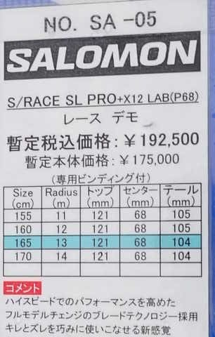

ノーマルな上級者向け板，S/MAX 12あたりだと

16.5万円．

20万ほどではないにしろ，昨シーズンより

2割ほど値上がりしてますか…(涙)

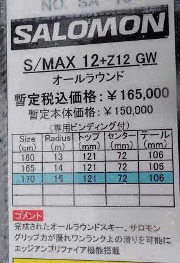

続いてATOMIC．

まずは基礎用としてはトップモデルの

S9i PROですが…

一瞬15万円と安く見えますが，ビンディング別です！

X12 VARビンディングをつけると，

19万6900円で…ギリギリ20万以下．

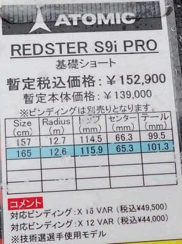

基礎のセカンドモデル的な位置づけ，

S9i REVOSHOCKは，17万5890円と，

他社と比べるとリーズナブルかも？？

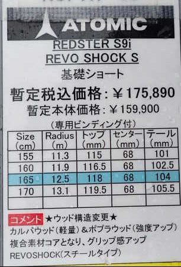

そして，オールラウンド的なQ9iは…

15万2900円と，これも比較的リーズナブル．

とはいえ，やはり昨シーズンより値上がり

してますが…

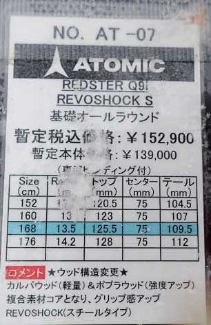

オガサカは前回ネタにしましたが．

TCシリーズは，FMプレートのみビンディング抜きで

16.2万円．

ビンディングを入れると20万ちょうどくらいですね．

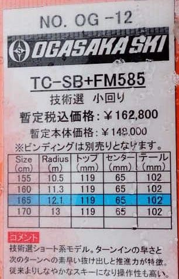

TCシリーズは，SRプレートだと17.8万円．

ビンディングを入れると21万円コースですね…(涙）

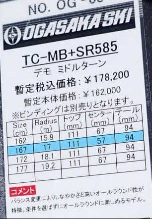

Keo'sのPSシリーズは，TCシリーズとほぼ同じ．

SRプレートだとビンディング抜きで17万3800円！！

これもビンディング入れると21万くらい

行っちゃいます…（涙）

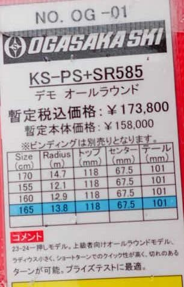

あとはVolkl．

基礎向けとしては一番高い，Racetiger SL Masterは

ビンディング別で17,6万！

これはビンディング入れると22万円コースかな…

高い…さすがプレミアム…

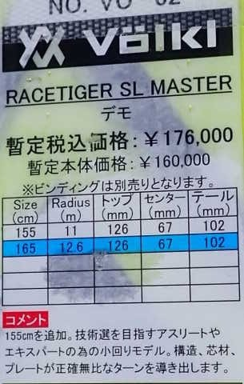

オールマウンテンタイプのDeacon 80は，

今シーズンからの継続モデルと言うこともあり，

ビンディング込みでも比較的リーズナブルな15,4万円．

…ただ，これは2割引いても12万円超えるので…

今シーズンまで，このクラスは実売10万以下だった

ことを考えると，やっぱりかなりの値上がり(涙）

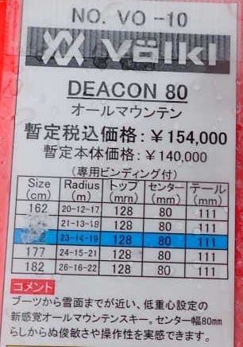

意外と安いのがHEAD．

暫定価格ながらも，トップモデルのe-SL FISが

ビンディング込みで18万1500円は…

他社と比べると安い！！

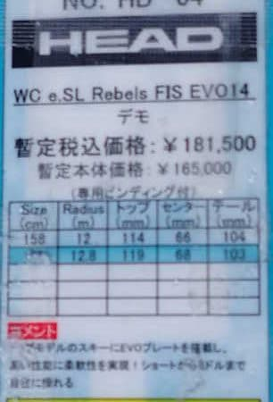

ただ，それと比べるとSupershape e-Magnumが

17万3800円なので…

以外と高い．

e-MagnumとSL競技用のe-SL FISが1万円以下の

差しかないなら，e-SL FISはめちゃくちゃ

バーゲンプライスなのでは？？？

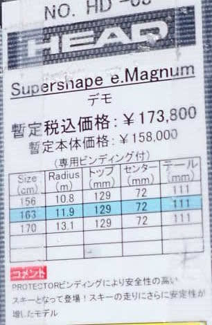

で，ElanはSLX Fusion Xの比較的上級モデルが

17万円と，思ったほど高くない．

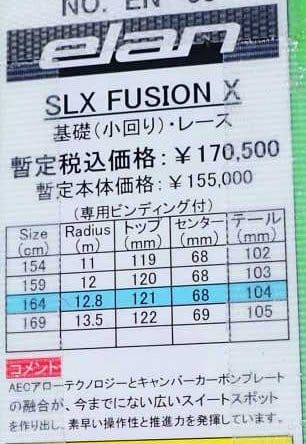

で，やっぱりNordicaは…

Sl競技用のDobermann SL WCが20万越え！！

まぁ，Dobermann SLRの22万に比べれば

安いけど…

20万越えますか…

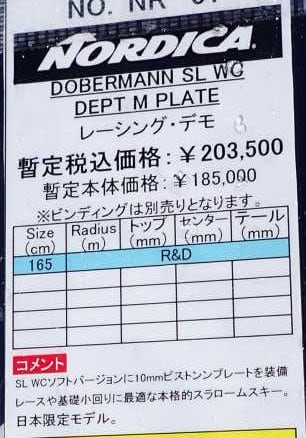

そして，とどめはFISCHER．

前回，エキップさんの試乗では出てなかった

SL競技用のRC4 WC SLが…

なんと，24万2000円！！！！！

高い…高すぎる…！！！

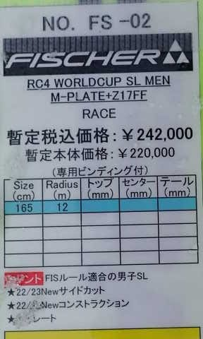

ってな感じで．

最近は円・ユーロのレートがかなり大きく変動

したのもあり．

一体いつの時点で価格を決めたかで各社

微妙な値付けの違いがありそうな感じです…

20万を超えるFISCHER，NORDICA．

トップがギリギリ20万，それ以外は20万を切っている

SALOMON，ATOMIC，OGASAKA，VOLKL．

トップも20万を切って，18万円台のHEAD．

メーカーごとにこれだけ価格差があると，

来シーズンは各メーカーの売れ行きがこれまでと

違う傾向になりそう…

でも．

とりあえず．

来シーズンはどこも板がすごい値上がりすることは

確実なので．

スキー板が売れないスキー冬の時代

がやってきそう…←スキーは冬にやるものだから，というお約束のツッコミ待ち

## 💬 コメント一覧

### 💬 コメント by (いか)
**タイトル**: Unknown
**投稿日**: 2023-04-12 23:44:45

来年も随分と値上がりですね…。

私は、今年期せずして買えたPrimeと去年買ったPro SL、ブーツも値上げに備えて今年3月に型落ちを買ったので、、、これから3年は何も買わずに過ごせるはずです！(淡い期待)

### 💬 コメント by (Skier_S)
**タイトル**: ＞いかさま
**投稿日**: 2023-04-13 03:56:49

今期Primeを買えたのは当たりですね…！

…でも，これから3シーズンも何も買わずに過ごせるはずがない…

と，予言しておきましょう！(笑)

