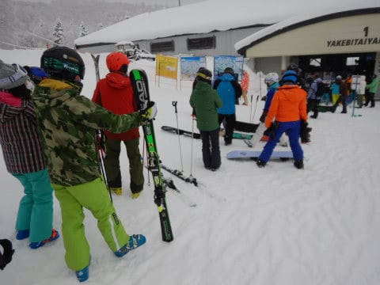

# 2021/1/3，3が日最終日の志賀高原・焼額山スキー場は…朝の積雪は10㎝弱．午前雪降り，午後薄日が差す冷え冷え最高雪！

📅 投稿日時: 2021-01-03 21:58:34

もうそろそろ，毎日毎日同じようなスキー場

レポートが続き．

読者の皆様も飽きてきたころかと思いますが…

いや．

実は書いてる本人も，レポートを書くのに飽きてきて

いるのですが．

…だって．

毎日同じような天気で，

同じ冷え冷え最高雪質のコンディションが

続いてるので…（ある意味ヨロコビ）

ってなことで．

本日も，これまでの数日と同じく．

朝はうっすら積雪．

雪が降ったりやんだりで，雪質冷え冷え最高！

ゴンドラは最大5分待ち，平均はゲートの外に

並ぶかどうか，

リフト待ちはゼロ…

という，「昨日のコピーか？」という

レポートになるのですが．

書く意味があるのか？？？…と思いながらも．

ちゃんとレポートを書く自分をほめて

あげたい…！←自分でほめてどうする

ってなことで．

今日も朝8:30のゴンドラ営業開始前に並びますが…←すでにここで，これまで数日のコピー感が…

列の長さは，昨日・一昨日と同じくらいですね…

で．

朝イチの山頂の気温は-11℃！

今日も-10℃を下回る冷え冷え気温！

そして，山頂の天気は雪が降ってますが…

降り始めは明け方だったようで，それほど積雪は

なく．

圧雪コースは数㎝のうっすら積雪．

でも，軽くてかなり気持ちいい雪で，

あさイチのGSコースは激烈快感バーン！

新雪コースのオリンピックコースは…

10㎝ちょい，ブーツが埋まらないほどの

薄めの激軽い新雪で．

しっかり締まった下地の上に乗った

軽い雪を蹴散らしながら，ものすごく

気持ちよく滑っていけます！

気持ちいい冷え冷え激軽パウダー！！

午前中は雪が降り続け，ちょいと視界が

良くなかったけど．

ガスってコースが見えなかった一の瀬方面に

比べれば，コース上はちゃんと見通せたし．

何にしろコース上はガラガラで，

さらに雪質も冷え冷え最高で，

どんなことでもできてしまい，

自分がうまくなったかと誤解しちゃう

勘違いバーン！！

今日も最高気温は-9℃程度と気温が上がらず．

雪質は最高のまま！

…最高雪質のこんなバーンを滑れるとは…

この正月休みは恵まれてる…

で．

今日は，ゴンドラはこんな感じで，

時折5分程度まで待ち時間が伸びたものの．

さすが3が日最終日．

昨日までのように10分待ちとかに

なることはなく．

昼間には飛び乗りになるタイミングも…！

…ただ．

午後は帰る人が多く待ち時間0になるのでは…？

と思っていたけど．

午後も時々ゲート外まで列がついてましたね…

意外と今日帰らず，明日まで残る人が多いのかな…？

とはいえ．

いつも通り，リフトは終日待ちなしだったし．

ゴンドラの乗車制限のおかげで，

ゴンドラに待ちがあっても，コース上は

ガラガラ！！

そして，午後2時ごろになると…

今日も昨日と同様に，薄日が射して

きました！

午後になっても，雪質は最高の勘違い雪質で，

人が少なかったからか，柔らかい雪にも

かかわらず，コースもそんなに荒れないまま！

うひょーーーーー！

夕方になっても，こんな最高コンディションでいいの！！

ホントにこの正月休み．

雪もいいし，混まないし．

天気も比較的いいし．

恵まれてる…！！

ってなことで．

今日もガラガラ最高のコンディションを，

16時のリフトストップまでたっぷり

味わい尽くしたのでした…

いやー．

しかし．

この正月休み，12月26日から今日まで．

昨シーズン全部合わせても2-3日あったかな？

という絶好コンディションが続いて．

…今シーズン，めちゃくちゃ恵まれてます…

…そして．

来る．

また，来ます．

7日から9日にかけて，大雪冷え冷えデーが…！

## 💬 コメント一覧

### 💬 コメント by (西舘Jr.（西舘の息子）)
**タイトル**: 初コメント致します。西舘の息子です。
**投稿日**: 2021-01-04 00:31:02

調子乗って初コメント書いてたら長文になってしまいました。ごめんなさい。

いつも天気予報ありがとうございます。このお正月は、夜から昼まで降って夕方晴れてくるのが毎日続きましたよね。1日ぐらいド晴天があってもいいじゃないかとお天道様に願ってるのですが。

二日間皆様にご一緒頂いてとても刺激的でした。またよろしくお願い致します。

本日の西舘（母）ですが、新しく買った板でちゃんと滑れるよう、一人でもくもくと必死に練習しておりました。大分去年の20000m滑りを再現出来るようになってると思います。次は自信を持ってターンしない傾かないずらさない滑りをお見せ出来ると思います。

ところで話は変わりますが、先日極楽さんにドーベルマンに乗せて頂いて、今まで乗ったこと無かったけど小回り系スキーってこんなに楽しいのかと思い、ついついダイヤモンドのレンタル屋に言って、上級モデル交換可コースにサインをしてしまいました。

レンタル屋の抱える在庫がある板に限られてしまうので、最新モデルはありませんでしたが、今まで全然乗ってこなかった基礎系の板を色々試して、こうも板の違いがあるのかと一人で興奮しておりました。

基礎系スキー板に関しては全くのぺーぺーですので、試乗感想としては雑になってしまいますが、それぞれの板の所感を書いたら、皆様から僕へのおすすめの板が飛び出してくるかと思って、勝手に試乗レポートを載せておこうと思います。どうぞどうぞよろしくお願い致します。（物欲を刺激されたら伝説が増える予感）

1本目【ATOMIC】REDSTER G9i(2018) 165cm

本当はS9iに乗ってみたかったのですが、ありませんでしたので、基礎大回り系の板ですがこちらを選択しました。僕のメインで使ってる【STRICTLY】THE CAB10（先日極楽さんと交換したパーク用ツインチップ）の乗り味と似ていて、安定して綺麗に大回り出来る板に感じました。

2本目【Volkl】RACETIGER SC E(2018) 165cm

軽くて動かしやすく感じました。しかしそんなに反発が無くて、僕には物足りなく感じました。（レンタルなのでへたってるんだとは思います）

3本目【OGASAKA】KEO'S KS-MD(2014) 165cm

古い板なので寿命超えてるのか、ズレすぎるし反発が無いしで物足りなく、そして重い。僕には相性悪いと思いました。

4本目【FISCHER】RC4 WC GS(2011)183cm

本格的な大回り板で、低速だと全然曲がらないのに、高速だと曲がるという不思議な感じに感動しました。朝イチ大回りしてる人はこれ目当てだったんですね。

5本目【ATOMIC】BLUESTER DOUBLEDECK 3.0 SX(省略) 165cm

在庫の奥に見つけてしまったので、Sさんリスペクト企画で乗るしかない！凄くギュインギュインして、Sさんのあの滑りはここから生まれるのかと。思わず手を上げて滑ってしまいました。無くなってしまったのが残念です。（時間に余裕があれば、1ゴンの前でSX抱えてSさんを入り待ちするつもりでした。）

6本目【FISCHER】RC4 WC SC Racetrack(2020) 155cm

お察しの通り、母に借りました。ギュインギュインのキレッキレで、滑るとどんどん楽しくなる感じ。ちなみに西舘林間コースでギュインギュイン遊んでたら、DTX履いて20000m滑りを発揮した母において行かれました。

0本目【NORDICA】DOBERMANN SLR RB FDT(極楽スペシャル)

前日に極楽さんから借りた板なんですけれど、結局一番使いやすく楽しく感じました。板の傾きが切り替えやすく、自分の行きたい所に動いてくれる感じで、これはドーベルマンが良いのか、極楽さんのエッジ角などの設定が良いのかが分からないのが困ってます。結構どきつい話も聞くので、あの感動は、この正月の超良雪によるものなのかとも思ってしまいます。助けて下さい。

僕が提供出来るものはソールサイズ303の、ちょっと変わった【STRICTLY】THE CAB10（極楽さんが履いて高速でくるくる回ってました）か【FISCHER】The CURV DTX 171cmしかありませんが、もし良ければ皆様の板に試乗させてください。どうかどうか。（そして物欲が暴れ回ります。）

P.S.センター幅90以上の太板も持ってるんですが、これで滑ってしまうと2万な方々において行かれてしまうので、焼額まで持って行くことが出来ませんでした。極楽さんごめんなさい。

### 💬 コメント by (Hide)
**タイトル**: Unknown
**投稿日**: 2021-01-04 01:34:57

S 様

ごあいさつありがとうございました。

今日の雪はホントに良かったですね。

しかし・・・連日・連夜さすがサイボーグです（笑）

私は次回は1月後半かな・・・（涙）

それまでの間、広島辺りのスキー場に顔出してみようかと思てます。

でもきっと物足りないと思います・・トホホ

### 💬 コメント by (かず)
**タイトル**: Unknown
**投稿日**: 2021-01-04 12:54:02

昨日ありがとうございました 結局帰りました 自分の最終日はSさんのお告げで決まります  笑  無いだろうと思ってましたがSさんの良くない読みが来そうですね………

### 💬 コメント by (はなげ親分)
**タイトル**: Unknown
**投稿日**: 2021-01-04 15:16:21

いや～

いいコンディションが続きますね❗️

S様のお力で、このまま奇跡のシーズンとなることを願っています。

で…

お供え物はいつものところでよろしいですか？(笑)

### 💬 コメント by (レインボー73)
**タイトル**: Unknown
**投稿日**: 2021-01-04 17:46:27

西館ジュニア様、おそらく過去最長の書き込みかと思われます。恐れ入って縮みます。読み進むにつけ、ジュニア様の凄さがわかります。レーサーなのでしょうか。

私なんぞ、なーんもわかりません。そんな定年初心者の私でも２万できちゃうんですから、途中で気付く虚しささえ克服できれば、案外できるのかも。

こんな面白いことをやらせてくださっているエス様らの皆様には感謝かです。

そのうち、良ければお母様の跡を追ってみてくださいな。

### 💬 コメント by (ももも)
**タイトル**: Unknown
**投稿日**: 2021-01-04 23:40:28

S様

本日もありがとうございました。板はもう少し検討してみます(大蔵大臣の財布の紐は硬いのです！)

yumi様と西館様にも会えました。楽しいお話をありがとうございました。今年のスキーシーズンが終わってしまってもいいくらい充実したお正月でした。

### 💬 コメント by (m&t)
**タイトル**: Unknown
**投稿日**: 2021-01-05 00:31:05

Sさんから直接志賀高原をホームにとのお言葉をいただき恐縮です。ホームにしたいのは山々ですが、m&tはアサマ2000を下りた所にGokuさんの渋の家みたいな所があり、そこを拠点にしています。さすがに小諸ICから毎日志賀高原は厳しいです。今後もスポット参戦でよろしくお願いします。緊急事態宣言の内容が気掛かりです・・・。

### 💬 コメント by (Skier_S)
**タイトル**: 帰宅しました
**投稿日**: 2021-01-05 02:45:03

＞西舘Jr.さま

試乗レポートありがとうございます！

そして，史上最長のレポートありがとうございます…

これまで基礎系の板を履いてなかったというのが驚きですが，

基礎系小回り板も面白いですよね．

SX，気に入りましたか…

やっぱりこの板，いい板ですから！

＞Hideさま

いやー．

この正月休み，雪は良かったですよね…

次は1月後半ですか．

志賀でお会いできればいいのですが，緊急事態宣言が出ると

K奈川県脱出できず，お会いできないかもです…

＞かずさま

今日は予想通りほとんど積もらず．5-10cmでした．

私のお告げで行動が決まってしまうとは，責任重大ですね（笑）．

＞はなげ親分さま

この正月休みはお世話になりました～！

このまま奇跡のシーズンが続いて欲しいものです．

そのためには，いつものご神体（？）にたっぷりのお供え物を…（笑）

＞レインボー73さま

今日はメッセージに気づかずすみませんでした！

…しかし，レインボーさんの滑りは，決して初心者ではありませんので．というか，上級者だと思うのですが…（笑）

＞もももさま

今日は子供たちと滑っていたので，あまりゆっくりお話しできず

すみませんでした～！

西舘さんにもお会いできたようでよかったですね！

…板はもう少しいい板を買った方が良いですよ…と，悪魔のささやきをしておきます（笑）．

＞m&tさま

アサマのそばに別宅があるのですね…うらやましいです．

でも，雪質は志賀の方が良いですよ～！

志賀高原へお越しください～！

### 💬 コメント by (西舘Jr.)
**タイトル**: 前回ありがとうございました。
**投稿日**: 2021-01-07 23:17:04

>レインボー73様

レーサーなんてそんなそんな。中級レベル板とツインチップな板でコース脇の壁に登り続けて10年という程度のものでございます。

既に母の跡をまさに追いかけまして（同じ日に）2万メートル達成して金ステッカーをメット・板ともに、貼らせて頂いております。（二人で9本も板を買ってしまいましたので、貼る場所は沢山ありました。）

そのおかげで、沢山の皆様に1ゴンでお声かけ頂き、大変楽しく過ごしております。レインボー様にもお会いしたく思います。

反応ありがとうございました。

>S様

回転半径18mとかの板ばかりで堕落しておりました。基礎系小回り板の圧倒的遠心力に魅了されてしまいました。

SX素晴らしい板だったのですが、もう売られてないのが寂しいものです。

>S様とこのブログ1億3千万人読者の皆様、長文乗っ取りコメントで失礼致しました。ゲレンデでお会い出来ました時はアドバイス是非よろしくお願い致します。

### 💬 コメント by (Skier_S)
**タイトル**: ＞西舘Jr.さま
**投稿日**: 2021-01-09 04:31:12

いや…

私は板を操作する実力が無いので，何もしなくても板が曲がってくれる

小回り板に頼っているんです…（笑）．

私は，10数年前の現役選手の頃は，小回りが激烈に苦手だったんですよね…

でも，小回り板，楽しいですよ～！！

