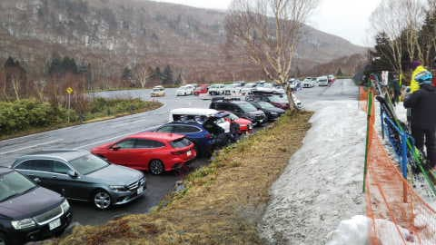
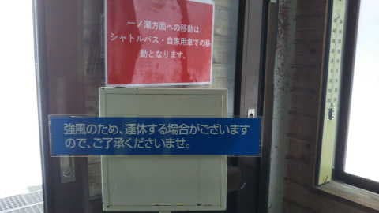
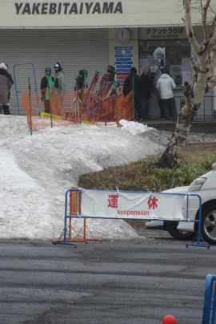
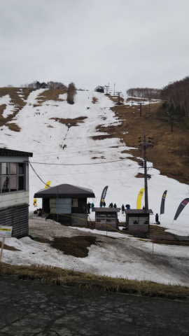

# 本日4月15日(土)の志賀高原焼額山は…朝から終日雨＆強風でゴンドラ減速＆ザブザブ雪＆ガスの4重苦，そして昼にゴンドラ運休！行かなくて良かった…

📅 投稿日時: 2023-04-16 00:21:17

えー．

本日の志賀高原ですが．

やはり朝から雨が降っていたようで…

さすがに集まった人は少なかった

みたいですね…

駐車場は土曜と思えないほどガラガラ！

でも，逆に言うとこれだけの人が

この悪天候の中滑りに来てるのか…

気温は朝で+2℃．

残念ながら，朝から雪は高温の雨に濡れた

ザブザブバーンで．

さらに山頂はガス&強風という，

雨＆ガス＆強風という嫌がらせ．

…しいて言えば．

雨のおかげで雪が板に貼りつかず，

滑りが良かったのが救いだったようですが…

強風のおかげであさイチからゴンドラは

かなり減速運転だったみたいで…

さらに12時頃．

強風のため焼額第1ゴンドラ営業終了(涙)

第1ゴンドラしか営業してないこの時期．

これで本日の焼額の営業終了という

悲しい事態…(泣)

いや…今日は行かなくて良かった…

みんなから「最高！」の連絡が来ない今日は，

心安らかに（？）家で仕事できましたね～！←心が狭い

しかし…

この雨のせいか，ダイヤモンドの雪も

減りましたね…

これで滑ってるのがすごい…

という感じで，本日は残念な志賀高原でしたが．

明日はどうやら朝8時から9時くらいまでには

雨が止みそうで…

その後，ちょっとポツポツ降るかもしれないけど，

そこまでひどい雨にならなさそうな予想に

なってきました…！！

ただ，朝から気温は高く，雪はザブザブでしょうが…

でも，明日は志賀高原に日帰り参戦します～！！

いや．

しかし．

今日は一日仕事に当てて，夜には一通り仕事が

終わったので．

なんと！！夜10時過ぎという早い時間に寝られる！！

…まぁ，明日は3時出発なので4時間半しか

寝られませんが…

ってなことで．明日志賀高原でお会いしましょう…！

## 💬 コメント一覧

### 💬 コメント by (アツシ)
**タイトル**: Unknown
**投稿日**: 2023-04-15 23:34:58

おそらく今季最終となる本日、雨やガスは覚悟の上でしたが、ゴンドラ運休は想定外でした！焼額限定券だったので、本日12時をもちまして今季終了となりました。最後、もうちょっと滑りたかったな。とはいえ、今季もいっぱい楽しめたし、いろんな方々にお世話になり本当にありがたいことだと思います。最後Sサマとお会いできなかったのが本当に残念でしたが、いろいろと教えていただいたりして、ありがとうございました😊お仕事大変ですが、くれぐれもご自愛くださいませ。ブログ更新、これからも毎日楽しみに待ってます❗️

### 💬 コメント by (Skier_S)
**タイトル**: ＞アツシさま
**投稿日**: 2023-04-17 01:03:32

最終日ですか…今シーズンもお疲れ様でした．

ラストがゴンドラ運休で強制終了なのは残念でしたね．

来シーズンまで死なない程度に仕事します（笑）

また来シーズンお会いしましょう…！！

