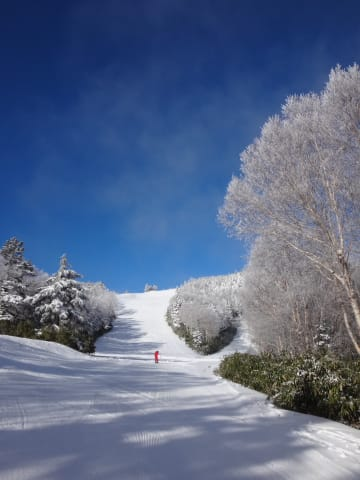

# 今シーズン初の焼額へ行ったわけだが

📅 投稿日時: 2015-12-09 01:30:44

🏷️ カテゴリ: [日記](cc4b5682fb7b8b144980957a978653fb0.md)

あー．

ダメです．

ダメだ…

やっぱり，この週末．

金曜～土曜にかけて．

雨

になりそうな今日この頃．

皆様，いかがお過ごしでしょうか（涙）．

うがーーー！

なんだ，これは～っ！！！！

11，12日の850hpa予想気温ですが．

平年より8度くらい高いんですけどっ！？？？

これは…雨です．

ああ…土曜はダメな感じ…

そして．

土曜に雨が降ったあとも，気温は冷えないので．

日曜もゲレンデ状況は全く改善しなさそう…（激烈涙）．

とりあえず，明日．

また詳細予想しますが…

これはきっと．誰か．

誰か，日ごろの行いが強烈に悪い人間がいるに違いない…っ！！←だから，それはお前だってば

ってことで，本題へ．

今週，ようやっと待ちに待ったオープンを迎え，

わがホームゲレンデの焼額山に行ってきたわけですが．

リフト券売り場に始まり．

リフト乗り場の索道係の皆さん，

そして予想外に，焼額のレストランのお姉さんにまで

「あ，今シーズンもよろしくお願いします～！」

と笑顔で挨拶され．

「…こんな方にまで，覚えてもらっていたのか…」

と驚きを禁じえなかったこの週末．

その他にも．

常連の知り合いの方に次々と出くわして．

「お久しぶりです～！今シーズンもよろしくお願いします～」

って挨拶を，何回やったことか…

昨シーズンの初めのころは，

他の常連さんと話すことはそんなになかったんですが．

…なんだか，このBlogのおかげで．

昨シーズン中，いろんな方に声をかけてもらえるようになり．

いや～．

1シーズンで，数多くの方と知り合ったんだなぁ…

と，思ったシーズン初日だったわけで．

…しかし．

しかし，だ．

物欲選手権に負けて，ウェアが変わっている今シーズン．

なぜ，常連の皆さんは，あれだけあっという間に

私を発見できたのだろうか…？？

と，ちょっと不思議に思ったSkier_Sなのだった…

＃滑りを見ればすぐわかる，という説もあり

## 💬 コメント一覧

### 💬 コメント by (はなげ親分)
**タイトル**: 雨ですか～
**投稿日**: 2015-12-09 10:57:41

12月にカッパ着て滑るなんて想像出来ません!!

降りの強さはどんなもんでしょうか？

あまりに強いようでしたら、下界に降りて蕎麦でも食べようかなぁ。

先週末は、ホテルてお見かけしましたが、ご家族と一緒でしたのでお声かけは遠慮しました。今週末にはご挨拶させていただきます♪

### 💬 コメント by (Skier_S)
**タイトル**: はなげ親分さま
**投稿日**: 2015-12-09 23:27:29

今のところ，土曜は雨．時折強く降るかも．

日曜は雨は降らなさそうな感じですが…

うーーーむ．

ダメな感じです…

先週末は，一の瀬で滑ってらっしゃいましたか？

宿の前でお見かけしましたが，ゲレンデでは

お会いしなかったような…

今週末，またお会いしましょう！

