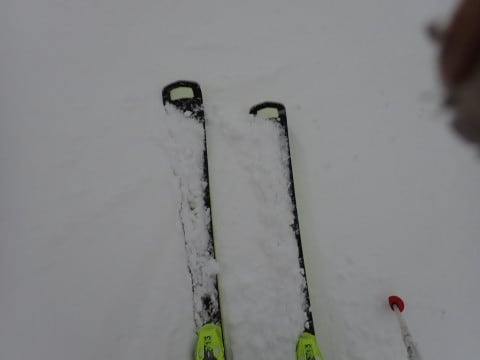

# 2023/12/3(日)の志賀高原スキー場，いまさらながら詳細レポート…雪質は固めながら結構いい感じ，朝は晴れたけど夕方にかけて本降りの雪に…

📅 投稿日時: 2023-12-06 01:27:29

えー．

昨日は，仕事の一つのヤマ場を終えて．

ほぼ終電の電車で家に帰ってから，

ひとヤマ越えてほっとしたのと疲労で，

帰宅後死んだように寝てました…

まぁ，月曜のヤマ場に間に合わせるため，

日曜に志賀高原で一日滑ってから帰宅したあと，

そのまま月曜の朝5:45まで寝ないで資料を

作ってたので，その夜に倒れたように

寝てしまうのは仕方がないよね…

とりあえず．

昨日は更新できなかったので．

いまさら感はありますが…

日曜の志賀高原焼額山，詳細レポートです！

まず．

あさイチは…車がガチガチに凍り付く，

-10℃近い寒さでスタートです！

志賀高原に登ってくる道も，わりと滑り気味な

本格雪道．

昨晩からうっすら積雪もあったみたいで…．

とりあえず，今日も冷え冷えで雪質は

よさそうな予感…！

…そして，今日も第4ロマンス1本のみ

営業の志賀高原焼額山．

朝8:30の営業開始前に待っているのは，

せいぜいこの程度で．

今日もそんなに混まなさそうかな…

と思わせる朝イチ．

8:30営業開始のリフトに乗ると…

青空が望めるいい天気です！

で．

あさイチのゲレンデは…

そうです！シマシマです！！！

しっかり硬めの人工雪の上に，柔らかい

天然雪が2-3㎝ほど乗って，それから

圧雪された，表面はかなり柔らかめの

圧雪バーン！！

…では，あさイチのシマシマ，いただきま～す！

エッジを立てると板が深く食い込みすぎて

しまい，加速しないほどの柔らかい表面

でしたが…

ふはははは！！

イエティとは違う，天然雪の快楽！！！

朝のうちは，人がほとんどいない，

気持ちいい圧雪バーンを思いっきり飛ばせる，

シアワセを思いっきり噛みしめることが

できて．

あぁ…焼額最高…

と，思っていたところ．

それほど多いとは言えないけど，人が

だんだん増えていき…

朝10時前には，ちょっとリフト待ちが

発生し始めました（ちょい涙）

まぁ，せいぜい最大3分待つくらいの混雑で，

そこまでひどくないですが…

ただ．

混んできたな～…と思ったら．

ゲレンデで無料ドリンク配布が始まり．

そちらに人が引き寄せられたのか…

リフト待ちはそれほど長くならず．

ドリンク配布中の10時半には，この程度の

リフト待ちに！

ちなみに，ゲレンデわきではこんな感じで

ドリンクの無償配布やら…

ヤケビステッカーの無料配布をやっていて．

どうやらこのステッカーは，SNSに投稿すると

もらえるようです…

その後，またリフト待ちが出る時もありましたが．

最大でこの程度で…

まぁ，3分待ちちょいくらい．

ちなみに，11時過ぎにはリフト待ちは

解消して，それ以降はほぼ待ち無しだったし．

ゲレンデも，人口密度はそこまで高くなくて，

滑りやすかったです！！

…ただ，昼頃になると，コース上に積もった

柔らかい雪の層が剥げて，硬めの下地が

出てきているところもわずかにありましたが…

でも，アイスバーンではない，人工雪の

下地なので滑りにくくはないよ！！

しいて言えば…

気温が低いうえに，第4ロマンスリフトが

長すぎて．

せっかく滑って暖まった身体が冷えてしまい．

冷凍人間になりかけるところが辛い…

その中で，午後になるとだんだん天気が

崩れ，日が全くささなくなり…

それどころか．

午後2時ごろには雪がぱらつき始め．

さらに午後2時過ぎには，がっつり

本降りになってきました…（泣）

まぁ，雪が積もってくれるのはうれしいけど．

やたら長い4ロマ乗車中に激しい雪が

降り積もるので…

4ロマは，いつもの冷凍人間製造機と

化してきました（泣）

ただ，そのおかげで．

リフトは全く待ちがないがら空き

状態だし．

コース上も，うっすら新雪が積もっていき…

人がいない3時過ぎには，

圧雪バーンにも，シュプールが残る

プチ新雪状態に！

人がいなくて，新雪が積もっていいけど…

でも…

寒い．

ひたすら寒い！

そして，本降りになって，前も見にくいし

足元も見えにくい状態に（涙）

そんな中でも．

人が少なくて，ガラガラでいい！！

とばかりに．

いつも通り，しっかりリフトストップの

16時まで滑ってしまったのでした…

…その後，300km車で走って帰宅して．

それから朝まで仕事していたので．

最後まで滑らず早く帰れよ

という声が聞こえてきそうですが…

自分でもそう思ってます

でも，リフトが動いていると帰れない

呪いがかかっているので…

ってなことで．

この週末は，結構いい感じの雪で滑れましたが．

これからの天気図を見ると…

どうやらこれから週末まで，志賀高原で

雪が積もることはなさそう（涙）

そして，人工雪を打てる日もそんなに

なさそうという恐ろしい状況に，

震えています…

果たして今週末までに雪が積もって，

焼額のゴンドラが動くのか？

…めちゃくちゃ期待薄ですが，

とりあえず祈って踊り続けましょう…

## 💬 コメント一覧

### 💬 コメント by (アリス)
**タイトル**: お疲れ様でした
**投稿日**: 2023-12-06 08:38:11

Skier_S様

リフトラスト→300km運転→5時過ぎまで仕事Σ（・□・；）→そのまま出勤

相変わらず超人スケジュールと体力♪

個人的には空いているゲレンデを見ると嬉しくなりますが、オープンのヤケビでしかも土、日であの程度とは逆に心配になります。

（トップシーズンでリフトやゴンドラ営業縮小とか)

オープン二日は四ロマの長蛇の列を想像しておりました。

やはりヤケビの魅力はゴンドラが動いての機動力とグルーミングされたロングコースなのでしょうね♪

### 💬 コメント by (スシネコ)
**タイトル**: Unknown
**投稿日**: 2023-12-06 12:54:59

オープン当日から捨て板を使わないでも滑れる状態だったのですね。冷凍人間製造機の写真を見るとシーズン真っ只中のような懐かしい景色です。

私は今年も初すべりは年末年始まで無理そうです。でもシーズン券デビュー２年目。毎週出勤するように頑張ります♪（自然とこうなる運命か。）

### 💬 コメント by (Skier_S)
**タイトル**: 今週末もゴンドラ運転は期待薄
**投稿日**: 2023-12-07 02:21:23

＞アリスさま

実は今回，志賀高原までは2人で乗り会っていったので，帰りのうち100㎞くらいは

運転してもらいました～！

…でも，1時間休めたかどうかってくらいですが（涙）

4ロマが混まなかったのはいいけど，営業的には微妙ですよね．

早くいっぱいリフトが動いて，人がいっぱい来てくれないと…

＞スシネコさま

初日から，新しい板でも問題ないレベルでしたよ～！！

この週末は冷えて良かったです．

今週末は微妙な感じですが（涙）

初滑りは年末年始からですか…

お待ちしています！！

