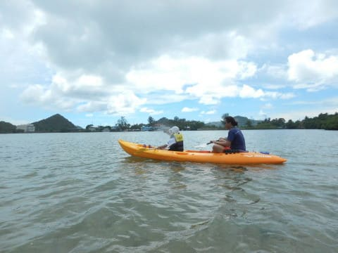

# 2017年8月，小学生の子連れでパラオ再訪！その24…ラストデーの午後は，カヤックツアー！！

📅 投稿日時: 2018-10-31 00:34:27

🏷️ カテゴリ: [ダイビング日記](ce3a7a8d424d112fce83ee85c81a0e344.md)

もう，スキーシーズンに突入したというのに．

まだ続く，ダイビング旅行記…

昨年行ったパラオの旅行記も，もうラストスパートなので．

早く終わらせないと…！

ってことで．

本日は，パラオダイビング旅行記です…

では，どうぞ～！

---

ってな感じで．

午前中に街中をぶらぶら買い物した後．

…午後からは，カヤックツアーに参加します！

ホテルに迎えに来た車に乗り込んで…

カヤックツアーを開催しているショップへ

やってきましたが…

あれ？

申し込んだカヤックツアー，ダイビングショップが

開催してるの？？

…他のショップでダイビングしたばっかりなのに，

違うダイビングショップでアクティビティに

参加するのは，すごく気まずい感じだけど…

うん．

どうみても，このたたずまい．

やっぱり，明らかにダイビングショップですね…

パシフィックダイバーズ「オアシス」という

ショップが主催するツアーだったようです…

とりあえず．

そこはあえて触れないようにして．

まずはツアーガイドさんの説明を聞きます…

最初に，パドリングの基本やら，

パラオの地形の成り立ちやら，

見ることのできる動物やら植物やらについて．

ガイドさんが，基本的な説明を

してくれたのですが…

ダイビングガイドも兼ねている，このガイドさん．

我々の恰好やら持ってきているカメラを見れば．

うちら家族がダイバーだということが，

一瞬で分かっちゃうので．

ガイドさん「どちらのショップで潜ってこられたんですか？」

私「…すみません．Day Dreamさんです…（小声で）」

ガイドさん「今度はうちでも潜ってくださいよ～！！」

私「…いやーー．

　でも，うちは娘をダイビングボートに乗せて

　一緒に連れて行きたいんで…

　さすがに，子供は一緒にダイビング

　ボートに乗せてくれませんよね…

　今回，Day Dreamさんだけが特別に子連れ乗船

　OKしてくれたんで，そこにしたんですよ…」

ガイドさん「うちも子供乗船OKとは言ってないけど，

　この娘さんだったらしっかりしてるし大丈夫！」

私「え…

　あ…そうですか…

　うちの娘，全くもってそんなちっとも

　しっかりしてないんですけど…（当惑）」

　（娘…どうやらお前は，実際よりもいい子に見えてる

　らしいぞ…）

普段よりおとなしくレクチャーを聴いて，

パドリングの練習なども，素直に言われたとおりに

やっていたので．

どうやら，かなりおとなしくて真面目な娘に

見えたようですが…

いや．

全然そんなことないですから…

とりあえず．

レクチャーを受けたあと，

カヤックに乗り込みますが．

このカヤックは二人乗りのシットオントップなので．

私と娘で1艘，

妻とガイドで1艘の予定が…

娘「ガイドさんと乗りたい～！！！」

…ガイドさんにかなり褒められた娘．

カヤックも一緒に乗りたくなったようですが…

でも，ガイドさんに娘の面倒を見てもらうわけにも

行かず．

私「だめ！ガイドさんとはママが乗るの！」

娘「えぇ～！ガイドさんと乗りたい～！！！」

ガイドさん「いやー．いいですよ～．娘さんと一緒に乗りますよ！」

私「えぇっ？？！」

娘「やった～！！」

私「…す…すみません…娘の面倒，お願いします…」

ってなことで．

娘がガイドさんと同乗することに…

ガイドさん，娘のお世話させて，すみません…

しかし．

うちの娘は[シングルカヤックも普通に乗れる
腕前を持っている](e24c4f066c2b4bd2b40fd095efc953442.md)ので．

ガイドさん「え？上手い！じょうず！」

褒められて，さらに有頂天になっている娘…

娘「一人で漕げるから～」

と，一人で漕がせてもらってます…

とりあえず．

わが娘．

別にカヤックでパラオの景色を見たいわけじゃなく．

お前は，カヤックが漕げれば，どこでもいいんだな…
