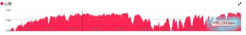
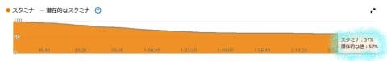
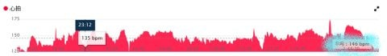
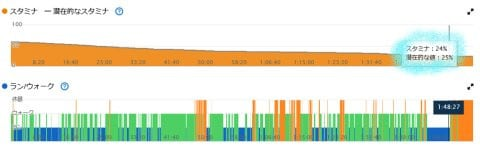
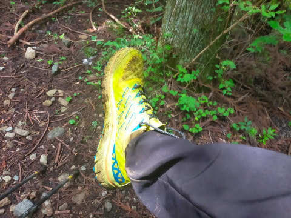
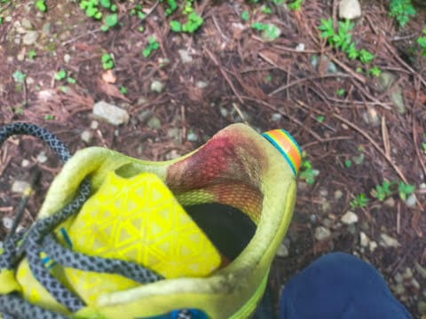
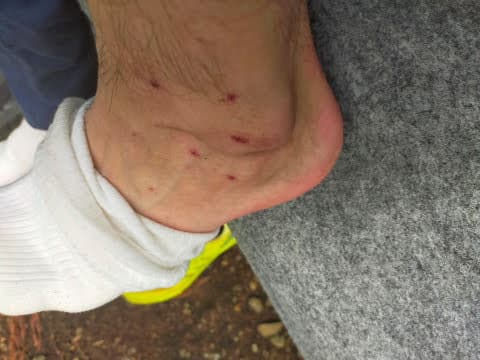
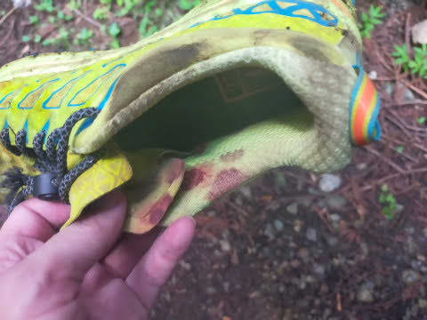
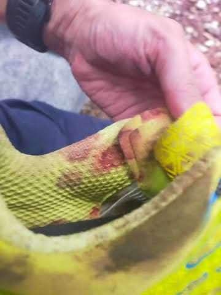
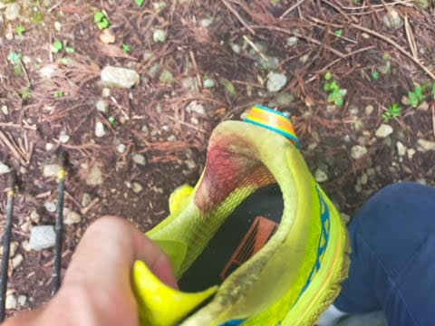

# また蛭ヶ岳を全力往復してきた，エピローグ…さんざんな山登りだったよ

📅 投稿日時: 2023-08-16 04:17:32

ってなことで．

[前回](e02c9c2551553fd5d53503c0c35107f93.md)で，蛭ヶ岳を下山するところまで書いたので．

蛭ヶ岳の話はこれで終わりじゃないの？

…と思うかもしれませんが．

この話，まだ続きます…

とりあえず．

山頂休憩時間を除くと，

登り2時間44分

下り1時間48分

トータル4時間32分

と．

トータル4時間半を切った昨年より

3分ほどタイムを落としてしまった

わけですが．

しかし．

雨で地面が濡れてなくて．

下り爆速のHOKAのシューズを履いていたら，

もう少し早かったかも…？

…と，負け惜しみを言ってみたいところ．

でも．

Garminさんのデータを見ても…

登りは平均心拍が143と，いつもの

150を狙っている私としては心拍数を

追い込めておらず…

そのせいで，登り終わった時点でのスタミナは

57％も残ってるし．

そして，下りも心拍は146と，

足場が悪くてスピードがあげられなかった分，

150まで心拍を上げられなかったので…

下り終わってスタミナが25％も残っている

という．

私としては，今回は全力を出し切れず，

余力を残しまくってしまった感…←一生懸命昨年よりタイムを落とした言い訳をしている

しかし，この上のグラフの青いところが走っている

時間だけど．

これでも，半分くらいの時間は走ってるんだな…

ってなことで．

今回は．

濡れてつるつる滑る木道や，

濡れた下りの急坂の足場が悪くて

ペースを追い込めなかったから

昨年よりタイムを落とした

という風に自分に言い訳しておこう…

と，分析（という名のいいわけ）したところで．

出発前から気にしていた，

雨の丹沢であいつが出たのか．

という．

出発前の危惧を，ゴール後に確認したところ…

やっぱりやられた～！！

うぎゃーーー！！シューズが血だらけ！！！！

…そうです．

この時期の雨の丹沢．

出るんです．

確実に．

ヤマビルが…（激涙）

分厚い靴下をはいていたので，しっかり

食いつけなかったからか．走っている途中に

振り切られたのか，血を吸いきって満足して

離れていったのか分からないけど．

下山時に確認したところでは，

ヤマビルはもう靴下についてなかったけど…

吸われた跡が数か所（激涙）

反対の足も，数か所やられてました…

（靴下は履き替えたやつなのできれいですが，

　山で履いていた靴下は血だらけ）

そのせいで，右側も左側も，

シューズが血まみれに…（涙）

だめだ…

やっぱり，雨の日の丹沢はダメだ．

でも，どうしてヤマビルって足首にくっつくのかな…

素直にミッドカットのLa Sportivaを

履いていくべきだったのかも…

しかし．

さすが蛭が岳と呼ばれるだけあって，

半端ないヒルの数だ…

と，血まみれのシューズを見て，

洒落にも何にもなっていない感想をつぶやきつつ．

帰路についたのですが．

悲劇はこれだけではなかったのだ（涙）．

下山中．

コースをふさぐ倒木を乗り越える必要があり．

その時，雨に濡れた倒木の木肌が思いのほか

ツルツルで，高さ1m弱の倒木に足をかけて

向こうに下りようとした際…

思いっきり滑って背中を打ってしまい（泣）

「痛いなぁ…」

と思いながら，それでも必死にハイペースで

下山していたのですが…

帰宅後．

普通にしているとなんともないけど，

動かしたり力が入ったり，

咳をしたりすると肋骨に激痛が走る

ようになり…

数日間経った今でも，まったく痛みが

治まる気配はなく．

これ，肋骨折れてるわ（激涙）

ぽっきりとはいってないけど．

この痛み，間違いなくひびが入ってる

感じ…（涙）

今，走ったりすると振動で痛いし．

寝がえり打っても痛いし，

咳とかするとかなり痛いです（泣）

（それでも病院が嫌いな私は病院に行ってない…

　どうせ肋骨のヒビは痛み止め処方だけで

　放置されるだろうし）

いや…

これでよく，転んでから30分近く，

走って下山したものだ…

肋骨折ってたんだから，昨年より

3分遅かったのは当然だったのかも．

ってか．

肋骨を折りながらも，昨年よりわずか

3分落ちのタイムで下山したってのは，

逆にすごかったのかもしれない…

ってなことで．

雨の丹沢山系．

思いっきりヤマビルにやられるわ，

濡れた木で滑って肋骨を折るわ

散々な山歩きだったわけですが．

今度から，やっぱり丹沢山系は，天気がいい

カラッと晴れた日にしよう…

と，強く心に誓った，Skier_Sだったのでした…

## 💬 コメント一覧

### 💬 コメント by (副院長)
**タイトル**: Unknown
**投稿日**: 2023-08-16 08:29:41

S様、症状的にはヒビ入ってる可能性高いですね。多分レントゲンでもわからないでしょう。数日後にずれてきたら、CTで分かりますが、日々ではわかりません。全治2週間ちょっとでしょうか。あ、特に山歩き？（トレイルラン）しても、痛いだけで、治癒には関係ないですし。OKですよ。2万メータークラブの人が、骨折ぐらい。僕はチャリで肋骨9本折っても3週間後にはヒルクライムレース、出てました。（エントリー費がもったいなかった）。お大事に。

### 💬 コメント by (ねも)
**タイトル**: Unknown
**投稿日**: 2023-08-16 11:55:12

Sさん　あちらに返信ありがとうございます(^^)v

こちら方面には、蛭ヶ岳からの下山で歩きました。大昔のことなので記憶があいまいですが、気持ち良い道だったと思います(^^;)

ヒルにやられたり骨折の可能性など災難でした💧　お見舞い申し上げます🙏

私は６月～９月は、丹沢遠慮してます😅

### 💬 コメント by (Skier_S)
**タイトル**: 肋骨が痛い…
**投稿日**: 2023-08-16 21:35:47

＞副院長さま

やっぱりヒビ入ってそうですか…

でも，山歩きはやって大丈夫なんですね！

しかし，肋骨9本折って3週間後にレースですか！？？？

3週間って，ぎりぎり痛みが治まるかどうかくらいの時期だと思うんですが，

痛くなかったんですか…？

＞ねもさま

もう，蛭やら骨折やら，散々な蛭ヶ岳でした…

蛭が出る以外にも，標高が低くて暑いので，確かに6-9月は登る山じゃないですよね…

ただ，家から遠くないのでお手軽なんですよね～．

いやー．

でも，ヤマビルはもういや…

### 💬 コメント by (油漏＠あちこち)
**タイトル**: 肋骨
**投稿日**: 2023-08-17 12:12:37

御怪我、お見舞い申し上げます。

私は一ノ瀬ファミリー中間のこぶラインがアイスバーンになっているとき、若気の至りでチャレンジし前のめりに転倒。Sさんと似たような状況になりました。冬場なので咳をするとしみじみ痛く、くしゃみは地獄のように痛かったです。「治療法はないからしばらく我慢してね。鎮痛剤もだすからね」とスキー好きな整形外科の先生は嬉しそうに笑っていました。

お大事になさってください。

### 💬 コメント by (yumi)
**タイトル**: Unknown
**投稿日**: 2023-08-17 21:15:00

Sさぁ～ん🥲🥲🥲

お辛いですね🥲

スキーで 転ばないのに 山登りで 転ぶなんて😓

そう言えば❗️

Golfのスィングで 肋骨を折った友達がいました😂

I hope you will feel better soon.🍀😌🍀

🍀🥰🍀

### 💬 コメント by (Skier_S)
**タイトル**: まだ痛い…
**投稿日**: 2023-08-17 23:06:56

＞油漏れ＠あちこちさま

あら…肋骨追ったことある人，意外と多いんですね…

私は病院に行ってませんが，どうせ行っても放置なんですよね…やっぱり．

病院どころか薬も嫌いなので，痛み止めも何も飲まずに過ごしてます…

肋骨骨折は痛いだけで運動しても大丈夫っぽいので，そろそろ今週末からまた運動再開

する予定です～！←懲りないやつ…

＞yumiさま

とりあえず，受傷からそろそろ一週間．

くしゃみや咳をすると，「いてーーーっ！」から，「あいたたた…」

くらいに，痛みは徐々に弱まりつつあります．

しかし，ゴルフのスイングで肋骨を折るって…

よっぽど鋭いスイングだったんでしょうね(笑)

### 💬 コメント by (院長)
**タイトル**: Unknown
**投稿日**: 2023-08-30 07:53:36

肋骨骨折大変でしたね。

しばらくレントゲンには写りません。

骨折というのは大体ヒビです。

ポキッと折れているのはかなりの重症です。

おっしゃる通り整形いっても

『安静にしてください』位です。

疼痛が気になる方や再骨折リスクある

(運動しようと思ってる)方はこちらをどうぞ。

お大事にお過ごしください。

バストバンド　サイズM〜L≪２分割胸部固定帯≫〔アップル医療〕【送料無料】

[楽天] https://item.rakuten.co.jp/tsukayoshi/a17022001/?scid=wi_ich_androidapp_item_share #Rakutenichiba

### 💬 コメント by (Skier_S)
**タイトル**: ＞院長さま
**投稿日**: 2023-08-31 02:29:44

そうなんですよね…

どうせ病院に行っても痛み止めくれるくらいで放置なんで，病院には行きませんでした．

情報ありがとうございます．

今回は妻が数日間，懐かしの（？）サラシを巻いて固定してくれました．

今はほぼ痛みが治まったので，もう大丈夫かな~…

と思ってます．

