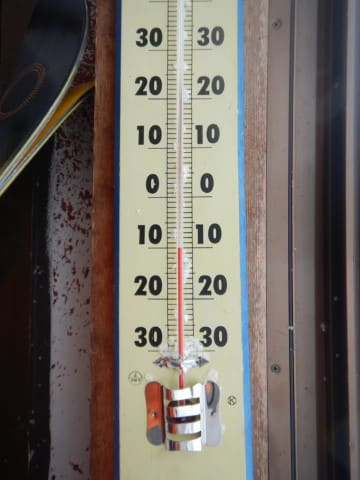
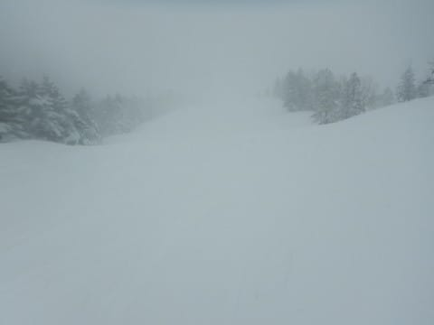
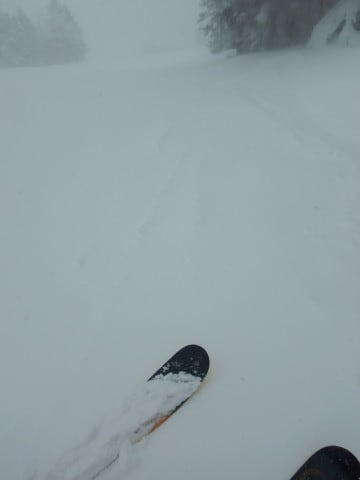
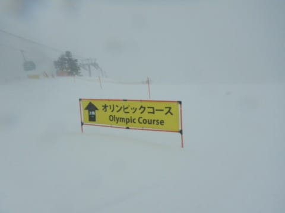
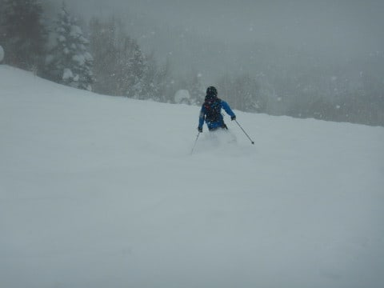
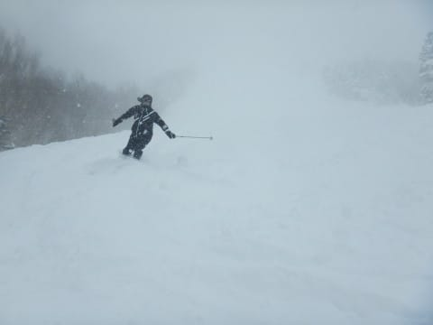
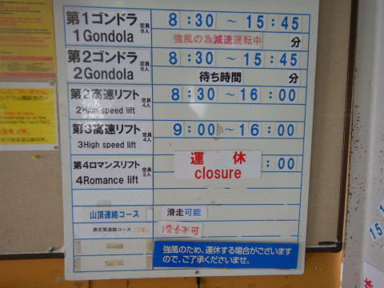
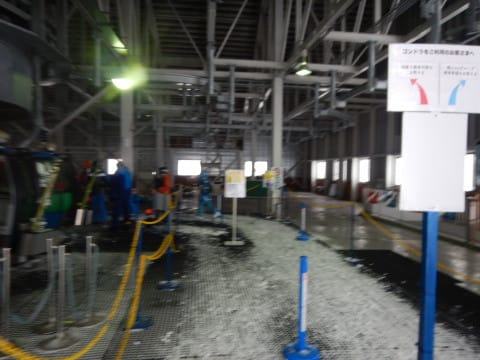
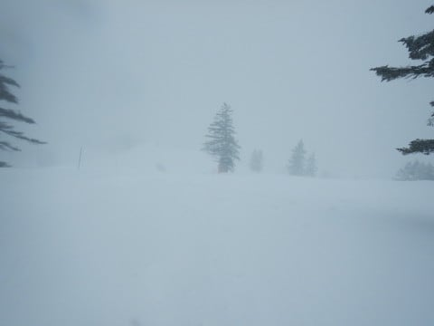
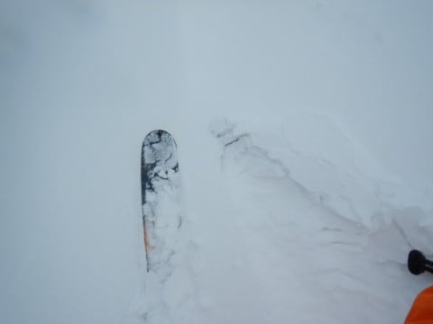

# 2022/1/4(火)の志賀高原焼額山スキー場速報レポート…終日雪降りのエンドレスパウダーデー！ガン降りで視界悪し

📅 投稿日時: 2022-01-05 02:43:51

🏷️ カテゴリ: [2022スキー滑走日記](cc9cb73e4320f6a97af6fccc37587a61a.md)

多くの読者の方が，

Skier_Sの志賀滞在は1月3日まで…

と思っていたようですが．

実は，今日も志賀高原で滑ってました～！

いや．

ありがたいことに，なぜか今日も仕事が

休みだったもので…

ってなことで．

さっき6日間の志賀高原滞在を終えて，

帰宅したわけですが．

私にとって，よっぽどなことがないと

取れない貴重な平日休みの志賀高原，

速報レポートです！

えー．

まず．いろいろ訳ありで，今日は昼前

スタートという，

あさイチに人生をかけている私にとって，←そんなものに人生をかけているの？？

シーズン中に1度あるかないかという

珍しい時間スタートだった本日．

12時前に山頂へ登ると…

気温は-10℃ですか…

昼でこの気温とは，結構冷えてますね．

そして山頂の天気は…

うーん．

これはいわゆる，「吹雪」って

やつですね(涙)

ゲレンデの視界はあまり良くなく，

雪の降りもかなり強く．

さらに悪天候＆平日のために人も少なく，

雪が踏まれてないので，圧雪コースにも

降り積もった雪が10cmほど溜まって

ます…！

パウダーがまだのこってるかな？と，

オリンピックコースへ向かってみると…

オリンピックコースは，

ブーツパフ～脛パフくらいのパウダー！

ただ，朝は結構重い雪だったらしく，

朝の重い雪が踏まれた凸凹の上に

新雪が積もって，凸凹が見えなくなって

いる感じ…

昼間に積もった，上に乗っている

雪は結構軽いんだけど，下地が結構

荒れていて，意外と手ごわかった…

(でも，難しいと思いつつもオリンピックコースを

ひたすらグルグルしてたけど）

今日は3が日も終わり，かつゴンドラが

減速運転になるほどの悪天候ということで．

わざわざ志賀高原にスキーに来ようという

人は少なく，ゴンドラは全く混みませんでした！

そのせいで，ゲレンデもほぼ無人状態…

いや～．

天気は悪いし，視界もあんまりよくないけど．

ガラガラなのはうれしい！

ってなことで．

ひたすら雪が降り続け，圧雪バーンでも

降り積もる雪でパウダーになっていくような

状況の中．

今日もひたすら太板で滑り続けたのでした…

というわけで．

6日間の志賀高原滞在，これにて終了です．

うーん．

終わってみると．

6日間，短かった…

もっともっと滑りたい…

明日から仕事なんだけど．

仕事したくないなぁ…

## 💬 コメント一覧

### 💬 コメント by (新米パパ)
**タイトル**: Unknown
**投稿日**: 2022-01-05 06:46:55

あけましておめでとうございます。

志賀高原情報より、神○川からでも朝イチに行くSさんが、近辺滞在？なのに午後スタートだった理由の方が気になります。

警察署の留置所にでもいたのかしら？

### 💬 コメント by (レインボー74)
**タイトル**: Unknown
**投稿日**: 2022-01-05 14:44:49

エス様、たった今、湯田中入りしましたあ！

朝から私はいそいそと遠征の準備。妻は「早く行け」とばかりに、うきうきと別れを待っているように感じる？？

考えてみれは３分の1年間も会えないんだ！

長野は寒いっすね。

9日間も滑れなかったこの間、エス様やその一党から、パウダーの動画や情報が毎日入ってきて、それはそれはよく眠れましたよ。

明日からた～っプリと、そのお礼をしなくっちや！

どうぞ楽しみに神○川で、じーっくり待機なさっていてくださいまし！

### 💬 コメント by (アリス)
**タイトル**: 悪天候お構いなし
**投稿日**: 2022-01-05 16:06:38

S様

こんにちは♪

Sさんの体力、スキーに対する執着心にはまったくもって恐れ入ります・・・

疲れていようが、睡眠不足であろうが、吹雪であろうがお構いなしで、まさにスキーを履いた超人ヘラクレス・・・違った・・フリーザー♪

きっと槍やミサイルが降ってもスキーを続けるんでしょうね♪

レインボーさんのコメントの「早く行け」は自分の事のようで、何か親近感を感じます♪

今週末も志賀高原のコンデイションは良さそうですね♪

### 💬 コメント by (西舘)
**タイトル**: Unknown
**投稿日**: 2022-01-06 07:27:26

今シーズンは太板ばかり履いたので

他の板は傷まなかったけど太板の損耗が激しくて、

物欲の神が降臨した際には、

今シーズン開催見送りの筈が、

何故⁉なんと！太板を！！な〜んてことになったりして

### 💬 コメント by (かず)
**タイトル**: Unknown
**投稿日**: 2022-01-06 10:37:42

本日から仕事です 温かい部屋のベッド快適でした 笑  昨日はオリンピックノートラックからほとんどノートラックいけました   若杉さん最高の9日間でしたよ！ 今年Sさんの予報を上回りますけど何が起きてるのでしようか？笑

### 💬 コメント by (Skier_S)
**タイトル**: 昨日は死んでました
**投稿日**: 2022-01-07 02:32:18

＞新米パパさま

いろいろ大人のお付き合いで，午前中は用事がありました…（涙）

＞レインボー74さま

湯田中復帰，お帰りなさい！

これから正月休みにパウダーレポートを送ったお返しをいっぱいされるのかと思うと，

悔しくもあり楽しみでもあり…

私も6日間ずっとスキーをしても，6日間がすごく短く

全く滑り足りないと感じたので，早く毎日スキーができるようになりたい…

＞アリスさま

槍やミサイルが降っても滑りますよ～！

私を止めるのは，雪不足と緊急事態宣言です…

また感染者が増えてきたのが恐ろしい…

＞西舘さま

この12月下旬から正月にかけて，私もほとんど太板ばっかり履いてます…

某氏にいろんな太板を試乗させてもらったので，私もヤバいかも．

＞かずさま

5日もパウダー楽しめたようですね…

パウダー当たりの正月休みでしたね！

年末年始は冷えましたが，このあとは平年並みが続きそうで，

1月中旬まではそこまでの大雪はなさそうです．

