# 4月28日（土）GW前半3連休初日の焼額速報っ！…とりあえず，ゲレンデ状態をレポート

📅 投稿日時: 2018-04-28 20:09:04

えー．

たぶん，明日から志賀高原に来るって方もいらっしゃると思うので．

取り急ぎ，焼額の現状写真をアップします．

後程，奥志賀の記事もアップしますので，

お待ちください…

とりあえず．

朝，志賀高原に登ってくるわけですが…

…サンバレー，もう完全に剥げてますね（涙）

去年はGWまで雪が残っていたのに…

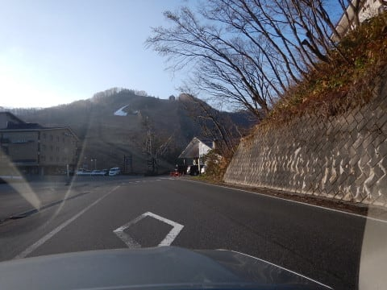

そして．

高天ヶ原も，山頂から滑れなくなり．

この写真の右下の，短いトリプルリフトだけが

滑れるようです．

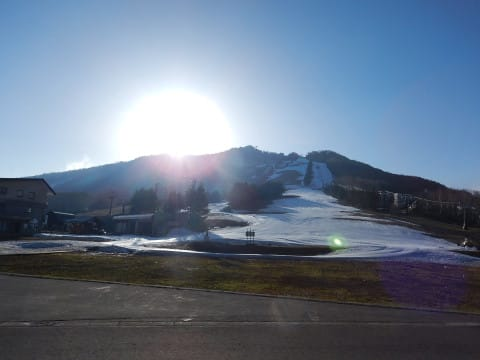

あぁ…まだGW始まったばかりというのに…

一の瀬ファミリーもタンネもダイヤも寺子屋も

滑れないのか…（泣）

で．

やってきました，焼額っ！

それも．今日は朝2時（深夜といった方が正しいのでは？）起きで

早朝営業に間に合うようにやってきました！

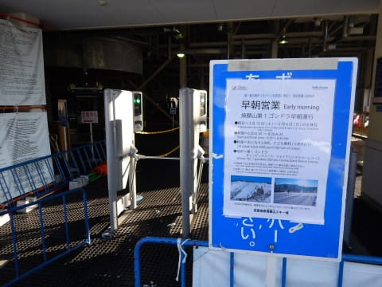

…が．

案内板を見て．

なに～っ！！！？？

早朝営業は今日で終了！？？？？

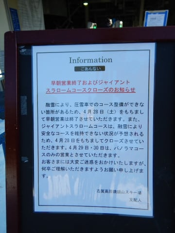

…そして，GSコースも今日で終了っ！！！？？？

ががががーーーん！！

なんてこった…っ！！

明日以降は，パノラマコースしか滑れないのか…

ってことで．

ゴンドラに乗ると…

もう，雪残ってないですね（涙）

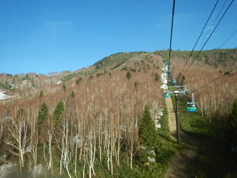

オリンピックコースも，雪が全く残ってません（泣）

今シーズン，雪が残っていればGWまで

オリンピックコースをオープンする予定

だったのに…（遠い目）

そして，ゴンドラから見たGSコースは…

なんじゃ，こりゃ～っ！！

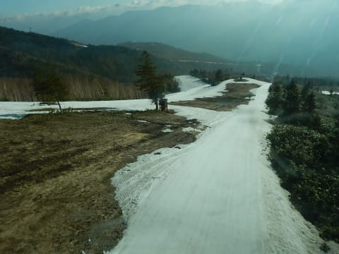

これは…紐ゲレンデ状態！？？

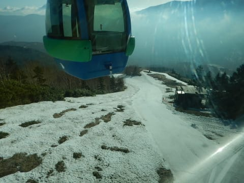

うーむ．

今日で今シーズンラストの早朝営業．

GSコースじゃなくてパノラマコースに

なった意味が分かる…

で．

山頂に着くと…

雪，減りましたね…（泣）

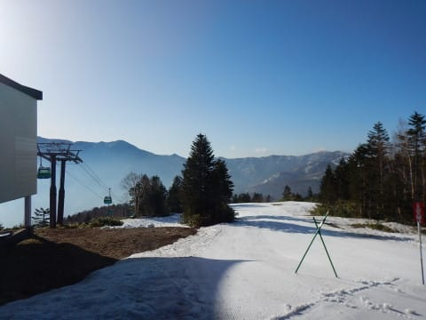

そして，山頂の気温は0℃～+1℃．

をを！！

意外と冷えてるよ！

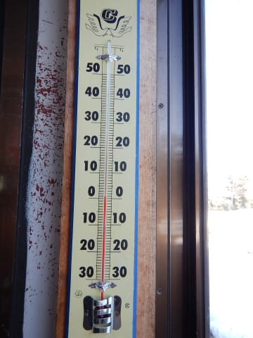

早朝営業をやっているパノラマコースへ

向かいますが…

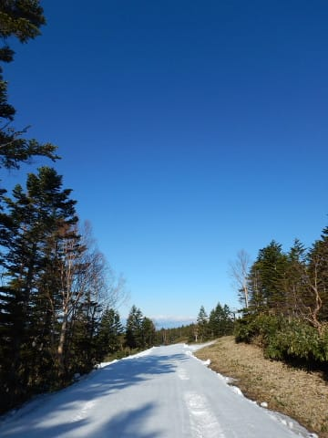

うむ．

パノラマコースは，雪がまだ結構残ってます！

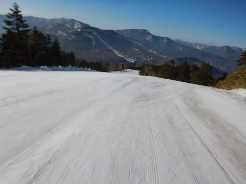

そして…

シマシマっ！！

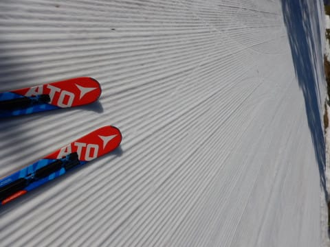

気温が低かったので，雪もしっかり硬くて

意外といい感じ！

白樺コースと別れるあたり，ちょっと幅が狭いところも

あったけど…

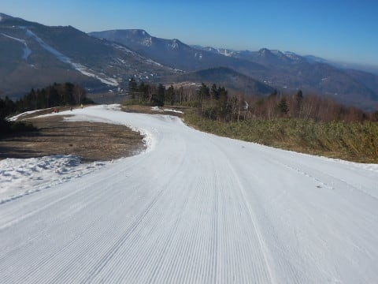

でも，朝イチはかなり気持ちいいよ！！

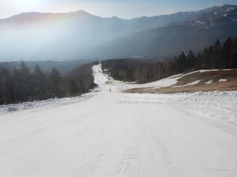

いやーーー．

来てよかったっ！！

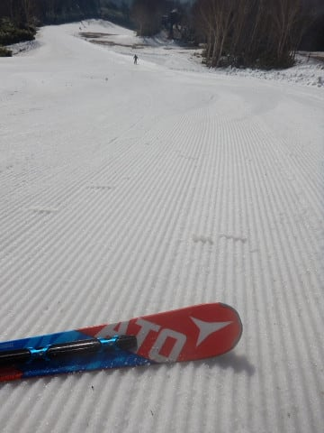

4ロマ山頂付近も，まだ結構幅があるし…

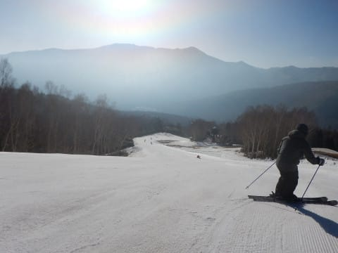

1ゴンに戻る部分も，多少幅が狭いけど．

まだ雪の厚みもあるし．

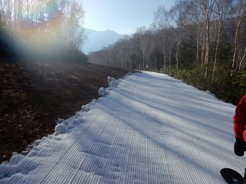

…でも．

第3高速をくぐってから1ゴン乗り場までは，

ちょっと10月のYetiを思い出す感じ…

とはいえ，早朝は雪も締まってるし．

もっと壊滅的状況を想像してたので．

意外と結構楽しめる感じ！！

…でも．

早朝営業が終わるころには．

気温は+3-4℃と低いものの．

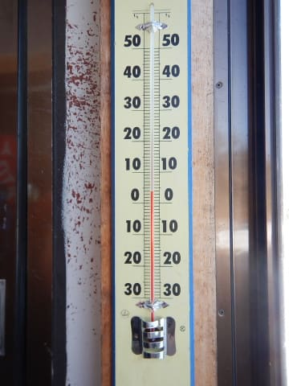

強い日差しで，雪が緩んできました…（涙）

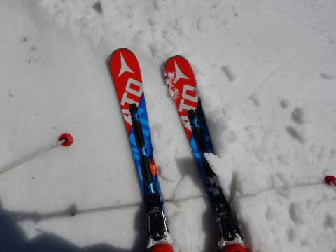

ってことで．

通常営業の8:30にオープンになった，GSコースへGo！

…まだ人が滑ってないので，シマシマが残っている

GSコース．

ゴンドラ降りたすぐの辺りは，まだマシですね…

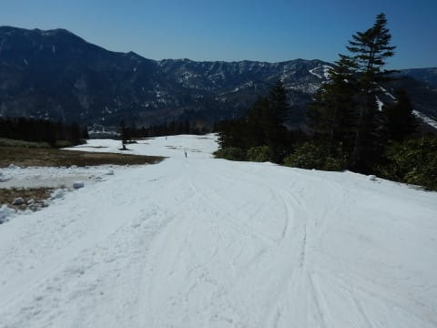

ゴンドラをくぐるあたりまでは，

まだ何とか…

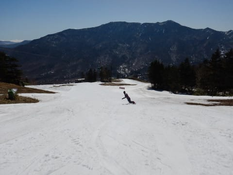

しかし．

ゴンドラをくぐると…

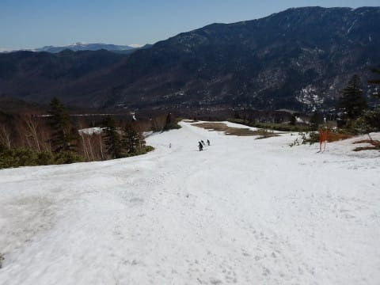

いつもはコブになってる3尾根側に

誘導されて．

コースがちょっと狭くなってきます…

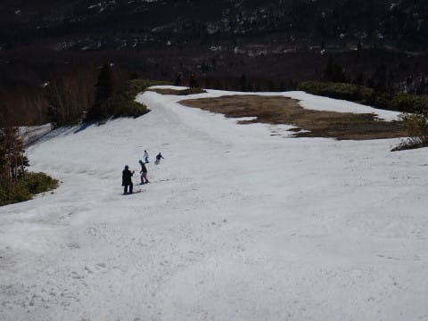

そして．

そこからしばらく降りて…

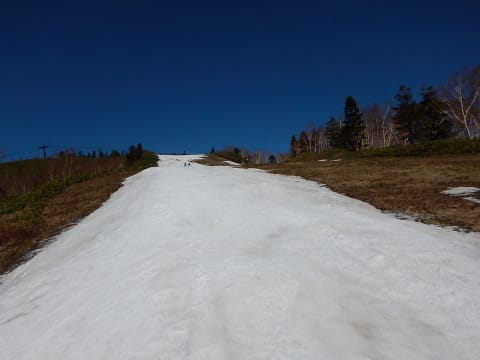

GSコースを良く滑っている人ならわかる．

コース突き当りを右に曲がっていくところは…

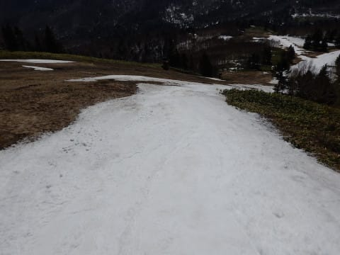

うむ．

かなり狭いね…（泣）

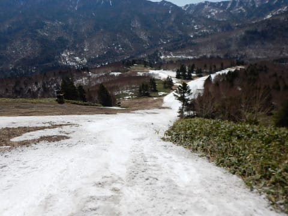

やはり，この部分が一番のボトルネックか…

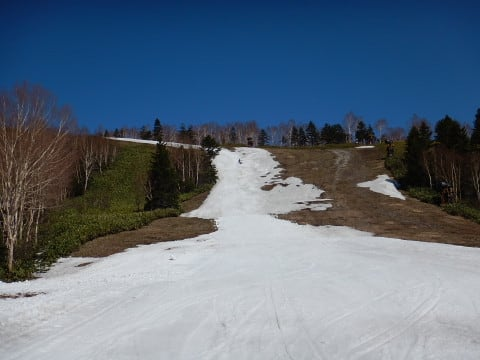

まぁ，今日でGSコース終了というのも

納得．

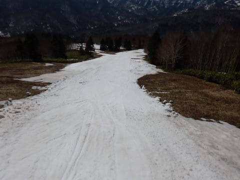

迂回コースはまだマシだったけど．

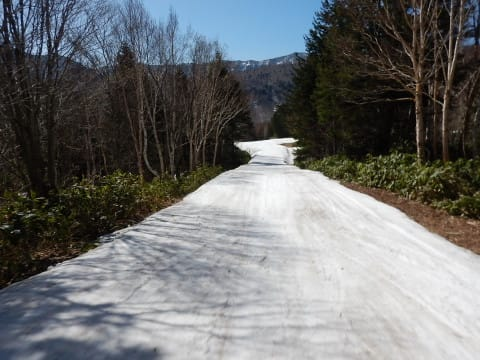

一番下の部分は，もう廊下状態ですね…

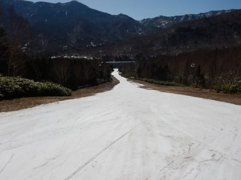

でも．

まだ，朝イチは良かった．

まだ，この状態はマシだった．

時間がたっていくと…

コースが一番細くなっている部分．

…これは，もうかなり厳しいのでは？？

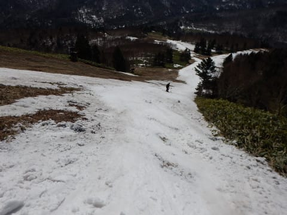

雪が削れて，やばい感じに…

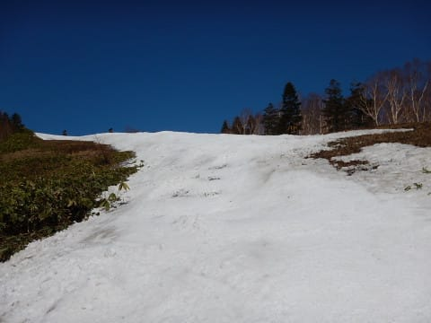

だもんで．

焼額スタッフ，人力でコースへ雪投入開始っ！

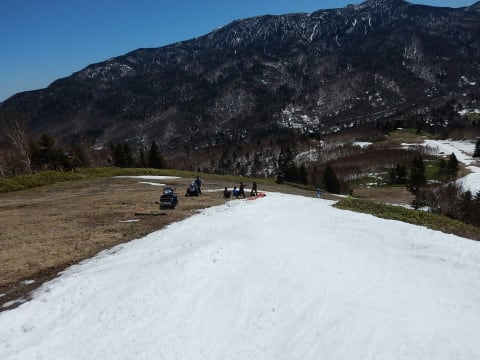

素晴らしい…

今日で終わりのコースなのに，ここまで

人手をかけてコース補修するとは…

素晴らしい！！

これでなんとか，今日一日は

ぎりぎり滑れる状態をキープしましたが…

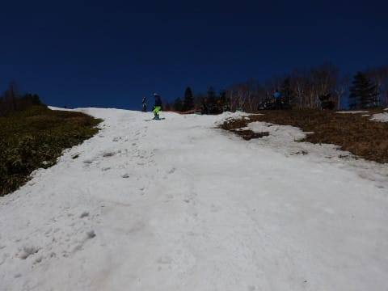

まぁ．

でも．

このGSコース．

やっぱり今日で営業終了が妥当ですね…

ってことで．

まだコースがまともなパノラマコースをメインで滑りますが．

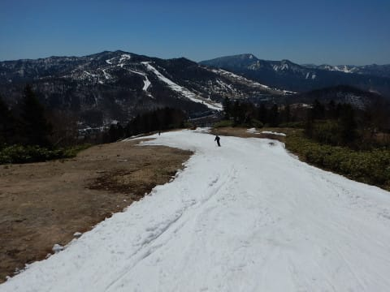

ここも，この写真の1か所．

白樺コースと別れた後の落ち込み部分．

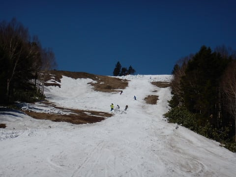

この一か所だけなんですが．

ここの雪が薄くなってきました…

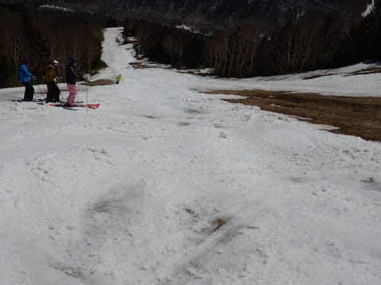

だもんで．

ここも人力投入！

さすが焼額！！

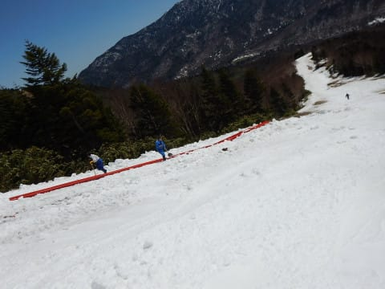

ここまで手間をかけてコース維持

するとは…

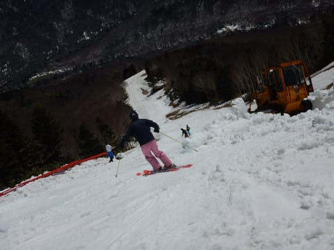

しかし．

最高気温は+12℃と，先週より低めだったとはいえ．

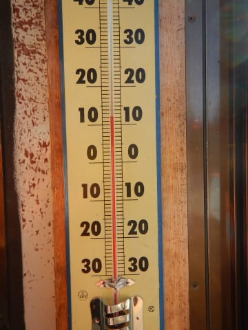

でも，強力な日差しで雪解けが進み．

雪の投入スピードと融けるスピードがが

同じくらいのような気が…

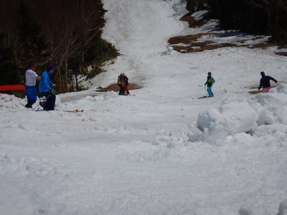

でも．

この一か所以外はまだそこそこ滑れましたよ～！！

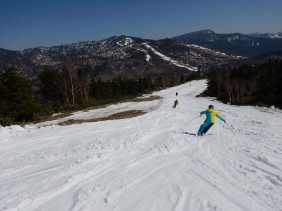

とりあえず，午後2時ごろまではこんな感じでした…

それ以降のレポートは，[後半](e763c6da635c4451c5616276bca76294f.md)に続く！
