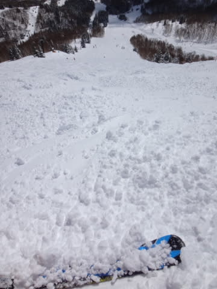

# 3月22日，3連休中日の志賀高原は…朝イチはもう，超ウハウハ最高パウダーだったのだ！…が．

📅 投稿日時: 2014-03-22 23:37:45

🏷️ カテゴリ: [2014スキー滑走日記](c992167609b6415052179ee69ea1ea7d8.md)

うむ．

今日はですね～．

朝から大量に雪が積もって…

ぱふぱふ！

ぱふぱふ！

もふもふ！

って感じで．

もう，私の日ごろの行いの良さ満開の←なんのこっちゃ？

最高の午前中でした！！！！

とりあえず．

朝イチの山頂の気温は…

[予想](e3057fecd255bc715dcf7b5f9e69e02af.md)通り，マイナス10度！

冷え冷えですな～．

で．天気は．

これも予想通り，ちょっと朝のうちは雲が残ったけど．

でも．

雪質は冷え冷え最高！

そして．

昨晩から，30cm以上の積雪があった今日は，

当然狙うのは圧雪バーンではないのだ．

パフパフのコースを狙うのだ！

オリンピックコースは，30cm，膝下パフだぁ！！！

それも，3月と思えない軽さ！！

最高なんですけどっ！！！！！

さらに，9時過ぎには晴れ間も見え…

ふはははは！見よ！私の日ごろの行いの良さパワー！←なんのこっちゃ？

ふははは．

この日差しの中．

よし！これから…もっとぱふぱふするぞ～っ！！

と，思ったら．

あら？

人が増えてきた…

…

…

そして．

いつもより早い午前9時半過ぎには…

がーん．

ゴンドラ10分待ち…(涙)

ゲレンデには人も多く…

午前11時ごろまで，ゴンドラは10分待ちが続いたけど．

焼額のいつものパターンで．

11時半には，ゴンドラががらがらに！

そして，午後にはこのままゴンドラ待ちが

なくなるんですね～．

ってことで．

まだまだ，コース上いろんなところに残っている新雪を

楽しんで．

まー，

気温はそれほど上がらず，昼間もマイナスをキープしては

いたものの．

さすがに昼間は，強い日差しでちょっと雪は緩んできた

かな～．

んでも．

昼ごろまで，雪質はそこそこ良いなぁ…

…と，思っていたところ．

…

新雪が積もった日の，午後の常として．

え？

あれれ？

うぎゃー！

圧雪コースも，全面コブコブですかっ！

まー，コブはキライじゃないから良いけど．

コース全面コブって，これ，

なにかの修行ですか？？

何かの報いですか…？(涙）←日ごろの行い良かったんじゃないの？

…って感じで．

今日は．

晴れて，朝はこの時期としては軽い最高の

新雪がチョーーー気持ちよい日だったんだけど．

午後はスキーヤーの根性と体力の限界を試す

全面コブ斜面化という，

なかなかに激しい一日だったのでした…

PS.

ナイターはしっかり締まっているのに，

エッジがこの上なく良い具合に噛み．

自分がむちゃくちゃ上手くなったのか～！？

…って，勘違いしてしまうほどの超官能的な

ウハウハバーンだったので．

明日の朝イチも最高に違いない…

＃昼にはあったまって春の雪になっちゃうけど

## 💬 コメント一覧

### 💬 コメント by (aqura)
**タイトル**: 天気、最高…＼(^o^)／
**投稿日**: 2014-03-23 06:03:43

予報通りの最高の天気でしたね。skier_s様の愛車の真ん前にうちの車を停めて、焼額山から奥志賀、一ノ瀬、寺子屋、西舘等々、リフト終了まで遠征してました。しかし、こぶを滑れない私にとって、修行の１日でした(-.-#)

日曜日は、締まって私好みのゲレンデかなぁー(^^*)

楽しみです。

### 💬 コメント by (Skier_S)
**タイトル**: aquraさま
**投稿日**: 2014-03-24 01:12:10

帰宅が遅かったので，コメント遅くなりました…

すみません．

いやー．

土曜，天気は最高でしたね！

午後のコブはいただけませんでしたが…

日曜は一日荒れずにいいコンディションでしたね！

もっと気温が上がる予想が，土曜と同じ程度の

気温に収まるとは…

こんなコンディションで滑れるのは，これで

今シーズン最後かも…

