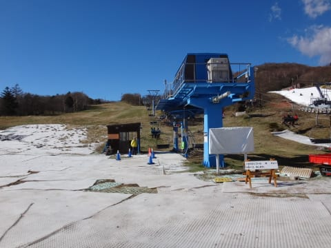
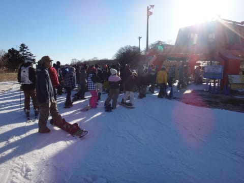

# 2015シーズンオープンから一か月…11月15日のイエティの状況は？？

📅 投稿日時: 2014-11-16 00:00:12

🏷️ カテゴリ: [2015スキー滑走日記](c09ea645cfc085f86dfcd80f49599dd89.md)

ということで．

今日は，予告通り，行ってきましたよ～．

イエティに．

えー．

今日は朝から晴天！

Yetiに向かう途中から，富士山がくっきり見えますね～．

んで．

イエティのそばに近づくと…

車の外気温度計は1℃！

うむ．

本格的に冷え込んでそうですな～！

ってことで．

今日も，オープン前に並んで，ゲートオープンと

同時に入場するわけですが．

…そうそう．

先週から，リフト料金が1000円値上げしてます（涙）．

うーむ．

これに，駐車場1000円+有料道路510円がかかるので，

結構痛い…

ってことで．

入場すると．

日陰は白く霜が降りていたので．

…昨晩は，結構冷え込んだようですね～．

その冷え込みおかげで．

昨日から，アイスクラッシュだけではなく，

人工降雪機も動かしているようです．

んだもんで，コース幅は結構一気に広がってますよ～！

アイスクラッシュじゃない，人工降雪の雪は

ちょっと柔らかめなので．

ところアイスクラッシュと人工降雪が混ざり，

ところどころ硬かったり，柔らかかったりの

微妙なコンディションでしたが…

んでも，朝イチ．

人がいない，コース幅も広がったコースを，

飛ばしまくりたい放題！

いやー．

オープンから1時間半，

朝9時半くらいまでは，かなり人が少ないコースを

飛ばせましたよ～っ！！

天気も良く，富士山はすっきり見えてるし…

リフトの向こう側に，はるか伊豆大島まで見えてます．

いやー．

天気も良く，空いていて．

オープン1時間半の9時半でも，この程度の混雑．

いや～．

晴れのYetiにしちゃ，珍しく

空いてていいよね～，

って感じで．

9時半まではリフト待ちもこんな感じでがらがら．

10時半には，ゲレンデの人口密度もちょっと上がり，

リフト待ちも増えて来ましたが…

でも，リフト待ちはせいぜいこの程度．

コース幅が広がったので，ゲレンデの人口密度も

先週までほどはひどく感じません…

11時過ぎくらいには，リフト待ちも5分近くになり，

やっとペアリフトが動き出しました．

でも．

終日ペアリフトの待ち時間は0だったし．

昼を過ぎても，クワッドの待ち時間もこんな感じで

2-3分程度．

いやいやいや．

空いてて，いいなぁ…

…と，思ったら．

なぜか，午後に向かって混んでいく，このスキー場．

午後2時ごろには，ゲレンデの人口密度も上がってきましたよ～．

なぜ，夕方に向かって混んでいくのか？？

志賀高原と，パターンが違いすぎる…

ってことで．

リフトを一番待ったのは，午後3時過ぎだったかも…

でも，待ち時間はクワッドで3～4分，ペアリフトは

0だったので．

結構空いてましたね～．

ってことで．

夕方はこんな感じで，人口密度も高く．

雪も凸凹してきちゃったけど．

それでも，終日天気は良く．

コース幅は広がり，土が出てくるようなところもなく．

リフト待ちも午前中はガラガラ，

午後もそれほどひどいわけではなく．

朝方はちょっと寒かったけど．

気温も昼間は結構暖かく快適で．

気持ちよく滑れた一日でした！！

…ってことで．

これで．

約一か月間通い続けた，今シーズンのYeti通い，

今回をもって，終了（のはず）です…

## 💬 コメント一覧

### 💬 コメント by (komu)
**タイトル**: こちらもラストにしたい
**投稿日**: 2014-11-16 21:51:02

先週から料金かわってたのですね。

今日のイエティは終日曇りで気温が上がらずまずまずのコンディションでしたが、人口密度が高く2時に撤収しました。

さて来週から本番ですね。

くれぐれも行いに気を付けて下さい（笑）

### 💬 コメント by (Skier_S)
**タイトル**: komuさま
**投稿日**: 2014-11-17 05:32:26

土曜は空いてたんですけど，

日曜は混んでましたか…

とりあえず，来週に向けて行いに気を付けます！

