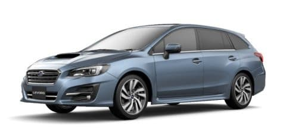

# プロジェクトX2始動？…レヴォーグE型の情報

📅 投稿日時: 2018-06-03 00:54:26

🏷️ カテゴリ: [車](cba0e8330b3f2ded7c1addfacc75d4547.md)

ってな感じで．

[前回](e9a0756864e16314de3b7cc7862aaf3a3.md)．

ついに，プロジェクトX2始動の時が来たか…？

と思ったので．

…まずはいろんな情報収集ですかね．

まぁ．

現時点で．

次世代主力戦闘機となる第一候補は

レヴォーグなわけなので．

スバルに車検見積もりに来たついでに．

6月から発売になる，今年の年次更モデルのE型．

この，LEVORG E型の情報を詳しく聴いてみました…

実車のデリバリーは7月ごろからになるようですが…

話を聞いたところ．

うむ．

アイサイトのプリクラッシュブレーキ制御が改良されて．

ブレーキの効き始めが多少早くなった…

っていう以外，

全く変更が無いようです．

ほとんどD型と変わらないようです．

外観も完全にD型のまんまです．

（スバルHPより…HPの情報ももうE型に変わってます）

E型のカタログと価格表ももらいましたが，

一番安い1.6GTのグレードが，オプションだった

撥水フロントガラスとリアフォグが標準になり

3万高くなった以外．

D型とE型で，お値段も全く変わりませんね．

ふむ．

E型で恒例の，お買い得特別仕様車．

1.6GT EyeSight Smart Editionってのが出ましたが．

1.6GTに＋6万円で，自動ハイビーム・リヤビークルディテクション・

フロントとサイドビューカメラがつく，このグレード．

うーむ．

BR LEGACYのE型で追加されたB-sportみたいに，

実質20万円以上安くなった…

というのから比べると．

お買い得感はそれほどでもないかな…

で．

E型とD型が変わらないとなれば．

D型でも全然OKなわけなので．

そろそろ旧型になるD型．

在庫処分ですごく安くなる車がありませんか？？

と，ディーラーに確認してみたところ．

私には不要な余計なオプションが大量について，

ものすごく高い車しか無いんですが…（涙）

オプションなしのE型の方がよっぽど安いよ…

ってなかんじの．

LEVORG E型だったわけですが．

うーむ．

どうしよう…

D型の中古が出てくるまで，

もう少し様子見かな…

## 💬 コメント一覧

### 💬 コメント by (ほっぽ)
**タイトル**: Unknown
**投稿日**: 2018-06-03 08:27:32

Ｓさん

やはりプロジェクトＸ２始動ですか！

最近、スバルディーラーもすっかり縁遠くなっていますが、

スバルも色々あってお買い得限定車を発売し難いのかもしれませんね。

Ｄ型で大幅マイナーチェンジしているでしょうから、

Ｅ型との差は少ないでしょうし、お買い得なＤ型や

距離の少ない中古車があれば、それも良いかもしれませんね。

私のレガシィも１年落ち、５５００ｋｍの中古車を買いました。

### 💬 コメント by (Skier_S)
**タイトル**: ほっぽさま
**投稿日**: 2018-06-04 04:55:38

D型の中古が値下がりしてくれると

いいんですけど…

意外と値崩れしなさそう．

ディーラー在庫車のお買い得車も，

高いオプションがいっぱいついていて

かなり高い金額でした（涙）

アイサイトもツーリングアシストにこだわらなければ

C型でいいんですけど…

ツーリングアシストでなければ今のBRレガシィで

いい気がしてます…

### 💬 コメント by (ほっぽ)
**タイトル**: Unknown
**投稿日**: 2018-06-04 06:44:39

Ｓさん

確かにディーラー在庫車はオプション満載の傾向はありますね。結果、大して安くない。(^^;

レヴォーグはＭＣでアイサイトが機能アップしていましたね。

確かにそれを見てしまうとＭＣ後のＤ型以降を狙いたいですね。

そしてＣ型以前ならＢＲレガシィでも大きな差は無い。

ＢＲレガシィの査定金額を考慮すると、

車検通してあと２年乗り続けるのが

一番お金が掛からない気がします。

今、ワゴン車は人気薄いですし、それの過走行車となると、

確かにＭａｘ３万円かもしれませんね。

別の見方をすると、距離ではなく状態重視の人が居たら、

Ｓさんのレガシィを個人売買などで安くＧＥＴできたら、

買った人はお得だと思います。

### 💬 コメント by (Skier_S)
**タイトル**: ほっぽさま
**投稿日**: 2018-06-05 02:09:16

そうなんですよ…BRレガシィに乗り続けるのが

一番いいのは分かってるのですが．

人生，そんな長くないと考えると．

いろんな車に乗っておきたいわけで．

そろそろ新しい車に乗っておきたいなぁ…

という欲求もあるんですよ．

私の車，程度がいいことを知っている方もいるので．

欲しいと言ってくださる方もいらっしゃるんですよ…

有り難いことに．

スキー板の場合は逆なんですけどね．

見た目は新しいのに，程度がすごい悪いことは

分かっているので．

私の中古は誰も欲しがらないという…（笑）

