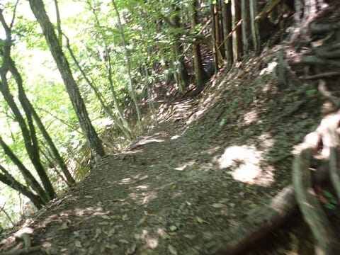
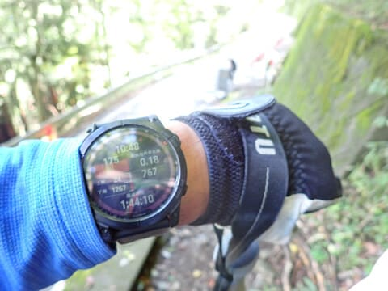

# 2023年9月，雲取山に登ってみた…ラスト，全力下山

📅 投稿日時: 2024-08-03 03:35:00

🏷️ カテゴリ: [登山・旅行](c1d637a11a25b457ac978d197adbdafc5.md)

またもや．

私の許可を得ないうちに，世界は勝手に

8月に入ってしまったようで…

一体誰が，何の権利があって，勝手にこの世を

8月に突入させたというんだ！？？←あなたが世の中を8月に

突入させる権利を持っているわけじゃないから

ということで．

2024年の後半戦も，もう早くも1か月過ぎ．

今年ももう残り5か月…

早い…早すぎる…

1日が50時間くらいあって，

1か月が300日くらいあって．

1年が3000か月くらい欲しい…←こうなったとしても，

人生50か月くらいだったら何も変わらないんだけど？

でも．

今年も残り5か月となると．

スキーシーズンが始まる10月下旬まで，

あと2か月ちょいじゃないか…

これだけ暑いと実感がわかないけど．

もうそんなにすぐに次のスキーシーズンが

やってくるのか…！！

ってなことで，本題へ．

雲取山の登山レポート，ラストです！

ーーー

下山スタートしてから40分弱．

ブナ坂分岐を過ぎ，尾根筋から外れ

ましたが．

尾根筋を外れると景色もよくないし．

あとは淡々と降りるのみなので…

ここからはちょいとスピードアップ！

幅広い尾根筋を外れ，コース幅は

狭くなり，ゴロゴロした石で足場も

あんまり良くないので，注意して

歩く必要があります…

猫の又とかいう分岐点を通過すると，

さらに斜度が急になり…

急な崖に，こんな感じの橋が架けられている

所とか，結構幅の狭いコースになってきます．

ちょっと写真がぶれていて見にくいですが．

結構な崖に張り付くよう，登山道が作って

あります…

この橋の上からの高度感はなかなかでした！

さらにしばらく，狭く，足場のあんまり

良くない道を下っていくと…

登りに通った道と合流！

七ツ石小屋の少し下の当たりになりますね．

週末というのに，ブナ坂の分岐からここまで

だれ一人としてすれ違わなかったので．

このルート，人気ないのかな…？？

合流点通過は，山頂から51分．

心拍数173って…

かなり追い込んでますね（笑）．

他に人がいないから，かなり飛ばしてます．

（周りに人がいるときはゆっくり歩くので…）

合流地点から先は，道幅も広くなり．

斜度も緩くなり，かなり歩きやすい道に

なってきます…

というか．斜度も急すぎず，重力に

任せて楽にハイペースで降りられる道です！

快適に下っていくこと，分岐点から15分ほど．

なんだかこんな看板が．

…え？ここ，平将門が敗走したルート

だったの…？

ここから先もひたすら下るけど…

登り返しもなければ，よく踏まれていて

すごく歩きやすいコースで．

ルートもいくつかあるからか，百名山に

しては通る人も少なく．

木立の中，いかにも山歩きという感じの

ルートを快適に下っていけます…

快適なルートをひたすら下ることしばし．

登山道の終わり，舗装路が見えてきました…！

心拍数が175になっていることからわかる

通り．

後半はかなり飛ばしましたが…

山頂からここまで1時間44分．

無事に駐車場に続く道路まで

戻ってきました～！

あとは駐車場まで，舗装路を走って…

山頂から1時間46分で駐車場へ到着！！

下山時刻は10時50分．

11時前に下山できるとは思わなかった．

…今回，本格的な山道だろうなぁ…と，

La SportivaのUltra Raptor MID GTXを

履いていきましたが．

これだけ足場が良くて斜度も緩めなら，

トレランシューズ履いていけばもっと

時間短縮できたかも…

ってなことで．

下山後にヤマレコのデータを見てみると…

距離22.1kmは，Garminさんより500mほど

距離が長いだけですが．

標高差が1790mは，ちょっとスマホの

GPSの高度の精度が悪いのかな…

当初計画では，標高差1566mくらいで．

こっちの方がGarminさんの記録とあってるので．

スマホの標高差はあんまりあてにならないかも…？

で．

Garminさんの記録を見ると…

うわ．

下山中の1時間47分のうち．

1時間ちょい，心拍数ゾーン5に入れてますね…

これは体に悪いレベルなので，

ちょっとやりすぎだったか…？

ってなことで．

今回登った雲取山．

山頂や登山中の景色がもう少し良ければ…

という惜しいところもあるけど．

手を使わなくてはいけない急登も

無ければ，全体的に斜度は緩めで

歩きやすく．

距離と標高差はかなりあるものの．

全体的に歩きやすいので，

スピードハイカーなら朝スタートで

午前中に下山できるくらいで．

天気が良ければかなり快適に山歩きを

楽しめる山でした～！

こんないい山が，東京都にあるんだなぁ…

## 💬 コメント一覧

### 💬 コメント by (1kamakura)
**タイトル**: Unknown
**投稿日**: 2024-08-03 06:04:27

江戸の秋

あと二ヶ月ちょっとでスキーシーズン突入？

月日が経つのが速〜い！

登山はスキーをするための体力作りの一環と、拝察しました。

ダイビング記事、私は楽しみです😊♪

### 💬 コメント by (Skier_S)
**タイトル**: ＞江戸の秋さま
**投稿日**: 2024-08-04 03:06:58

スキーシーズンまで，あと3か月切ってます！

っていうか，私のスキーのオフシーズンが，6月下旬から10月下旬まで，そもそも4か月くらいしかないので…（笑）．

最初はダイビングに行けなくて始めた登山ですが，今は完全にスキーのトレーニング目的になっちゃってます…

