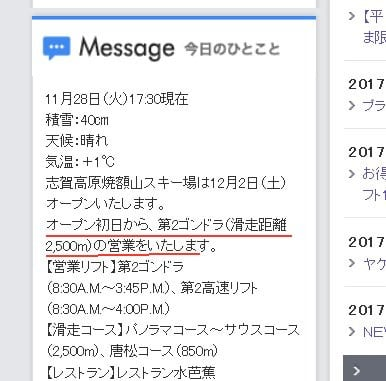
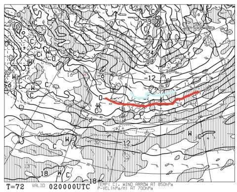
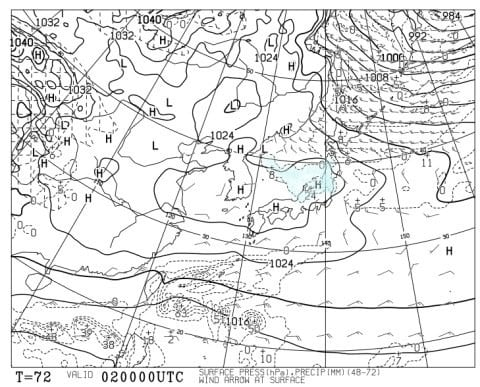
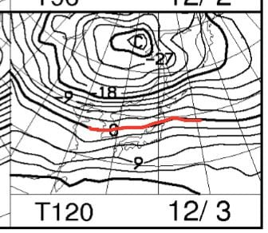
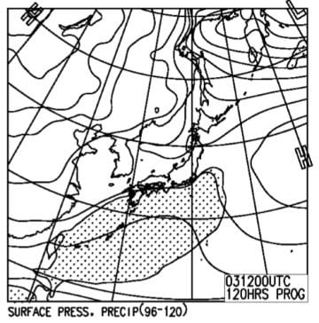

# 12月2，3日の週末の，志賀高原スキー場の天気は？…焼額オープンデーはまあまあ良さそうなコンディションかな

📅 投稿日時: 2017-11-30 03:23:28

🏷️ カテゴリ: [スキー天気予想](c6554f5c3c106093b511a8daae23757e8.md)

ということで．

今週末から，わがホームゲレンデの焼額が

オープンです～！！！

で．

そうなんですよ．

[GokuさんのBlog](http://red.ap.teacup.com/gokurakuskier/797.html)をみて気づいたのですが．

雪に恵まれている今シーズン．

なんと．

焼額がオープン初日からゴンドラ営業っ！！

（[焼額山ホームページ](http://www.princehotels.co.jp/ski/shiga/)より）

うおおおーーっ！！

12月2日から，2ゴン・2高が営業だとっ！？？？

オープン日からゴンドラ営業って…

何と…

なんて恵まれてるんだっ！！

＃でも，自分の過去の記録を調べてみると．

＃12月オープン日からの焼額ゴンドラ営業は，

＃過去10年で2007年12月，2010年12月，2012年12月と

＃3回あるので…意外と多いんだな

ってことで．

焼額ゴンドラも動くし．

かなり期待できるこの週末．

果たして，志賀高原の天気や如何に？？

…あ，焼額がオープンする今週以降，GWまで．

私は志賀高原にひたすら通い続けることになるので．

基本的にこの天気予想は，志賀高原特化型

極狭領域向けピンポイント天気予想と

なりますので，ご容赦を…

…自分が行かないスキー場の天気は，予想に気合い

が入らない…

ってことで．

2日，土曜日の850hpa予想図から見ますと．

うむ！

赤い0℃線は太平洋側まで下がり，

志賀高原には水色の-6℃線が！

これは．

この時期としては結構な冷え込みじゃないですか！

いい感じですな…

で．

土曜日の地上天気図は…

ありゃ．

残念．

冬型じゃないのか…

だもんで．

土曜日の志賀高原．

雪は降らなさそう…

ただ，気温は冷えるので人工降雪機は

ガンガン動かせます！

そして，日曜ですが…

850hpaの気温予想はこんな感じで．

うーむ．

0℃線が東北くらいまで上がっちゃいます…

志賀高原には+3度線が掛かっているので．

これで，降れば雨になっちゃうところですが…

日曜の地上天気図を見ると．

まぁ，降水が予想される網掛けが

志賀にかかっておらず．

雨は降らないでくれそうですね…

ってことで．

まとめると．

土曜：朝の気温は冷え冷え！焼額山頂で-8～9℃くらいか．

　朝は曇り．

　前日からの積雪はそれほどではなく，数日間

　天然雪が積もっていないので，圧雪はかなり締まり気味．

　スピードが出る圧雪かな．

　もしかしたら，前日の晩にわずかに降った雪が，

　うっすら圧雪の上に乗っているかも…

　人工降雪機があるところは，人工降雪が

　圧雪された固めのバーン．

　天気は朝は曇っていたものが，昼に向かって

　日が射すようになっていく．

　でも，日が射しても気温は低く，雪はしっかり

　締まったままで緩まない．

　12月としては冷える一日．

日曜：朝は…晴れかな？晴れていれば放射冷却で

　結構冷え込むかも．

　土曜からの天然降雪は無く，

　雪は土曜と同じ人工雪．

　午前中から雲が増えていき，曇り空に．

　でも，雪は降らないかな～．

　土曜より気温が上がり，昼間はプラス気温に．

　ゲレンデの雪はちょっと緩むけど，

　致命的なゲレンデコンディションの悪化は

　ないはず．

ってことで．

この土日も．

結構良さげな感じ…

## 💬 コメント一覧

### 💬 コメント by (かず)
**タイトル**: 今シーズンも宜しくお願いします
**投稿日**: 2017-11-30 09:53:11

2日に狙いを定めて昨日シーズン券届きました

僕としては全面だったら行く予定でしたので奥志賀オープンの来週にします　今年もパウダー予報期待してます

### 💬 コメント by (タカ)
**タイトル**: ２ゴンスタート‼️
**投稿日**: 2017-11-30 19:58:27

明日から結構冷えますね～来週の５日辺りに冬将軍チャンスがあるみたいですので自分はその後スタートですかね～。明日休みだからかぐら行っちゃうかもですが(笑)

### 💬 コメント by (Skier_S)
**タイトル**: 眠い…
**投稿日**: 2017-12-01 05:46:11

＞かずさま

あら．

今週末はヤケビゴンドラが動くというのに，

見送りですか…

まぁ，今週はパウダーは無いですけど…

では，来週お会いしましょう！

＞タカさま

明日から3日朝くらいまで冷えて．

3日昼～4日夜まで温まりますが．

その後，5日から8日くらいにかけて，

また寒気が来ますよ～！

…でも，5日以降も，志賀はあんまり天然雪が

降らなさそうな天気図ですが…

もし今日滑られているなら，どんな感じだったか

教えてください～！

