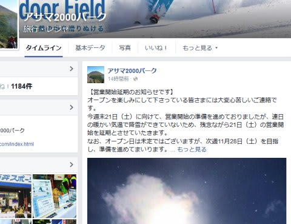
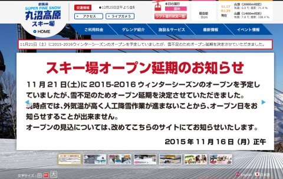
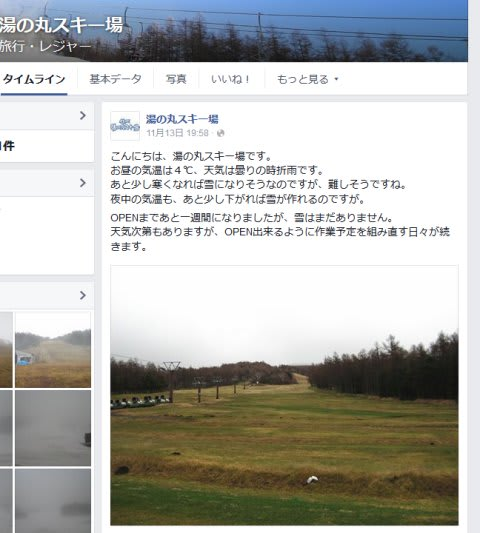
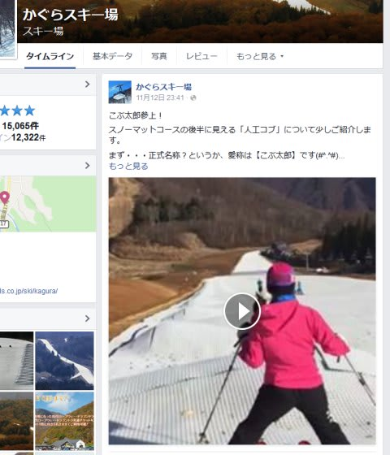

# な，なんてこったいっ！！！…11月21日オープン予定のスキー場，次々オープン延期（涙）

📅 投稿日時: 2015-11-17 01:46:38

🏷️ カテゴリ: [日記](cc4b5682fb7b8b144980957a978653fb0.md)

えー．

本日は，日曜のイエティの詳細レポートをするつもりだったんですが．

…あまりにもショックなニュースが続いたので，

そちらの記事を書くのだ．

ってことで．

タイトルにある通りです．

以上．

…

…

…って，終わらせたいくらいですが．

もう．

なんなんだか．

ふがーーーー！！！

って感じで．

せっかく，今週末から滑れると楽しみにしていた，アサマ2000．

[Facebook](https://www.facebook.com/pages/%E3%82%A2%E3%82%B5%E3%83%9E2000%E3%83%91%E3%83%BC%E3%82%AF/544741572217955)を見ると…

…

…な，

なぬっ！！！！

オープン延期だとっ！！！

いかんっ！

3連休は，アサマに行く予定だったのに…

…

じゃ，丸沼は？？

と，[丸沼のHP](http://www.marunuma.jp/)を見に行くと…

ななな，なんですと～っ！！！

こちらも延期で，オープン未定！？？

同じく[湯の丸](https://www.facebook.com/yunomaruski/photos/a.580219268659369.144953.580159975331965/1168566086491348/?type=3&theater)は…

…とても，あと5日でオープンできる状況ではないですね（涙）．

こーゆー場合でも，期待できる熊の湯は…っ！？

と，[熊の湯スタッフブログ](http://ameblo.jp/kumakumanoyu/entry-12096090442.html)を見たところ．

…まだ，19日オープン予定をあきらめてないようですが．

やはり，今週末のオープンは厳しそうなコメントが…

そして．

[かぐら](https://www.facebook.com/snowkagura/?fref=nf)は…

…オープン予定は全く変わってませんね．

雪が1mmも積もってなくても，ピスラボゲレンデとして

オープンする予定でしょうか？？

うーむ．

ってことで．

今週いっぱいも気温が高い日が続き．

続々スキー場がオープンするはずの今週末，

ほぼ壊滅状態となってしまったようで…（涙）．

うーん．

今週末もYetiかな…

そろそろ飽きてきたんだけど…（涙）．

ああ．今週末から，幅の広い中斜面で滑れると

楽しみにしていたのに…（泣）．

もうしばらく，廊下の緩斜面での修業が続きそうです（残念）．

## 💬 コメント一覧

### 💬 コメント by (いか)
**タイトル**: Unknown
**投稿日**: 2015-11-17 20:37:20

どんどん後ろ倒しになりますね(´△｀)

天然雪だといつになることやら…

私は釣りに行く期間がどんどん長くなるのですが(笑)

### 💬 コメント by (mae)
**タイトル**: Unknown
**投稿日**: 2015-11-17 22:04:59

後ろ倒しになるなら、その分だけ雪ももってシーズンも伸びればいいんんですけどね～

シーズンに入ると週末は嫁から母子家庭だと咎められてるので、それまでは家でじっとしてます(^^;

### 💬 コメント by (Skier_S)
**タイトル**: どんどん後ろ倒しに…（涙））
**投稿日**: 2015-11-18 00:46:10

＞いかさま

あー．

釣りですか…

私は釣りをやらないので．

ひたすらYetiで修行（緩斜面に耐える精神面の）です．

＞maeさま

いやーーーーー！

ホントにそうですよね．

GWすぎて，6月くらいまで滑れたらいいんですが…

焼額も，12月第1週にホントにオープンできるのか…

来週以降の冷え込みに期待です！

### 💬 コメント by (まいる)
**タイトル**: 初めてコメ
**投稿日**: 2015-11-18 19:30:44

はじめまして、初めてコメントします。

実は、このブログみて昨年アウトバックBRMのE型を買ったんですが・・

11月なのにあり得ない暖かさですね(--;)

### 💬 コメント by (Skier_S)
**タイトル**: まいるさま
**投稿日**: 2015-11-19 00:24:12

初コメありがとうございます．

プロジェクトX時代から読まれているんですね（＾＾

しかし，去年BRM購入って，ぎりぎり滑りこみですね（笑）．

充実のスバル車ライフをお送りでしょうか？？

しかし…

11月というのに暖かすぎです（涙）．

早く雪よ降れ～！！

