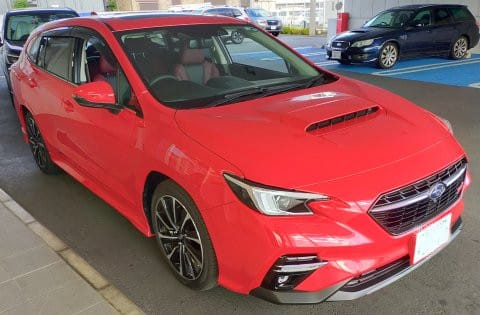

# SUBARU LEVORG STI Sport R 2.4Lに試乗してきた

📅 投稿日時: 2022-07-11 05:00:09

知らぬ間に，早くも我がVMG LEVORG君が

そろそろ購入から4年になるわけですが．

4年経つのに，走行距離が9万9500kmと，

やっと10万kmに達するかどうか

という程度．

普通なら1回目の車検で10万km近く

走ってしまう我が車としては，歴史的に

少ない走行距離なのですが…

とりあえず，4年目の12か月点検に

車を出したついでに，かねてから試乗したいと

思っていたLEVORG2.4Lに試乗してきました～！

準備された試乗車は，真っ赤な目立つ

ボディ―カラーでした…

一応センターに11.6インチディスプレイは

着いてるけど，

試乗したのはアイサイトX無しの，

通常アイサイトのモデルでした…

まぁ，オプションの11.6インチディスプレイ

着けたら，あんまり内装の違いは

分かりませんね．

メーターがフルディスプレイじゃなく，

針の従来メータ＋センターディスプレイに

なるので，そこは違いますが…

まぁ，普段からメータ表示にするだろう

自分にとって差は無いかな．

とりあえず，シートやインパネ部分は

1.8Lと全く変わりません．

…あ，強いて言えば．

メーターの真ん中のディスプレイに

ブースト計が出せる！

…ってのが，1.8とのわずかな違いかな？

そして，走り出すと…

おっと．

同じ2.4LのWRX S4に比べればかなり静か！

そして，ステアリングも軽め．

モードセレクタがNormalモードでも，

S4のConfortよりちょっと軽い感じ．

ただ，ふわふわした軽さじゃなく，

しっとりした手ごたえで，

良い反力の出方があり，

フリクション感が少ない，

かなり高級な感じのなめらかな軽さ．

これ…

リアルにステアリング系のフリクションを

メカニカルに削ったのか，

あるいは電動パワステのプログラムを

追い込んだのか…

多分，フロントサスは直進性を高めるため

多めのキャスター角をとってるジオメトリ

だと思うので，どっちにしろ強めの

アシストがいるだろうから…

おそらくプログラムを追い込んだ？

愚直にフリクションを減らそうと思うと，

すごいコストがかかるはずだし．

スポーツ系の車って，時折妙な反力を

あえて発生させて，強制的にニュートラルを

維持させるEPSプログラムの車もあるけど．

そんな妙な重さがない，ナチュラルに

すっとステアリングが切れていく，

いい感じの反力の出方．

…1.8Lって，ここまでステアフィール

良かったかな？？

2.4Lでエンジンが重くなった分，

アシストのプログラムをちょっと変えて

きたのかな？？

そして，もう一つ驚いたのが．

歩道の段差なんかを乗り越える時．

私が普段乗っているVMG LEVORGの

つもりで覚悟して段差を乗り越えると…

その予想の数分の1のショックで段差を

乗り越えていく！

あれ？

新型の1.8Lに比べても，フロントサスの

段差の乗り越えが滑らかになってる

気がする！？？

2.4Lでサスセッティングを進化させてきたのか，

あるいはB型で1.8Lも2.4Lもセッティングを

変えてきたのか…？？

またはエンジンの重さがなせる上物の

安定感のせい？

とりあえず，フロントサスの突き上げの

マイルドさは，かなりのレベルだと思う…

そして．

肝心なエンジンの方は…

アクセル開度が低いところでは

それほど驚きのトルク感は無いです．

というか，アクセルペダル操作に

対するトルク感のリニアリティが高く，

10km，20km，30kmと，狙ったスピードで

ピッタリ止める操作が楽にできます．

アクセル開度が低い領域でも，

回転数がほとんど上がらずスーッと

加速していくので，トルク感がありますね．

先代1.6Lのように，クッと回転数が上がって

加速させる…というシーケンスじゃないので，

快感度が高いです．

そして．

アクセル開度が大きい領域になると…

大排気量NAか？

というターボラグの少なさで，

「こんなに要らんわ」

というトルクが出てきます…！

私の乗っている2.0L LEVORGだと．

ターボラグがでかいので，

「とりあえず一回全開にしてから」

ブーストが出てくるのに合わせ，

アクセルを戻していくという

お作法が必要なのに．

この2.4L．悔しいほどラグが無い…

数値上の馬力・トルクは先代2.0Lの方が

上だけど．

ゼロスタート加速や追い越し加速は

ラグが無い2.4Lの方が速いんじゃないかな…

で．

やっぱりアイドリングストップが

ついているのに驚きが…

かなりブーストを掛けた直後なのに，

すぐエンジン止まっちゃって，

ターボの冷却大丈夫か？？？

と心配になる私は古い人間なんだろうか…

とりあえず．

走る・曲がるの気持ちよさは

スバル車の中でもぴかイチ．

激しく物欲を刺激する車でした…

うーん．

欲しい．

欲しいけど…

500万は払えんな（涙）

## 💬 コメント一覧

### 💬 コメント by (しんちゃん)
**タイトル**: 最近のターボの性能向上
**投稿日**: 2022-07-11 22:32:29

最近のクルマは、ターボの性能がよくなりましたよね。ターボラグをほとんど感じなくなってきているし、低回転からいいトルク発生するし。

ターボインペラーとかベアリングの材質もよくなってきてるんでしょうね。あたり前のようにターボ車にもアイドリングストップついてますよね。

技術の進化がすごい代わりに、値段も高くなりましたね（涙）

### 💬 コメント by (Skier_S)
**タイトル**: ＞しんちゃんさま
**投稿日**: 2022-07-12 02:06:40

欧州のダウンサイジングターボが流行って以降，電子制御ウェイストゲートバルブの緻密な制御と

ブーストの立ち上がりの速さ(その代りターボ容量は小さいけど…)が一気に進化しましたよね…

あんまり材質は変わって無くて，CAEによる設計手法の進化でタービンやインペラの効率を

かなり上げている感じです．

2000年を過ぎたあたりかな？昔は油冷だったターボベアリングが水冷になりターボの冷却を気にしなくても

済むようになったのは…

昔のグローがついていた車を知っている世代には，ディーゼルターボでアイドリングストップとか，

初めて聞いた時はびっくりしたもんです…

グローを知っている人と同じくらい，手動チョークとかセミオートチョークの車に

乗ったことがある人はもう絶滅危惧種なんだろうなぁ…

