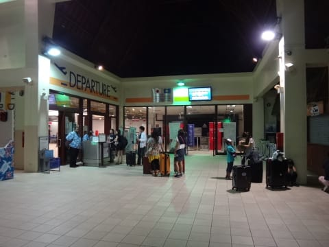

# 2014年10月，小学生の子連れでパラオへダイビングに行ってみた，その38…ファイナル，帰国．

📅 投稿日時: 2015-10-05 02:36:10

🏷️ カテゴリ: [ダイビング日記](ce3a7a8d424d112fce83ee85c81a0e344.md)

ということで．

長らくに渡ったパラオ旅行記．

本日の記事で，ようやく本編は終了となりますが．

…しかし．

長かった…（感嘆）．

今年の7月から連載を開始して，約3か月…

途中，夏の志賀高原やキャンプレポートなどが

入ったので，かなり長い連載になりましたが．

うむ．

まさか，この，2014年10月のパラオレポート．

2015年10月になってやっと終わるとは（笑）．

…確か，2014年10月10日に出発したこの旅行．

ほぼちょうど一年後の，10月5日まで書き続けるとは

思わなかったよ…

ってことで．

1年前のネタ，いざ，最終回！

---

ということで．

最終日，帰国日になりますが…

というか．

昨日夜9時前に寝たというのに．

12時にホテルピックアップという無謀な時間．

…2時間ほど寝ただけで．

まだ乾ききっていない器材を回収し…

眠い目をこすりつつ，ピックアップのバスに乗りこみます．

そして…深夜0時45分，空港到着．

パラオは，深夜発の飛行機が多いので，

この時間でも空港の人は多いなぁ…

で．

パラオ出国税＆グリーン税合わせ，一人当たり＄50を払います（高い…（涙））

ガイドブックとかには「現金のみ」と書かれてますが，

この張り紙にあるように，クレジットカードでも払えるようです．

ってことで．

一人当たり$50を払ったら，搭乗待合室へ…

搭乗待合室も，人であふれかえってますね～．

でも．

ここでは，ダイビングで一緒だった人とたくさん出くわすので．

いろいろと会話が弾み，時間がたつのがあっという間．

娘も，船の上で優しくしてくれたお姉さんと再会し，

深夜というのに寝ずにおしゃべりしてました…

そして，1時45分，ボーディングタイム！

飛行機大好きな娘は，飛行機に乗ってしばらくはハイテンションで…

いろんな説明を読んだり．

CAさんから配られるおもちゃをもらって喜んだりしていましたが…

なにぶん，深夜2時半発の飛行機．

機内食が配られる頃には，寝ちゃってました…

…娘が楽しみにしていた，「飛行機のおべんとう」ですが．

こんな夜中に起こして食べさせるのあれなので．

私の胃袋におさめました…

という感じで．

わずか4時間のフライトで，

朝6時半には，成田到着！！

…ああ．

終わったよ．

終わっちゃったよ…パラオ旅行．

夢のような時間だった…

そして．

なんと悲しいことに．

今日は平日．

…仕事があるんです（激泣）．

ってなわけで，急ぎ自宅へ戻り．

朝9時には，いつも通り出社して，

一日仕事をこなしたのでした…

＃朝からフルスロットルで働かされ．

＃昼頃には，「あれ？今朝までパラオにいたんだっけ？」

＃という感じで…帰宅は深夜（涙）死ぬかと思った．

（完）
