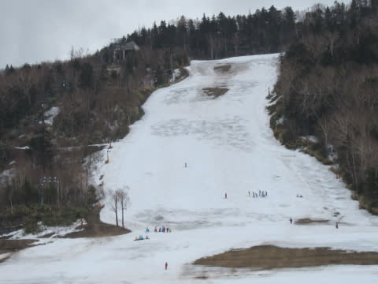
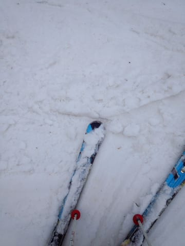
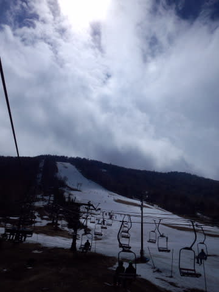
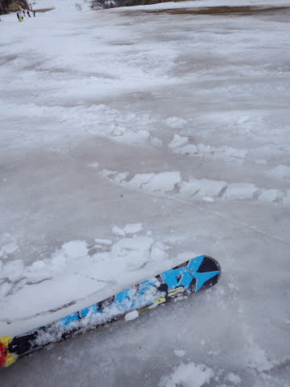
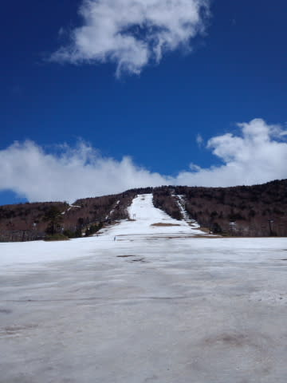
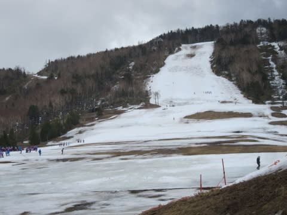

# 4月17日，日曜の志賀高原・一の瀬スキー場は…雪解け激しく，午後は強風でリフト運休（涙）．

📅 投稿日時: 2016-04-18 01:20:25

えー．

久しぶりの家族スキーだった本日．

…いろいろ寄り道して帰ったので．

本日も，なぜかこんな時間に…

もう，1時過ぎてるよ…（泣）．

ってことで．

今日も，日曜夜恒例の速報モードにて…

えー．本日．

曇り空で始まりましたが．

…朝から，かなりヤバ気なゲレンデ状態なんですが…（泣）．

一晩で，かなり雪が解けた気がするのですが…っ？？

で．放射冷却の冷え込みはなく．

さらに，朝から気温は10℃程度と高かったので．

朝イチから，ゆるい感じの雪でした…（涙）

朝のうちは，晴れたり時折ポツポツ降ったり…

という感じの天気だったのですが．

午前11時過ぎには，結構本格的な雨になり．

ゲレンデはところどころ水浸しに…（泣）

だもんで，早い昼ご飯がてら，晴れ待ちをしていたら…

ををっ！！！

12時過ぎには，すっきり晴れてきましたよっ！！

いや，これなら滑りに行こうっ！！

…と，思ったら．

なんということだ．

強風で，リフトがすべて止まってしまいました…（激烈涙）．

そして．

午後2時近くになっても風は弱まらず．

全くリフトが動く気配がなかったので．

本日は，午後2時ごろに涙をのんで帰宅しました…

悲惨な一日だったなぁ…（涙）．

あぁ…

しかし．

雨＆強烈高温南風で．

昼ごろにはこんな感じになっちゃった一の瀬ファミリー．

…来週，正面バーンはもう無理だろうなぁ…

滑れても，紐コース状態か…

ヘタすると，下半分も迷路状態かも…

おそらく．

一の瀬ファミリー．

GWは無理っぽい…（涙）．

## 💬 コメント一覧

### 💬 コメント by (はなげ親分)
**タイトル**: 降参しました
**投稿日**: 2016-04-18 12:57:12

ステッカーありがとうございました。

あの後2本滑ったんですが、滑走可能な場所がを探しながら滑るのは「う～ん」だったので熊の湯に移動。

ところが全リフト運休(泣)

気持ちが萎え、松本で蕎麦を食べて帰りました。

このままでは終われません!!

GWは絶対滑る！

### 💬 コメント by (Skier_S)
**タイトル**: はなげ親分さま
**投稿日**: 2016-04-19 02:57:46

Gokuさんも熊の湯に行っちゃったようですが，

朝からリフトは動いてなかったようですね…

我が家も，1時半ごろにくじけて花見して帰りました（笑）

私もこのままでは終われません…

来週も滑るっ！！

