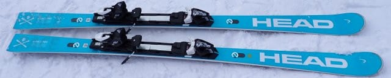
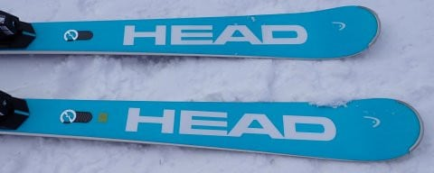
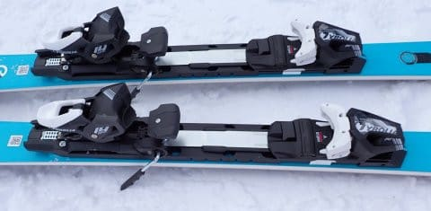
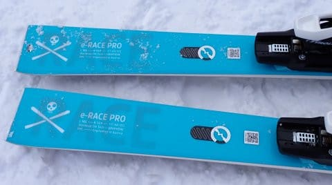

# 2024シーズンモデルのスキー板，試乗レポートその7…HEAD Worldcup REBEL e-RACE PRO

📅 投稿日時: 2023-05-26 01:45:03

🏷️ カテゴリ: [スキー板試乗](c0bd8048615710cee890e403a36cc9a2b.md)

そういえば．

Googleさんで，「志賀高原　ブログ」で

検索すると，ホテル銀嶺さんがトップで，

このBlogが2位なのですが．

「スキー場　ブログ」で検索すると，

あらゆるスキー場の公式サイトを

さしおいて，なぜかこのBlogが1位で

出てくるということに気づいてしまった

今日この頃，皆様いかがお過ごしで

しょうか（時候の挨拶）

うーん．

「お前のブログを見たいんじゃない！！

スキー場の公式のブログを見たいんだ！」

という怒りの声が聞こえてきそう…

ちなみに，「スキー　ブログ」で検索すると，

ブログ村のブログランキングが1位，

Amebaのブログランキングが2位に出てきますが．

このBlogが3位に出てきちゃいます…

個人ブログとしては，有名スキーヤーを

さしおいてトップに出てきてしまうのか…

うーん．

このブログががんばってるんだか，

前時代的なブログなんていうもので情報発信

しようとしている人が減っているんだか，

一体どっちなのか…←絶対後者．今どきの人はブログなんて書かないから

ってなことで，本題へ．

今日も2024シーズンモデルのスキー板の

試乗レポート．

今回もヘッド編です．

では，どうぞ～！！

〇HEAD Worldcup REBEL e-RACE PRO　165cm

小回りベースオールラウンド

e-RACEにはプレート違いで2種類あって，

こちらは強めのRACEPLATE WCR 14がついた

e-RACE 「PRO」になります．

長さ165cmでR=13.9と，e-SLシリーズに比べれば

ラディウスは多少大きめですが，でも13m台と

どちらかと言えば小回りベースと言える板．

滑ってみると…

e-SL RD EVOと同じく，これまでのHEADより

しなやかになった感じ…！

それも，フレックスが単に柔らかくなったと

いうのとは違う，いい意味でのしなやかさ．

たわむ前からエッジが捉えて板のサイドカーブ

なりに回ってしまうというより，エッジが捉えて

しっとりとたわんでから，たわみに沿って

回り始める感じがあります．

それでいて，フレックス自体が柔らかく

なりすぎたわけではなく…

最初はすっとたわむけど，その後に板に

しっかり感があって，簡単にはたわみきって

しまわない感じ．

板のばね感も結構感じて，ターン中に

板にしっかり圧が溜まる感じがあり，

切り替え時に圧がすっと解放されて，

気持ちよく板が走って切り替わっていく

感覚があります．

さらに，板のグリップもかなり強めで，

トップからテールまでの長いエッジが

しっかり効いている感があり，ターンして

いると165cmというよりは，もっと長い

板のような安定感を感じます…

プレートが強いからか，しっかりした

踏み応えがあるたわみ感．

その強さのおかげで，R=13.9ｍという

よりも，比較的縦目に落としていくことも

できます．

返りはそこそこあるけど，早すぎないので

小回り強制板ではないです．

サイドカーブじゃなくたわみで回る感じ

なので，たわませなければかなりロング目の

ターンまで行けるし，しっかりたわませて

いけば深い弧のショートターンまで行けて，

乗り手がかなり自由にコントロールできて，

ターン弧の自由度はかなり高め．

e-SLシリーズに比べれば，オールラウンド性は

高いです．

そして，フレックスがそこそこ強いので，

結構高速耐性もあります．

ただ，小回りの鋭さは，e-SL RD FISには

かなわないけど…

かなりスピードを出して攻める人で，

小回りベースのオールラウンドが欲しい場合は．

結構張りが強めなのにコントロール性が高い

この板，結構いいんじゃないでしょうか…！！

## 💬 コメント一覧

### 💬 コメント by (ひゃくりん)
**タイトル**: ブログ検索について
**投稿日**: 2023-05-27 09:12:49

ブログ検索順位はすごいですね。

毎日更新の効果でしょうか？

私はたまに、Google検索で

「スノーボード ブログ」で検索して、

自分のブログをクリックしています。

検索順位が少しでも上に行かないかなと

試していますが、ひとりぐらいじゃ効果はありません（笑)

### 💬 コメント by (Skier_S)
**タイトル**: ＞ひゃくりんさま
**投稿日**: 2023-05-28 02:41:26

今シーズン，12月以降は1度しか志賀でお会いできなかったですね…

でも，私もBlogいつも見てますよ～！（あんまりコメントしてないけど）

Blogは…かれこれ12年，ほぼ毎日書いていたのが効いてるんでしょうか…？

しかし，Webサイトのアクセス数はGoogle様のご機嫌如何で決まることに

Googleアナリティクスとか見てみると気づきますね…

このBlogはGoogleのおすすめに出ることが多く，どのくらいの人におススメとして表示されたかで

アクセス数が全然変わります…

### 💬 コメント by (ひゃくりん)
**タイトル**: Unknown
**投稿日**: 2023-05-28 14:56:35

>Skier_S様

ブログを見て頂きありがとうございます（笑）

焼額山に行くたびに、探していたんですが、

スノーボーダーからするとスキーの知識がないので、

スキーヤーはみんな同じに見えてしまうんですよね・・・。

4月にお会いできたのは奇跡的でした。

### 💬 コメント by (Skier_S)
**タイトル**: ＞ひゃくりんさま
**投稿日**: 2023-05-29 04:07:33

そうなんですね…スキーヤーは同じに見えるんですか…

だとすると，ウェアが変わっていたのによくわかりましたね！

まさに奇跡！？？

### 💬 コメント by (ひゃくりん)
**タイトル**: Unknown
**投稿日**: 2023-05-30 20:54:09

>Skier_S様

なかなか言いづらいんですが、

たまたま焼額山で知り合った人が

Skier_Sさんの知り合いらしく、

新しいウェアの特徴を教えて下さいました。

その情報が無ければ、分からなかったと思います。

奇跡が2回起きて、やっと会えた感じですね！

### 💬 コメント by (Skier_S)
**タイトル**: ＞ひゃくりんさま
**投稿日**: 2023-05-31 00:27:00

そうですね．焼額で知り合った人だと，私のことを知っている可能性は極めて高いですね(笑)．

貧乏な私はウェアは3－4シーズン使うので，来シーズンもウェアは変わらないはずです～！

また来シーズン，あのウェアを目当てに探してください．

あ，Yetiの時は汚れるのでぼろいウェアを着ていくと思いますが．

