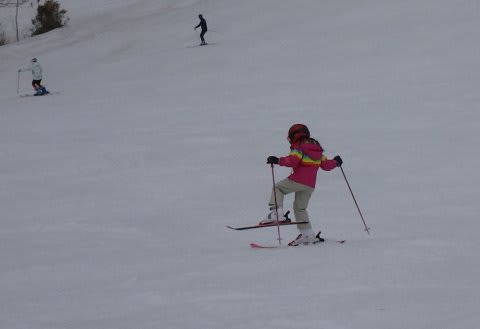
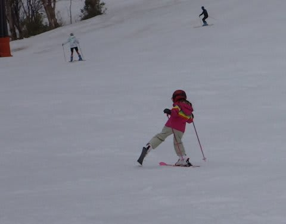
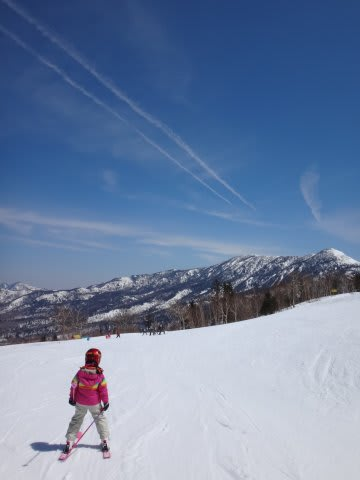
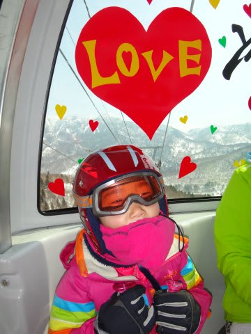

# わが娘＠6歳…片足スキーもパラレルも

📅 投稿日時: 2014-06-04 02:15:46

🏷️ カテゴリ: [日記](cc4b5682fb7b8b144980957a978653fb0.md)

ってことで．

昨日の続きですが．

ある日，

ゲレンデで何気なくたずねてみたわけですね．

私「片足で滑れる？」

娘「できるよ～っ！」

…という会話のあと．

…なんだ！？

ちゃんと滑れるじゃん…

かなり安定感ある滑りなんですけど…

…これだけ，ちゃんと片足で滑れる，ってことは．

私「足を揃えて滑れる？」

娘「できるよ～っ！」

な，なんと！

時々プルークスタンスが出るものの．

…大体パラレルスタンスで滑れてるじゃないかっ！

うちの娘とは，一緒に滑っているだけで．

何も教えてないのに．

幼稚園年長の年に，これだけ滑れるようになるとは…っ！

焼額ゴンドラも，それほど待つことなく

滑れるようになってきたし．

来シーズンあたりは，親子同じくらいのスピードで

滑れるようになるといいなぁ～．

（スキーラブ♪）

PS.

そのあと，

後ろ向き滑りも披露してくれましたが…

これはまだまだ，修行の余地があるな…

## 💬 コメント一覧

### 💬 コメント by (いか)
**タイトル**: Unknown
**投稿日**: 2014-06-04 19:27:11

あ、ぼくこの外足を上げてターンに入っていくのできません（笑）

パラレルもしっかり踏んで曲がっていていいですね(^^)

### 💬 コメント by (KENKEN)
**タイトル**: 上○愛子2世か？
**投稿日**: 2014-06-04 21:09:11

コブは自分も負けてるかもです。(悔しい)

我が娘も昨シーズンは10数回スキーに行き、同年代の子供達に比べると上手なレベルかと思いますが、Sさんの娘さんとはちょっとレベルが違いすぎます。

このまま上達すればオリ○ピックを目指せるかも？

追伸；お手数ですが、Ｇメールを一度ご確認頂けますでしょうか？

### 💬 コメント by (Skier_S)
**タイトル**: 娘もレジャースキーヤーに育てます（笑）．
**投稿日**: 2014-06-05 02:14:36

＞いかさま

外足荷重でしっかりターンさせようと思って，

山足踏み出しのシュテムをやらせてみたのですが．

予想以上にうまくできちゃってて，びっくりです．

これができると，パラレルもきれいに板を踏んで

曲がっていけるんですよね～

＞KENKENさま

メールのレスポンス遅れてすみませんでした…

うちの娘，コブは大好きなので，

かなり上達しちゃいましたね～．

KENKENさんの娘さんも，すぐに

上達しますよ～．

このころの1－2年での上達具合は，

大人の想像を超えるものがありますから！

…でも．

うちの娘は，私同様

「レジャースキーヤー」として

育てる予定です（笑）．

### 💬 コメント by (マルハバ)
**タイトル**: 次の冬は・・・
**投稿日**: 2014-06-09 10:24:29

これくらいは十分イケそうですね～

https://www.youtube.com/watch?v=oy3tBm2Omw0

それにしても、

コブ斜面をあれだけコントロールしながら滑れるのは

スゴイ！

ワタシよりゼッタイ上手い！（汗）

### 💬 コメント by (Skier_S)
**タイトル**: マルハバさま
**投稿日**: 2014-06-10 00:05:20

こぶ斜面はかなり攻めるように

なってきましたよ！

リフトの上からの注目を一身に

受けてましたね～．

まぁ，そんなにうまくならなくても，

私と一緒に同じペースで滑ってくれる

ようになってくれれば，それ以上は

求めません（笑）．

