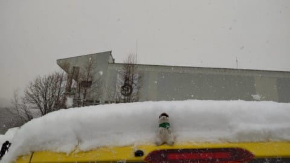

# 3月22日（火）の志賀高原特派員レポート…冷え冷え雪降り！夕方は晴れ！．そして今週日曜27日は液体が降る危機

📅 投稿日時: 2022-03-23 03:30:19

🏷️ カテゴリ: [日記](cc4b5682fb7b8b144980957a978653fb0.md)

ってなことで．

本日も志賀高原特派員から写真が

送られてきましたが…

今日は冷え冷えで，午後3時近くまで

曇り～雪降りの一日だったようです！

朝の気温は-3℃とそれほど冷えた

わけではないようですが，

昼間も気温はマイナスキープ．

朝は冷えた3cmほどの積雪がバーンを

覆い，下地の硬いのを隠してくれて…

さらに昼間も冷えた雪が降り続き，

ゲレンデにも雪が積もっていったようで．

昼過ぎには，いい雪質の雪が，10cmくらい

積もっていたようで…

そのおかげで．

バーンはトップシーズン並みの

コンディションだったようです…！

それなのに．

午後3時ごろには日も射し始め…

さすが平日，人も少なくてかなり

良かったらしく．

平日に滑りに行ける身分になりたい

と，願わずにいられない感じでした…

ちなみに今日の昼間だけで，こんなに

積もったようです！

あぁ…3月下旬でこんなにコンディションが

良いなんて…

今日滑れた人は，シアワセですね…

ってなことで．

3月下旬にも関わらず，3連休中日の

日曜あたりから意外な冷え込みが

続いてますが．

この冷え込み，金曜朝まで続きそうです…！

だけど．

金曜昼から気温が上がり．

土曜は暖かい南風が入る曇り空，

土曜深夜から雨になり…

日曜は時折液体が降る天気になりそうです（涙）

また明日，詳細天気予想やりますが…

うーん．

今の予想では，土曜は雪は緩むものの，

日差しもなくそこまでひどい雪にはならず．

なんだか日曜がダメっぽい天気です（涙）

ってなことで．

本日は月曜の志賀高原詳細レポートやる

つもりでいましたが．

いろいろご無体が続き，今週末滑りに行けるのか

ヤバい感じのきわどい状態です（涙）

ここで，

Blog記事を書いていたせいで週末にスキーに

行けなかった

とかいうことになったら暴れてしまいますので．

とりあえず今週末スキーに行けるよう，これから

もう少し仕事頑張ります…

## 💬 コメント一覧

### 💬 コメント by (新米パパ)
**タイトル**: Unknown
**投稿日**: 2022-03-23 08:05:29

お仕事お疲れ様です。

この三連休焼額山予定も、次女が足首捻挫で断念。

この週末は沖縄ですが雨予報、、、

あー、パパだけ志賀高原に行きたい。行きたい。。

4月第1週末、まだ、行けますかね、志賀高原？

来季は、方針転換で長女が中学受験準備とか言い出してて、、、

### 💬 コメント by (西舘)
**タイトル**: Unknown
**投稿日**: 2022-03-23 08:29:43

詳細レポートも読みたいけど、

それ以上にSさんにはゲレンデにいて欲しい！

今シーズンはSさんの日頃の行いの賜で

良い状態がずっと続いていて感謝しています。

なのに今月末で終了してしまうゲレンデもあって、

我が家のホームゲレンデ西舘も

まだまだ楽しいのに当然のごとく終了。

寂しいなぁ

### 💬 コメント by (レインボー74)
**タイトル**: Unknown
**投稿日**: 2022-03-23 16:16:08

水曜日の最高志賀高原情報

朝の上林-4℃　蓮池も-4℃。昨日の新雪が圧雪されて、それはそれは楽園でございましたよ。思いっきりの(うまくなったと)勘違いバーンでした。

あまりにいいので、昼までヤケビから出れませんでした。明日も良さそうですよね。

### 💬 コメント by (Skier_S)
**タイトル**: コメント回答めっちゃ遅れました！すみません
**投稿日**: 2022-03-26 00:33:00

＞新米パパさま

仕事，死にそうです…

3連休スキーに行けず，ご愁傷様でした…

というか，娘さんのねんざ，大丈夫ですか？？

沖縄もいいですね…

4月第1週ならまだ全然大丈夫だと思いますよ！！

＞西舘さま

なんとか今週末もスキーに行けそうです…

死にそうですが．

＞レインボー74さま

この日までは良かったようですね…

週末は残念な感じです

