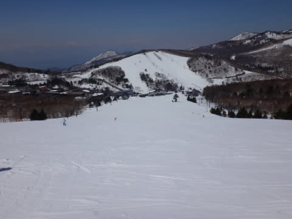
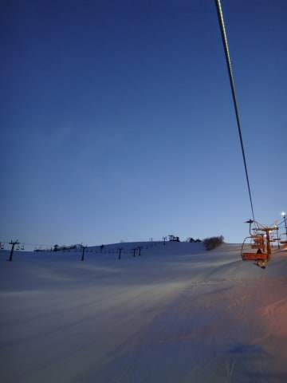

# 4月12日の志賀高原は…晴天だけど，暑くはならず．この時期としては比較的良いコンディション！

📅 投稿日時: 2014-04-12 21:33:33

えー．

もう，首都圏では桜も散ったというのに．

志賀高原は，まだまだまだまだ雪がたっぷりありますよー！！

例年よりかーーーーなり多く．

GWは何の心配もなく，コース幅いっぱい滑れそう！

ってことで．

本日ですが．

あー

朝から晴天で．

道路も志賀高原のてっぺんまで，ほぼ完全に

ドライになりました…

＃トンネル内ごく一部凍結してるので，注意！！

で．

焼額に到着すると…

なんと！

早朝は，マイナス8度まで冷え込んだようで．

この時期としてはめったにない冷え込みの

朝だったようで．

で．

通常営業開始後のゴンドラで山頂へ登ると…

うーむ．きわきわマイナスの気温．

＃久々にご登場いただく，第2ゴンドラ山頂温度計

んで．

コースは…

うほー！

シマシマっ！

（ちょっと硬いけど)

うはーはははー！

シマシマだ！

（ちょっと硬いけど)

いやー．

朝イチは人も少なく，超ハイスピード大回りバーンですな！！！

(ちょっと硬いけど)

硬いので，かなりスピードが出せます！！

…っていっても，ガチガチアイスバーンではなく，

表面がかすかに緩み始めた，エッジが利くアイスバーン

なので，かためが好きな人にはもう最高っ！！

気温が低かったので，ぴかぴか晴天だったのに

10時近くまでは，雪はそれほど緩まず．

むしろ，表面がちょうどやわらかくなって，

10時から12時くらいまでは表面がうっすらとけて

エッジが利く，ちょうどいいバーンって感じで．

硬めなので，昼までゲレンデはほとんど荒れず．

人も少なく，フラットで．

気持ち良いバーンコンディション！

4月中旬なのに，すっきり晴天で，午後まで

雪がざくざくにならないなんてっ！！

すばらしいっ！！

…たた．

さすがに午後2時ごろになってくると．

ちょっと雪が緩んできて…

ゲレンデも荒れてきましたが…

んでも．

ざぶざぶドボドボの汚れが浮いてくる雪ではなく．

やわらかいザラメって感じで．

3月下旬くらいの感じですね～．

…でも．

やわらかくなったので，コースは一気に荒れて…

そして．

3時半ごろには気温が下がり．

お約束どおり．

今度は雪が硬くなり始めました…

このまま凍っちゃってるから，ちと滑りにくい…(涙)．

でも．

まぁ．今日は．

終日晴天だったのに．

午前中はほぼフラット．

午後もざぶざぶにはならず．

恵まれた一日でしたね～！

超理想の春スキーの一日でしたよっ！！

で．

そう．

当然のごとく．

ここでは終わらない．

…お約束の，ナイターへ繰り出します．

このナイターが．

なんと．最終日の今日は無料っ！

いよ，一の瀬太っ腹！！

ちょっと固めだったけど．

エッジが食い込まない硬さでなく，

表面はちょっとやわらかかったので．

気持ちよーくハイスピード小回りを決められる，

かなりの脳内麻薬バーンでした～．

いやーー．

でも．

散々お世話になった一の瀬のナイター．

これで今シーズン終了とは…っ！（涙)

来シーズンまでナイターともお別れです（悲）．

また来シーズン～！！

PS.

Komuさん，ナイターご一緒ありがとうございました～(^^)

## 💬 コメント一覧

### 💬 コメント by (komu)
**タイトル**: ありがとうございました
**投稿日**: 2014-04-12 23:11:00

いや～ナイターもノンストップで滑り切りましたね。いろいろありがとうございました。

さすがにかなーり眠いので朝に備えて寝ます。では早一でお会いしましょう。

### 💬 コメント by (Skier_S)
**タイトル**: komuさま
**投稿日**: 2014-04-14 01:26:23

今朝はあまりゆっくりお話しできませんでしたね～．

すみません．

無事帰宅されましたでしょうか…

私は来週末＆GWはずっと志賀ですので，

またお会いしましょう～！

