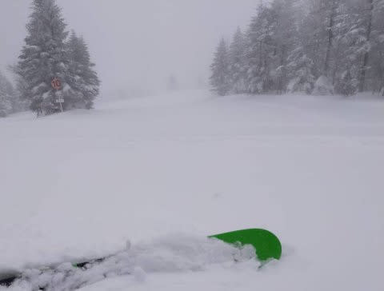

# 横手山，ヤバいと自ら宣言（涙）…早く緊急事態宣言解除になってほしい

📅 投稿日時: 2021-01-20 02:27:12

🏷️ カテゴリ: [日記](cc4b5682fb7b8b144980957a978653fb0.md)

ってなわけで．

本日，パフパフパウダーデーになる予想だった

志賀高原．

予想通り，朝は焼額の駐車場で20cm程度の

パフパフ積雪だったようです！！

…温度計がちゃんと写ってなくて見にくいけど．

気温は-12℃程度の冷え冷え！！

そして，圧雪コースもコース上は新雪が

覆い…

朝に圧雪をかけるようになった

オリンピックコースも，ブーツパフ

だったようです！

今日の志賀高原．

どこに行っても冷え冷えパウダーで，

かなり気持ちよかったみたいですね…

そして，人が少ないので，営業終了まで

そこかしこに新雪が残っていたようで…

う，うらやましい～っ！！！

で．

明日は予想通り，今日積もった雪がきれいに

圧雪された，冷え冷え晴れの最高スキー日和です！！

朝のうちは雲が多めかもしれないけど．

太陽が射すのに気温が上がらず，

雪質は最高のままという夢の一日に

なるでしょう…

で．21日も，昼間の気温はプラスまで上がって，

日当たりのいい斜面は雪は緩むものの．

晴れて穏やかなスキー日和でしょう…

…そのあとはいろいろヤバそう．

22日は0℃線はかなり北に行っちゃってるし…

降水域はギリギリ志賀にかかってる気が…

拡大すると．

ホントにギリギリ志賀に降水域が

かかるかどうか．

うーん．

微妙…

志賀高原何か降るのか？

降るとしたら，リフト営業中に降るのか？？

…今の段階では，まだ分からないです…

23日は見事な南岸低気圧で，以前から予想している

通り，気温が上がりそうだけど…

…リフト営業時間中は降らずに済むかも？

とりあえず．

また明日，この週末の詳細天気予想します～！！

ってなことで．

非常事態宣言が出て，志賀高原もガラガラに

なっており．

いろいろヤバい状態ですが…

ついに横手山．自ら

「存続の危機」

と言い出すほどになってきたようです…！（泣）

（[横手山ホームページ](https://yokoteyama2307.com/news/13280/)より）

いや…

ここまで公言するようになるって…

かなりヤバいのでは？？

おそらく，こうやって素直に書かないまでも，

危機に瀕しているスキー場は多数ありそうです（涙）

ってな感じなので．

スキー場が閉鎖される悲劇を避けるため．

コロナが落ち着いたら．

このブログ読者78億5000万人の皆さん全員，

どしどしスキー場に繰り出して，

スキー場の売り上げ回復に貢献して

ください！←読者の数，地球人口より多くないか？

…と，書いておきながら．

シーズン券を持っていて，昼ごはんも食べずに

ひたすら滑り続ける誰かは，

日々のリフト券の売り上げにも

レストランの売り上げにも貢献しないので，

スキー場に来ても来なくても一緒なのかも…

と，日々の自らの行動をちょっと反省した

Skier_Sだったのでした…←って言っておきながら，緊急事態宣言が解除されたあとは「今までの分も滑らなきゃ！！」と，絶対昼ご飯を食べずに滑り続けるはず

PS.ナイター券も買ってるし，宿代も払ってるし，

　ちゃんとスキー場に経済貢献しているはず…と信じたい

## 💬 コメント一覧

### 💬 コメント by (レインボー73)
**タイトル**: Unknown
**投稿日**: 2021-01-20 15:13:34

水曜日の志賀高原情報

なし

ごめんなさい。野沢に浮気してしまいました。

昼あがりで、龍王入口の岩本蕎麦屋に寄りましたが、10割ざる蕎麦大盛り900円。しかもgo to eat 対応ですからお勧めです。極めて美味しゅうございます。

長野県の郵便局で販売していた　go to eat ですが、今日郵便局で確かめてきました。2月08日まで、販売休止だそうです。その後のことはわかりません。10000円で12500円分食べられるので、かなりお得かと。しかも、有効期間が６月まで延びたそうです。。

### 💬 コメント by (新米パパ)
**タイトル**: Unknown
**投稿日**: 2021-01-20 19:48:39

あー、志賀高原にお金落としたい。

妙高でクルマぶっ壊してクルマ入院中。。。

仕方なくナスパニューオータニに毎週末お金落としてますが、やはり志賀高原にはかないません。

どんなに自粛しても、昼から飲んでる方々から病棟を埋めていってますから、、、

収束なんて、気温がらあがる春までは到底無理なハナシなんです。

### 💬 コメント by (ほっぽ)
**タイトル**: 1/20　志賀高原
**投稿日**: 2021-01-21 07:11:03

Ｓさん

今日が何日で何曜日なのか、感覚がマヒしている世捨て人です(^^;

昨日も志賀高原、１日天気も良く気温は低く人は少なく、滑るには最高でした。

今日も貴重な晴れの１日のようなので、悔いの残らないようしっかり滑ってきます。

明日以降週末の天気が心配です。高級雨カッパは持参していませんし(^^;

昨日の滑走レポートはblogにアップしておきました。

http://hoppo.officialblog.jp/

### 💬 コメント by (yumi)
**タイトル**: Unknown
**投稿日**: 2021-01-21 07:11:52

Ｓさぁ～ん😱😱😱

ヤバい❗️ヤバい❗️のは、横手山だけでは無いですよ😅

熊🐻ちゃん（熊の湯スキー場）も 同じく大変な事に・・・

一昨日のパウダーデーにも関わらず・・・

10人ほどだったそうです😢

（熊の湯公式YouTubeより）

### 💬 コメント by (レインボー73)
**タイトル**: Unknown
**投稿日**: 2021-01-21 11:45:09

木曜日の志賀高原情報

日本晴れ 10時の奥志賀でマイナス2℃、暖かく雪は柔らかいけど私には丁度いい。パノラマ、カラマツ、オリンピック、ＧＳ、ダウンヒル、エキスパート。どこもかしこも気持ちいい。特にエキスパをあんなに上手く滑れたのは初めてで満足感いっぱい。

さあ、目指すは高天の銀嶺。快適な白樺からダイヤモンド経由でファミリー、高天。ダイヤだけは圧雪が悪かったような。

ざる蕎麦800円、ざる蕎麦大盛1100円。今日も美味しゅうございました。陽ざしが強く、風もなく、ゲレンデは静寂。

満足しすぎて、一人が『早めにあがろうか』。

そんな予感がしてました。食べたら速攻でヤケビにもどります。志賀は人を待ってます。

### 💬 コメント by (Northfox)
**タイトル**: Unknown
**投稿日**: 2021-01-21 13:54:53

いろいろ考えましたが、今週末から志賀高原通いを再開する事にしました。

予約していた宿はキャンセルするのキャンセルしました。

後は天気。槍や雨が降って来ないのを祈ります。

### 💬 コメント by (レインボー73)
**タイトル**: Unknown
**投稿日**: 2021-01-21 17:13:58

木曜日の志賀高原情報

昼食ででかい隊員が眠りに落ちてしまい、ゆっくりの午後。パーフェクタで友人に会ったので、板を交換してヤケビへ。やっぱりヤケビは圧雪技術がすごい。今日の奥志賀エキスパートは快適だったけど、圧雪の境いめがかなりめだっていました。ヤケビは違います。そこでもちょっと楽しんで、レインボー少し前にリタイアしました。

今日もガラ空き。みんな、来て！

### 💬 コメント by (Skier_S)
**タイトル**: 昨日は死んでた
**投稿日**: 2021-01-22 02:43:35

＞ヒロさま

私への応援コメントありがとうございます．

ちょっと物議をかもしそうな表現もあったので，私だけが見れる設定としておきました…

すみません．

＞レインボー73さま

引き続きレポート＆写真ありがとうございます～！

スキー場がつぶれないよう，毎日の経済貢献よろしくお願いします！！

＞新米パパさま

やっぱり志賀がいいですよね～！！

しかし，車壊れちゃったんですか！？

大変でしたね…

かなり致命的な故障だったんでしょうか？

＞ほっぽさま

私も平日に1週間続けてスキーしたいです…（涙）

今の仕事量だと，休日にスキーをするのもきわどい感じに

なってきました（泣）

週末は雨にならなさそうですよ～！！

＞yumiさま

えええ！！熊の湯，10人！？？？

それは…ヤバいですね．

＞Northfoxさま

あ，今週末は志賀なんですね．

大丈夫です．液体は降らなさそうですよ！！

