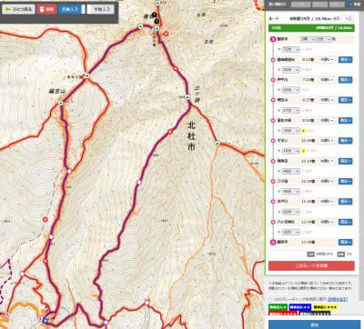
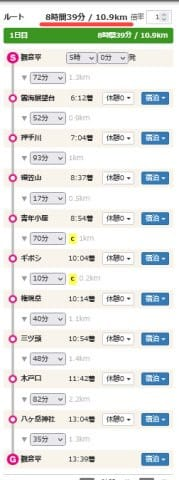
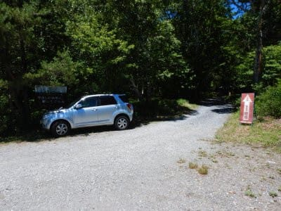
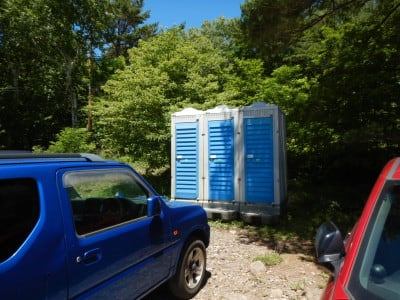
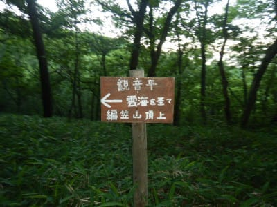
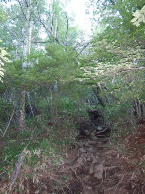
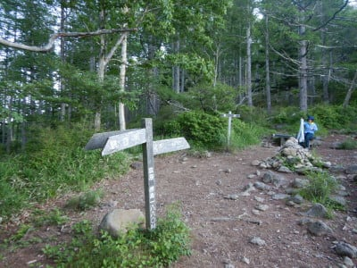
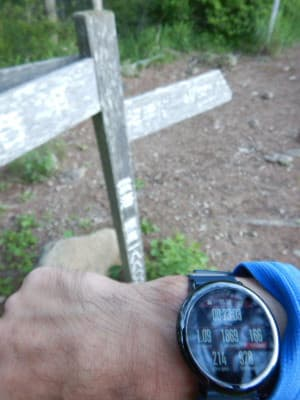
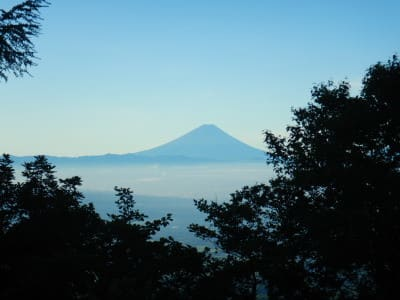

# 2021年7月，編笠山リベンジ＆権現岳へ！その1…膝痛で死んだ昨年からの復活なるか？

📅 投稿日時: 2021-08-17 01:24:13

ということで．

昨年からの山歩きでは，100％膝痛を

発症するようになってしまい．

[前回のレポート](ea2ea1081ec82f7e9317b70572fc5a44c.md)に書いたように，

昨年ラストの編笠山＆西岳登山では，

まだ中間点にも達しないうちから

かなりひどい膝の痛みに襲われ．

「これはもう，山歩きができない体に

　なっちゃったのか…」

と，かなり落胆したわけですが．

この膝の痛み，何とかならないか…

と，対策を探しまくり，

「まさか，こんな簡単なサポーターで

　あの痛みを防げるわけはないよな…」

と，[ダメもとで買ってみた膝サポーターを
テストしてみた](ed5d3fb11d9a830f9ae2b172dd8a3caf8.md)ところ．

なんだか効きそうな感じだったので．

これは，本格的登山で試してみなくては

と．

それなら…

「昨年悔しい思いをした編笠山

　にリベンジだっ！！！」

と，不純な動機（？）で本格テストの

目的地を選んだのでした…

で．

編笠山まで行って調子が悪ければそこで

引き返し．

問題なさそうなら，もっとハードな

権現岳まで足を伸ばしてみる…

というプランでルートを作成して．

権現岳まで行けば，コースタイム

8時間39分．

リハビリ（？）としてはまぁまぁの長さの

コースを選んだのでした…

果たして．前回，

下り標準コースタイム3時間20分の

ところ，5時間20分かかった

状況から，どれだけ改善するのか？？

いざ，テスト！！！

…ってなことで．

当日は朝2時過ぎに家を出て，

朝5時に観音平の駐車場に到着！

ちなみに，観音平の駐車場は2段に

なっていて．

駐車場の入り口入ってすぐの左に，

こんな分かりにくい狭い入り口を

奥に進むと，さらに駐車場があるので．

下の駐車場がいっぱいな場合は，

この先もチェックしてみてください…

ちなみに，7月の週末のこの日は，

朝5時の段階で下の駐車場はほぼいっぱい．

上の駐車場はまだガラガラでした．

昼過ぎには，駐車場に入りきらなかった

車が，数100mに渡る長い路上駐車になって

連なっていたので，早めの到着をおススメ．

あ，あと，この駐車場にトイレはありますが，

簡易トイレです…

ってなことで．

朝5時10分に，観音平駐車場を出発！

まだ日が登り切ってない登山道を

歩いていきます…

駐車場から最初のポイントの雲海まで，

標高差300m，コースタイムは72分．

いきなり標高差300を稼ぐので，

最初からそこそこの斜度の登りが

続きます…

が．

今回はサポーターのテストを兼ねているので．

膝が痛くなるようになって以降の

「痛み防止のゆっくりペース」

ではなく．

あえて

「トレーニング目的の心拍数150程度キープ」

で登ってみます…

（リアルタイムの心拍数が出るAmazfit PACE君が大活躍)

ということで．

軽く息が上がる程度のペースで登り

続けますが…

まずは最初のポイント，雲海へ到着！

ちょっと負荷をかけ気味に登ったので．

コースタイム72分のところ．

半分以下の30分で到着！

うむ．

これまでだと，間違いなく完全に100％

絶対に不可避で膝が痛くなる

ペースで登っちゃいましたね…

果たしてこんなハイペースで登って，

後で膝が痛くならないのか？？

前回のように，下りで膝の痛みに

のたうち回って死なないのか？？？

まだまだ登山は始まったばかりで，

これからどうなるか分からないけど．

この時は，雲海のポイントできれいに

富士山が見えたことに．

「今日はいい日に違いない」

と勝手に決め，今日は痛くならないと信じて，

続きの道を登り始めたのでした…
