# 焼額春営業の情報が出たけど，やっぱり2ゴンのみか（涙）…そして2021/3/23(水)の志賀高原スキー場特派員情報！

📅 投稿日時: 2021-03-24 03:38:36

🏷️ カテゴリ: [日記](cc4b5682fb7b8b144980957a978653fb0.md)

えー．

本日，日課の焼額山スキー場のWebページを

確認した時…

「うむ？春営業の案内が出てるなぁ…」

と，見てみたわけですが．

ふーむ．

春営業は2ゴン，2高のみ．

やっぱりこの春，1ゴンは営業して

くれないのか…（涙）

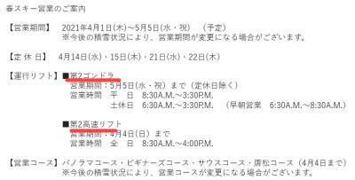

（[焼額山スキー場ホームページ](https://www.princehotels.co.jp/ski/shiga/informations/spring_skiing2021/)より）

…って．

さらに詳しく見てみると．

え？

えええ？？

4月1日から春営業扱い？

例年は，4月第1週の土日…

つまり今年なら4月4日，春休みの

土日が終わってから，春営業扱い

だった気がするけど…

ってことは，1ゴンは3月31日が営業最後ってこと？？？

来週末は1ゴン動かないってこと？？？

そして，気のせいでなければ…

第2高速も，4月4日で終わり？？

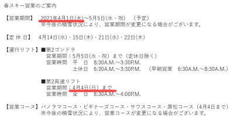

ということは．

4月5日からGWが終わるまで，

2ゴン1本だけってことですね…（涙）

まぁ，山の神も4月4日で営業終了という

嫌がらせ（？）をするので，

2高を動かしても一の瀬と行き来が

できないってのはあるかもしれないけど…

うーむ．

せっかく人工雪を打った唐松コースを

閉鎖するとは…！！

今年もまだまだいっぱい雪が残ってるのに…！！

そして．

1ゴンが春営業だったここ数シーズン．

1ゴンなら，GS，オリンピック，SGS，

ビギナーズ，パノラマーサウス…と，

5本のコースが滑れるけど．

2ゴンだとビギナーズとパノラマ・サウスの

2本のコースしか滑れないし．

奥志賀との行き来もできない…（泣）

あぁ…

春営業，1ゴンでやってほしかった…

で．

今シーズンの春営業は．

定休日が4日あるみたいです…

4月7，8はやるようですが，それ以降

2週続けて水・木は休みのようです．

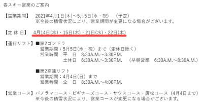

まぁ，昔は4月第1週以降は，土日祝日のみ

営業…という時期も長かったので．

4日休むだけであとは営業してくれる，

というのはまだありがたい．

…けど．

やっぱり1ゴン＆2高で春営業やって

ほしかったなぁ…（涙）

まぁ，お客さんがすごく減った今年，

春営業やってくれるだけで感謝

すべきなのか…

あぁ…

今シーズンまともに滑らないうちに，

我が住み家の1ゴンが終わってしまう

とは…！！

今シーズン．おそらくここ20年で

1ゴンに乗った回数がこれほど

少ない年も無かったなぁ…

という，私の記憶に残る年に

なりそうです…（激涙）

とりあえず．

気分を取り直して．

本日の志賀高原特派員情報を行って

みましょうか…

まず，朝は全く積雪は無く…

硬そうなシマシマの上におこみんが

鎮座していますが．

今日はなぜか，おこんみんが分裂して

双子になっています！！

いつものおこみん写真をとってくれる

特派員が，お友達の某特派員の

おこみんを一緒に並べて撮った

みたいですね…

そして，朝イチの山頂の気温は

-9℃と…かなりの冷え冷えですね！

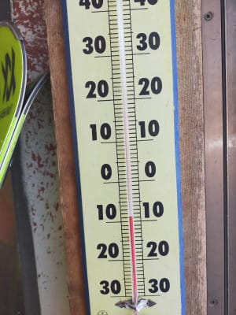

朝イチバーンは…

すっきり晴天のシマシマ！！

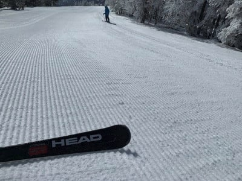

結構固めだったけど，どうしようもない

硬さではなかったようで．

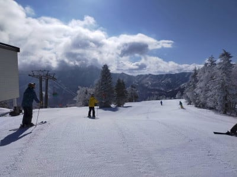

朝のうちは結構いい感じで

滑れたようです…

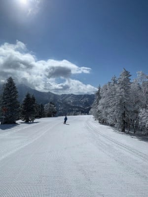

気温はそれほど上がらなかったので，

午前11時ごろまでは比較的いい

バーン状況をキープしてくれた

ようですが．

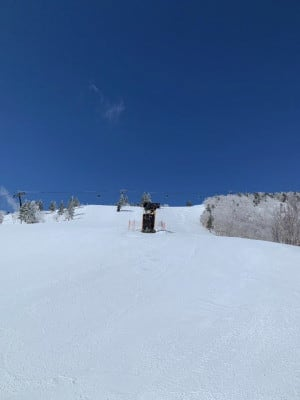

昼近くになると，強い日差しで

バーンはコロコロ＆もさもさに

なってくるところもあったものの…

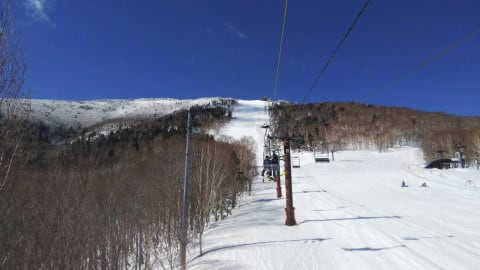

昼間の最高気温も0℃をわずかに

上回る程度で，そんなに気温が

上がらなかったので．

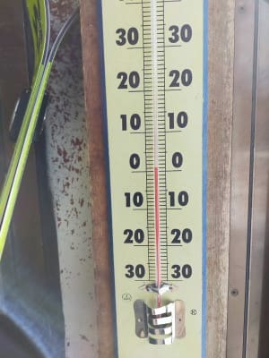

奥志賀第3や…

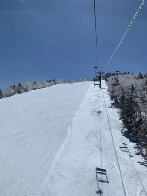

寺小屋は，昼過ぎでも

かなり固めに締まったいいバーン

状況で．

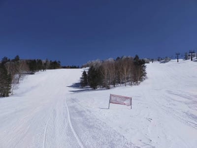

硬いながらも，日差しでザブザブより

ずっと楽しめる感じだったようです…

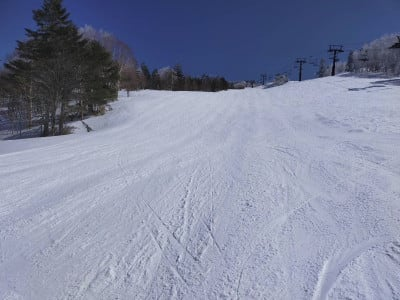

寺小屋，午後2時過ぎでも

こんな雪だったようです…！

うらやましい…

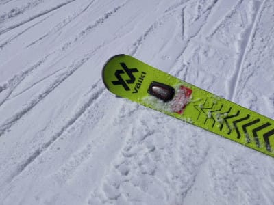

ただ，やはり先日の雨の影響で，

雪はかなり減ってしまい．

コース脇に土が出てきたところも

あったようで…（涙）

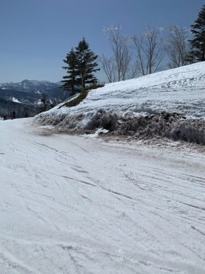

日差しの強く当たる西側バーンは，

最高気温0℃程度の本日でも，

強い日差しで雪が緩んだようです．

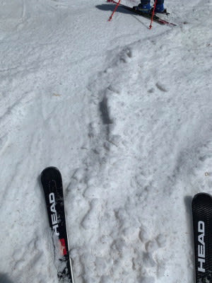

で，焼額GSコースも，ラストまで上半分は

硬めのバーンをキープしてフラットな

ままだったようですが．

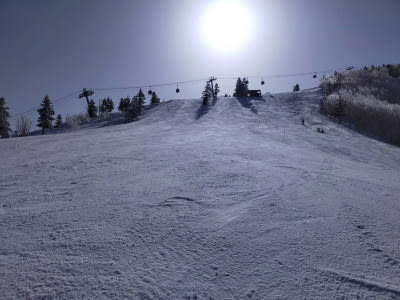

日が当たる下半分，緩んで荒れた

バーンがそのまま固まった，

かなり手ごわいバーンだったとか…

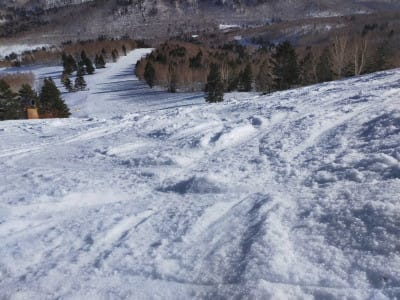

まぁ．

とはいえ．

晴天のなか，最高気温0℃までしか上がらず．

雪は全面ザブザブになることなく．

それでいて，日差しで適度に緩んで

滑りやすく，

いい感じの一日だったようですね…

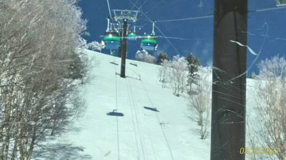

ただ．

明日以降はしばらく気温が高い日が

続きそうなので．

昼間は重い雪になる日が続きそうです…

うーむ．

この3月の850hpa気温傾向を見ると．

2月25日に平年比わずかに冷えた以外．

3月中はずっと平年比+4℃程度の

高温が続き．

さらにこれから3月末までも，

平年比最大+6℃近い高温が続いて，

平年より低くなる日が全くなさそう

という…

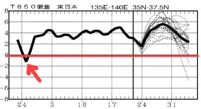

ラニーニャと言われていた今シーズン．

こんなダメダメな3月になると

だれが思っただろうか…（涙）．

3週連続で週末に雨が降ったり．

スキー場にとってはさんざんな

3月だったなぁ…（泣）

せめて4月は，

毎日マイナス10℃くらいまで冷え込んで，

週末はいつも腰パフの激軽パウダーが

滑れるといいなぁ…←うん．ありえないね．それは．

## 💬 コメント一覧

### 💬 コメント by (レインボー73)
**タイトル**: Unknown
**投稿日**: 2021-03-24 11:25:20

水曜日の志賀高原情報

朝の上林０℃　蓮池２℃。暖かい。2ゴン乗り場の日陰でも凍ってない。朝圧雪にしたのかなあ。

2ゴン上は２℃。快晴。パノラマからカラマツへ。うん、まだ意外と硬め。

１ゴンから、ＧＳ最後の壁が半分しか圧雪してないのを確認。どうせすぐにぐちゃぐちゃになるからなのか。

ＧＳは適度な勘違いパーン。いいぞ。オリンピックは日当り良好で、早くも柔らかい。

九時半のＧＳ真ん中の壁は、早くもぐちゅぐちゅ。

奥志賀ダウンヒルは熊落としから下は緩んでる。

10時00分のバスまで５分。エキスパートはゆるめだけど快適。楽々セーフ。

目的地寺子屋にはスーパー小３女子が。やっぱり上手い。硬めの寺子屋を数本滑って、ファミリー経由で高天の銀嶺へ。ファミリーはアイスバーンに削られた雪が多少乗って、まずまずかな。

### 💬 コメント by (レインボー73)
**タイトル**: Unknown
**投稿日**: 2021-03-24 14:01:15

水曜日の志賀高原情報２

昼食後は西舘短いリフトから高天、タンネ経由で一の瀬へ。パーフェクタも快適、ファミリーも快適。

場所をうまく選べは、結構楽しめるもんですね。最後のサウスはボコボコでしたが。

今日も妖怪は昼寝してました。

### 💬 コメント by (Goku)
**タイトル**: ＧＷまで雪が・・・
**投稿日**: 2021-03-24 19:48:40

ホントに残念な感じの春営業ですが、数年前には4月第1週で営業を止めてしまったこともありますから、コロナ禍の中ＧＷまでやってくれることに感謝しています。

でも、本音は最低でも１ゴン営業して欲しかった。

後はこのところの異常ともいえる暖かさでＧＷまで雪が持ってくれるかが心配です。

今年は雰囲気的に奇跡の４月は来ない気がします・・・(-_-;)

### 💬 コメント by (かず)
**タイトル**: Unknown
**投稿日**: 2021-03-24 20:19:40

3月5日以来テンションがかなり下がってしまって行ってません…今週末行きますけど最後にならないといいのですが…

### 💬 コメント by (Skier_S)
**タイトル**: ダメダメな3月
**投稿日**: 2021-03-25 03:09:43

＞レインボー73さま

ファミリーと寺小屋は良かったみたいですね．

ヤケビは早い時間で緩んじゃったみたいですが…

今週末も気温が上がり，雪はすごいことになりそうです．

＞Gokuさま

そうですよね…4月に営業してくれるだけありがたいも言えますね…

でも．やはり2ゴンより1ゴンがいいですよね…

しかし，この異常高温の3月のせいで，GWがどうなるか

心配になってきました（涙０

＞かずさま

3月に入ってから，ホントに雪が降りませんでしたね…(涙）

今週末も，コンディションは期待しない方が良さそうです…

