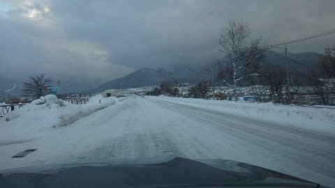
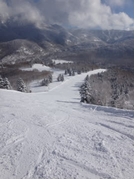

# 12月23日の志賀高原，焼額山の状況は…いやいやいや．最高っ！！

📅 投稿日時: 2014-12-24 01:44:31

🏷️ カテゴリ: [2015スキー滑走日記](c09ea645cfc085f86dfcd80f49599dd89.md)

とゆーわけで．

土日志賀滞在のあと．

月曜日に，1日仕事を挟んで．

無謀な「K奈川県から日帰り志賀」で，再び

志賀高原に舞い戻ったわけですが．

本日の志賀は…

ふははははは！

やはり．

予告通り，最高だったのだ！！

朝イチ，結構いい感じで滑る山道を登り，

焼額に向かうわけですが…

焼額に到着すると．

第1ゴンドラ前の表示は…マイナス15度！

いやー．

いやいや．

冷えてますね～！

山頂温度計も…

マイナス12度を指してます．

うん．

今日は，昨日の予想通り，冷え冷えの

雪が積もり，雪質はすごくいいよ！

…ただ．

うーん．

これも昨日の予想通りなんだけど．

朝のうちは，曇りでちと雪も舞っていて，視界が…

まぁ．

予想通りであれば，雪が降るのは朝のうちだけのはず！

とりあえず，ゲレンデに飛び込むと…

うほほほほ！

いや～！柔らかくエッジが食い込むけど，

しっかりした圧雪バーンの上に，うっすら5～10cmほど，

すごく軽いフワフワ新雪が乗っかっており．

これは…

これは，楽しいよ～っ！！！

雪は，質・量ともに，もう1月トップシーズンと同じレベル．

もう，ゲレンデ状態は，完全ハイシーズン突入ですな！

そして．

予想通り，雪が降ったのは朝のうちだけで．

10時半ごろには，うっすら日も射しはじめ…

ゲレンデが，だんだん明るくなっていきます．

ふはははは！

見よ，私の天気予想の正確さを！

そして．

12時前には，太陽が降り注ぐ，気持ちよい天気に…

でも．

昼間でも，最高気温はマイナス5度と十分冷えてたので．

ゲレンデの雪質は，一日ずっと，片栗粉のような

さらさら粉雪！

そして．

ゲレンデ脇には，おいしそうなパフパフゾーンも

残ってます（じゅるる）←よだれが垂れる音

土曜の雨で，日曜はクラストした雪で悲惨だったけど．

今日の雪は，もう完全にパフパフ！

完全にトップシーズンの雪になってます！

で．

こんな雪質が良い，天気が良い，最高のゲレンデなのに．

…人がいなくてガラガラだよ～っ！！

みんな，どうしてこんな最高のゲレンデを滑らないの？

人が少なかったので，ゲレンデはそれほど荒れることなく．

もう，好きなラインを好きなようにお望み通りの

大回りやりたい放題！

したい放題！

…オリンピックコースは，ちょっと荒れてましたけど…

でも．雪はフワフワ柔らかく．

人もいないし．

多少の荒れは，ぜんぜん問題なく滑れちゃう！

いやー．

ホントに．

やっぱりスキーは太陽のもとでやるものだな～

雪よし，天気よし，ゴンドラ待ち0．

ホントに今日は，最高っ！！！！！！！

とりあえず．

今日は．

K奈川県から日帰りで来るだけの価値は十分にあった一日だったのでした．

…って感じで．

大満足のあと，志賀高原を後にしたわけですが…

…こ，これは…

完全ブラックアイスバーンだよ…

昼間の日差しで溶けた雪が，そのまま凍ってて．

目の前の車があっという間に対向車線にスリップアウト

していったり，2台前の軽トラが横転したり…

と，エキサイティングな帰路だったのでした…

## 💬 コメント一覧

### 💬 コメント by (aqura)
**タイトル**: Unknown
**投稿日**: 2014-12-24 11:55:28

いゃ～、良いコンディションでしたねでしたねぇ。2時まで滑ってました。その後帰り支度(結構大変、雪降ろしとか)、4時にから車で降り始めましたが、予想通り、路面コンディション最悪。(かなり大きな車？降ろしているので)、びびりました。でも、滑って良かった火曜日でしたね。

### 💬 コメント by (Sora)
**タイトル**: ブラックアイスバーン
**投稿日**: 2014-12-24 12:04:31

軽トラが横転ですか。これはカーブのところで、なんでしょう？　私のは２FRのトラックですから、こういうのを聞くと志賀に二の足をふんでしまいます。

でもゆっくり走れば、アイスバーンも感知、対処できて、大丈夫なんでしょう？（ウンと言ってください・笑）

### 💬 コメント by (aqura)
**タイトル**: Unknown
**投稿日**: 2014-12-24 12:43:11

降りたの何時頃でしたか？

### 💬 コメント by (はなげ親分)
**タイトル**: うらやましい!!
**投稿日**: 2014-12-24 13:27:34

S様の読み通りの天候でしたね。

私は12月に入って3週末天候に恵まれませんでしたので、是非ともS様の予報に乗っかりたかったのでしたが、志賀高原日帰りに二の足を踏みまして（根性無しなもので・・・）エコーバレーで滑ってきました。

朝から快晴で、久しぶりに太陽の日射しを浴びながら楽しみました。やっぱりお日様は神様と思えました♪

年末年始は志賀高原に戻りますので、またお会いできたら妻も喜びますので、その時はよろしくお願いします。

### 💬 コメント by (Goku)
**タイトル**: Unknown
**投稿日**: 2014-12-24 21:32:28

昨日はお疲れ様でした♪

いや～もうサイコーの一言でしたね。

毎回あんなに良いコンディションで、ガラガラだったら最高なんですけどね（それは経営的にヤバイか）

それではまた焼額山で～！

### 💬 コメント by (Skier_S)
**タイトル**: みなさん，コメントありがとうございます
**投稿日**: 2014-12-25 01:04:21

>aquraさま

いやいや．ホントにシーズン中にそうそうない

最高のコンディションでした…

私はリフトストップまで滑りたいところ，

30分早めの3時半ごろ切り上げて帰りました…

着替えもせず車に乗り込んでただちに出発なので，

3時半発，信州中野インターは4:45ごろだったかと…

4時ごろだったら，まだこけた軽トラが路上にありませんでしたか？

>Soraさま

カーブでアウトに膨らんで，びっくりしてハンドルを切りすぎて

インに向くようにハーフスピン，そこからイン側に向かって

横滑り，雪の段差に引っ掛かり横転…

という感じでした．

4WDの軽トラだったんですけどね～

…とりあえず．

トラックだとかバスとかも走ってますし，

チェーンを付けてゆっくり走れば大丈夫かと…

＃志賀は登り口で2WD車はチェーンをつけさせられます

>はなげ親分さま

よかったですよね～この日は．

焼額は超最高でしたよっ！！

年末年始は，私は大勢で滑ってるときも

あるかと…

その場合はゆっくりお話しできないかもしれませんが，

一人で滑っているときに見かけたらまたよろしく

お願いします～

＞Gokuさま

いやーーー．

二人そろって焼額かっ飛ばしましたね～．

気持ちよかったですね～．

私も，毎回あれだけガラガラならいいなぁ…

って思うんですが．

帰りの高速もがらがらで，最高でした…

また，焼額でお会いしましょう～

