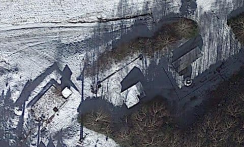

# 焼額山スキー場のパノラマコースに，人工降雪用の新しい設備工事中？12月の第2ゴンドラ営業開始が早くなるかも…？？

📅 投稿日時: 2024-10-20 16:25:37

🏷️ カテゴリ: [スキー雑談](c1f9d2cb7478308da16419928ea3945e9.md)

えー．

今日は休日なので，いつもの夜中と

ちがう時間に投稿していますが…

スキーシーズンも近づいてるので，

今日もスキーの話題です！

最初に「だい」さんからコメントがあったの

ですが．

どうやら焼額山第2ゴンドラの山頂に近い，

パノラマコースで謎の工事が行われており，

人工降雪用の工事じゃないか？

という情報が流れていたんですが…

今回改めて，ひゃくりんさんからより

詳しい情報があり，ひゃくりんさんのブログ，

「[100日記](https://teikiken.exblog.jp/)」に[工事の写真と解説が
いろいろ書かれてました～](https://teikiken.exblog.jp/33258083/)！！

とりあえず，ひゃくりんさんの「100日記」から

写真を2枚ほど引用させていただくと…

こんな感じでパノラマコースが掘り返され，

パイプと電源コードらしきものが埋め込まれ

ているようです…！

ちなみに，ここはスキーシーズンだと

こんな感の場所．

白樺ーパノラマコース分岐から，

パノラマコースの第2高速降り場を

眺める方向で，シーズンインの雪着きも

悪く，春先に比較的早く雪が解けて

しまう場所ですね…

で．

パノラマコースの上の写真からさらに

山頂に向かう方向，第2ゴンドラ降り場

に至るまで工事が続いているようで…

この写真は，スキーシーズンだとこんな

感じ．

パノラマコース，ゴンドラを降りてしばらくの

ところにある，ちょっとした落ち込みの

部分ですね…

ちなみに，地図で示すと．

最初の写真が水色矢印部分，

続く写真が赤矢印部分ですね．

パノラマコース上部全体に，こんな感じで

水パイプの埋め込みと，取り出し口の

工事が行われているようで…

どうやら，これまでの人工降雪を行っていた

水色部分に加え，赤色部分を新たに人工降雪

可能エリアにするようですね…

このあたりが人工降雪できるようになれば．

第2ゴンドラの営業開始がこれまでより

早くなる可能性が高いし，春もGWまで

ゴンドラで滑れるようになる確実性も

高まるし…

そうなれば，焼額をホームとしている私の

ような人間にとってはありがたい限り！！

…もう少し詳細な情報や写真が

ひゃくりんさんの[100日記](https://teikiken.exblog.jp/33258083/)に書かれていますので，

気になる方は見てみてください～！！

で．

これだけだと単にほかの方のBlogの紹介

記事になっちゃうので．

ちょっと志賀高原雑学（？）をば…

人工降雪には，当然大量の水が必要で．

水のプールとか，水を冷やすクーリングタワー

とか，フィルタやポンプの設備が必要に

なるわけですが…

一ノ瀬エリアのそれら設備は見つかりやすい

ので，見たことある人は多いと思います．

一ノ瀬ファミリー，ダイヤ，高天ヶ原の

3か所の設備があるのは，それぞれ矢印で

示した場所ですね．

まず，高天ヶ原スキー場．

短いトリプルリフトに乗れば，右手に

見えるこの場所です．

拡大すると…

見ての通り，丸いクーリングタワーっぽい建物と，

それを囲むような四角い平らなエリアがあって，

この地下に貯水槽があることがわかります…

周りにはポンプ小屋ッぽいものもありますね．

一ノ瀬ファミリーの貯水槽はここ．

ファミリークワッドかペアに乗ると，

パーフェクターコースから降りてくる

コースに接して設置されているのが

すぐわかる，わかりやすい設備ですね～

拡大すると．

これも地下式のコンクリート貯水槽と，

右側に円筒形のクーリングタワーが

あるのが見えて．

ポンプ小屋ッぽいのがあるのもわかります．

そして，一ノ瀬ダイヤモンドはこちら．

こいつを拡大すると…

こいつは開放型の貯水槽と，

そのすぐそばに設置されている

クーリングタワーが見えます．

右上のがポンプ小屋ですかね…

ゲレンデからは木に隠れて，

ちょっと見つけにくい場所です．

ってな感じで．

一ノ瀬エリアはどこに人工降雪

設備があるかは比較的すぐわかるの

ですが…

おそらく志賀高原で一番広い人工降雪

エリアをもっている焼額．

これだけ長いこと，ほぼ毎週のように通って

いる私でも，どこに設備があるのかをこれまで

知りませんでした…

少なくともゲレンデから見えるところなら

もう見つけているはずなのに，まだ見つけて

いないので…

一体，どこにあるんだろう？

と，Google mapの航空写真でゲレンデそばを

必死に探してみるものの．全く見つからず…

もしかすると，ゲレンデから離れたところに

あるのかも…？？

とおもって，探索範囲を広げると…

んん？？

こんなところに，不自然な池が…！！

拡大すると，こいつ．

焼額スキー場へ向かう道，第2ゴンドラを越えて

第1ゴンドラへ向かうと，その右側になる

この場所です！！

…うん．

間違いない…

天然でできた形じゃなく，人工っぽい

形の池で．

池に突き出す形で何らかの設備が作られて

いるし…

さらにこの写真の左下にあるのが，

温度調整とフィルタ・ポンプの

設備じゃないかな…？？

いやー．

このあたり，横道に時々スキー場の設備

関係ぽい人が入っていくことがあったから，

なんかあるんだろうなぁ…

と思ってたけど．

まさか，ゲレンデと反対側，道路を挟んだ

こんなところに人工降雪用の設備があったのか…！！

ちなみに．

この人工池．

一ノ瀬エリアの設備より圧倒的にでかいので…

やはり，かなり広いエリアに人工降雪する

焼額山．

それに足りる水を準備しているようですね…

ってなことで．

今シーズンから，人工降雪設備が増強されるっ

ぽい焼額山．

これまでも12月オープン時には，「あと10cm

積もればゴンドラ動かせるんだけど…」という

悔しいことが何度かあったけど．

これからはそういうことも減りそうなので．

ムチャクチャ期待してます～！！

## 💬 コメント一覧

### 💬 コメント by (だい)
**タイトル**: やはりそうでしたか
**投稿日**: 2024-10-21 22:42:49

おお、やはり人工降雪用の工事なんですね。オープンから2ゴンが動いてくれたら最高ですね～

### 💬 コメント by (Skier_S)
**タイトル**: ＞だいさま
**投稿日**: 2024-10-22 23:28:58

こちらのコメント，回答遅れました～！

どうやら人工降雪の工事らしいです…

オープンから2ゴン動けばいいですが，サウスの後は唐松に人工雪を打つと思うので，

唐松オープンと第2ゴンドラオープンのどっちを優先するか？という話になりそうですね…

### 💬 コメント by (レインボー77)
**タイトル**: Unknown
**投稿日**: 2024-10-25 16:35:37

おありがとうございますだ！

行きの登りだけで疲れきる熊へ、行かなくて済む。

### 💬 コメント by (Skier_S)
**タイトル**: ＞レインボー77さま
**投稿日**: 2024-10-26 00:38:05

これで焼額のゴンドラオープンが確実に12月上旬になってくれて，GWいっぱいまでゴンドラが滑れる

ようになるとありがたいですね~…

また今シーズンもよろしくお願いします！！

