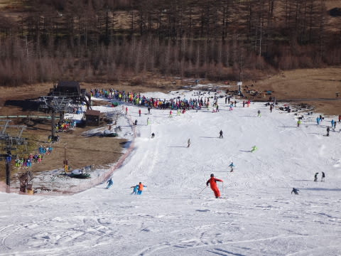
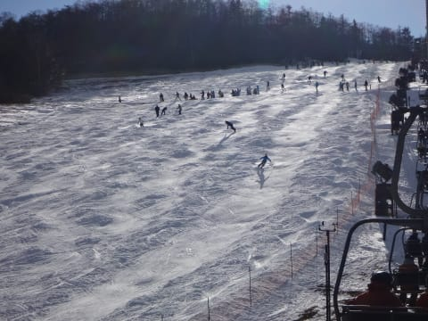

# 11月24日のアサマ2000は…結構混んだよ

📅 投稿日時: 2014-11-26 02:19:29

ということで．

昨日，速報したアサマ2000．

本日は，詳細レポートです～．

昨日のレポートの通り，まだ積雪が残っている

道路を登り，8時頃にスキー場に到着したわけですが…

いや，今日も晴天！

…なのはいいんだけど．

積雪がなかったからか．

もしかすると，一昨日より雪が減っちゃったかな～

でも．

朝イチはのバーンコンディションは…

うはははは．シマシマっ！！！

すごい大回りバーンっ！！！

…だけど．

ちょっと天然雪もうっすら混ざっていた

一昨日に比べると．

雪は表面がちょっとツルツルした感じの，

結構固く固まった感じで．

ところどころピステンで平らになり切っていない部分もあり．

ちょっと怖いところも…

んでも．

朝9時半くらいまでは，快適な超ハイスピードバーンを

楽しんでいたわけですが…

でも，なんだか．

3連休最終日というのに．

なぜか，初日よりも人が多く…

ゲレンデの人口密度も高め（涙）

そして．

リフトも，8時半の営業開始から，午前11時までは

かなり待ちも多く…

リフト前，かなり長い列がついてます（泣）．

リフト待ちは，午前11時過ぎまでは，5分超えてましたね…

んで．

11時を過ぎると．

ふむ．

出てきましたね～．

この時期のアサマ2000名物，小回り道…（涙）．

小回り道部分は，カチカチ氷でツルツル状態です…

12時前で，すでにこの状態…

ただ．

そのおかげで．

11時を過ぎると，一気にリフト待ちは減りました．

11時半には，1-2分程度．

午後はタイミングによっては，ほとんど待ちなしになったんですが…

まぁ，そのかわり．

午後のゲレンデは，こんな感じで．

うむ．

楽しくない（激泣）

…結構つらいな…

リフト降り場のすぐ下も，結構雪が

はがれてきて，ブッシュがかなり出てきました…（涙）

でも．

それでも．

結構滑ってる人がいますね～

ってことで．

午前中は結構混んで．

午後はリフト待ちは減ったものの，雪が荒れて

かなりツライ感じのアサマ2000でしたが．

まぁ，天気も良かったし．

3連休，ちゃんと予定通り滑れただけでも

まだよかったということにしておこう…

PS.今日も帰り道まで，道路は雪道でしたよ～

（夕方の帰宅時の道路状況）
