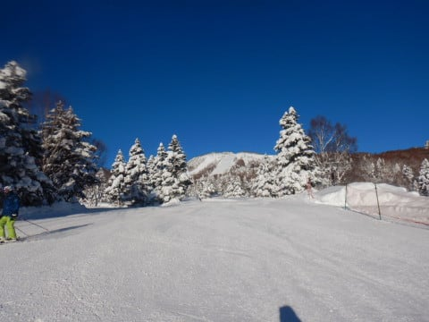
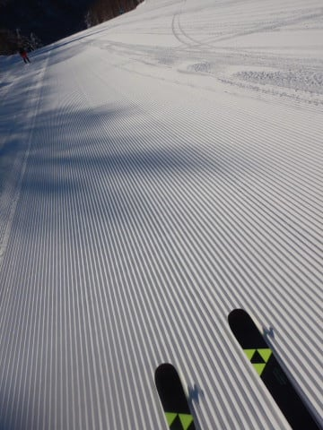
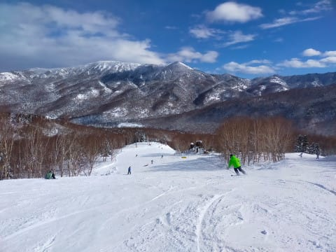
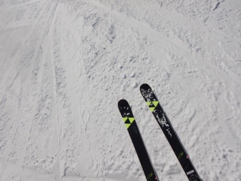
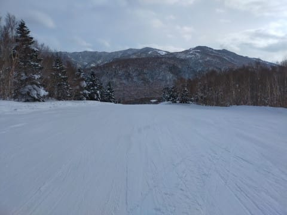
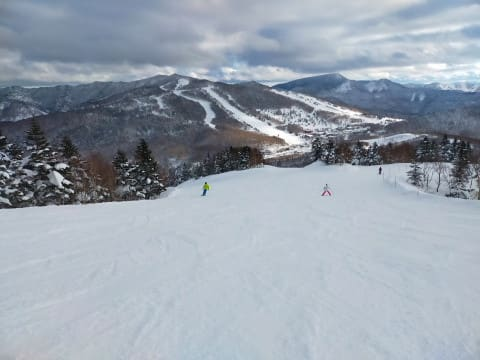

# 2022/1/16(日)の志賀高原焼額山スキー場速報レポート！…朝は最高シマシマ晴天！！午後は曇り空だったけど，ガラガラで最高の一日

📅 投稿日時: 2022-01-17 02:40:10

🏷️ カテゴリ: [2022スキー滑走日記](cc9cb73e4320f6a97af6fccc37587a61a.md)

ってなわけで．

今日も志賀高原で滑っていたわけですが．

今日もいつも通りラストまで滑ってしまい．

帰宅は深夜パターンなので，

帰宅日恒例の速報モードにて…

えー．

まず，朝は雲一つない，見事な快晴で

スタート！！

あさイチは…

うひょーーー！！

昨日より締まった感じだけど，

トップシーズン冷え冷えシマシマの，

自分が上手くなったと錯覚する

激烈勘違いバーン！

見事な極上プレミアム快楽シマシマっ！

そして，昨日に引き続き今日も

ガラガラで．

第1ゴンドラがゲートの外まで並ぶ

ことはほとんどなく．

午後は第1ゴンドラ，第2ゴンドラともに

搬器2-3台待つ程度のガラガラだったし．

当然，ゲレンデの人口密度も低め！

こんなガラガラで，さらにわりと締まった

圧雪だったので，ゲレンデは午後に

なっても荒れず…

ずっとフラットをキープ！

午後になってもGS板を履いて

アホのように大回りができる

最高雪質のかっ飛ばしバーン！

ただ，午後になると，

　午後に向かって雲が増えていき，

　夕方は曇り空になる．

と予想した通り，雲が増えていき…

ちょっと曇り空に(涙）

でも，リフトストップの時間まで，

全く荒れないフラットバーンが続き．

そしてガラガラなので，好きなラインで

大回りし放題だったという，

シアワセな一日だったのでした…

いや．

先週の3連休も良かったけど．

今週も良かった…

こんないい週末が2週連続で続くなんて，

今シーズンは恵まれてる…

また明日，詳細レポートやります～！！

## 💬 コメント一覧

### 💬 コメント by (mitsu-light)
**タイトル**: Unknown
**投稿日**: 2022-01-17 07:36:24

初めまして。

天気予測の記事を見て、昨日の（日）、日帰りで初めて焼額山スキー場へ行きました。

オススメされる理由に納得しました！

ありがとうございました。

子連れだったので第二ゴンドラ中心にグルグルでした。

### 💬 コメント by (レインボー74)
**タイトル**: Unknown
**投稿日**: 2022-01-17 13:54:00

月曜日の志賀高原情報

朝の上林-1℃　蓮池-5℃。小雪舞う朝。

まずはパノラマからカラマツヘ。圧雪の上に少しだけの雪が。気持ちよか！

オリンピックは硬雪の上に10cm位。

GSは5cm位。

雪はだんだん強くなって積もってくる。湿気も多くなってくる。

そして、忘れていた恐ろしい妖怪板つかみが！

でも、なぜか私にだけ。ワックスが私だけ赤だったのがいけなかったのか、滑り方が悪いのか？楽しくない。

エッジで切っていくのをやめて新雪の滑り方にしたら、なんとか解消。だけど仲間を待たせるはめに。

二高の獅子で五目焼きそばを食べて昼には終了。

レインボーの名前に恥じる早退が続いているので、「名前を変えろ」とのご意見が。

苦肉の答は「レインボーとは、最長２時という解釈でお願いします」、でした。

明日は14日と似た予報なので、妙高が第一候補です。

### 💬 コメント by (かず)
**タイトル**: Unknown
**投稿日**: 2022-01-17 19:14:34

日曜は野沢の試乗会でした  7年ぶり位かもしれません  他のゲレンデに行くと志賀の良さを痛感しますね…朝道の駅で顔を洗うと顔が氷ます……笑

### 💬 コメント by (Skier_S)
**タイトル**: 20日はすごい積もりそう…！
**投稿日**: 2022-01-18 00:21:18

＞mitsu-lightさま

初コメントありがとうございます～！！

日帰りで焼額にいらしてたんですね！！

私も午後は2ゴン側コースをグルグルしていたので，

もしかしたら，どこかでお会いしているかも…

焼額，気に入っていただけたなら，ぜひまたお越しください～！！

＞レインボー74さま

え？この時期に妖怪板掴みですか？？

ワックスが強烈に合ってなかったんでしょうか…？？

しかし，最近では確かにレインボーよりさらに早退が続いてますね（笑）．

＞かずさま

やっぱり志賀高原がいいでしょ～．

私はもう他のスキー場だと，すごいアウェー感を感じて落ち着かず，

やっぱり志賀に戻りたくなります…

