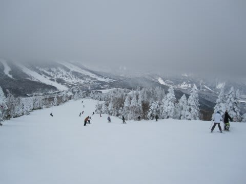

# 1月8，9日の志賀高原は…

📅 投稿日時: 2011-01-12 01:38:52

すでに速報は書きましたが．

3連休の前半2日，志賀高原に行ってきました．

で，いつもどおり朝イチ焼額を目指すのですが…

8日の朝，信州中野でチェーン規制が入ったため，そこから

数kmの渋滞が．

小布施のETC出口から出ますが，タイムロス．

志賀高原の上り道も結構混んでいて，焼額到着が8時40分…

しまった．8時からの一番ゴンドラに間に合わなかった…

天気は予想外に朝から晴れ！

朝イチの山頂の気温はマイナス12度．

ゲレンデは，昨晩から降った雪がぴかぴかに圧雪されたコンディション．

きれいな圧雪ですが，降りたての圧雪でちょいやわらかめ．

エッジがもぐって，スピードを出すと板が曲がりすぎる位に

感じる雪です．

…これは，午後になったら掘れちゃって荒れそうだなぁ…

焼額のオリンピックコースも，ピカピカ圧雪バーン．

超快適に大回りができます！

午前中は，上信越道の混雑が効いたのか，比較的すいてます．

10時半まで，焼額のゴンドラの待ちがなかったです…

しかし，10時半を過ぎるとゴンドラ待ちが発生．

それでも，最大5分待ち程度だったし，午後になると

2-3分待ちまで短縮したので，ひたすら焼額第一ゴンドラをぐるぐる．

さすがに午後2時を過ぎると，結構でこぼこした感じに

なって，快適な大回りは厳しくなってきましたが…

でも，この日は終日天気もよく，最高気温もマイナス5度程度までしか

あがらず，雪質もよく最高でした…

で，夜はナイターへ．

サンバレーナイターへ繰り出しますが，

すごい寒かった！！！

しかし，圧雪ぴかぴかバーンで人が少なく，

思いっきり飛ばしたい放題．

ナイター終了時まで，ピステン跡が残っているくらいの

人の少なさ．

これで2時間1500円なら，安い！！

と思わせる最高のコンディションで，同行者の

ショートターン板を借りて快楽の小回りを

エンジョイしてきました．

うーーーん．

ATOMIC DEMO D2 TypeS，かなり面白い性格かも…

さて．

あけて9日．

この日は朝から…

曇り．

昨晩からの積雪は全くなく，昨日の雪がきれいに圧雪された

状態です．

んで，朝の気温はマイナス12度．

気温が低く，日が射さないので，圧雪された雪は

きれいに締まってます．

固すぎず，柔らかすぎず，まさにベストのバーン

コンディション．

「自分ってこんなに上手かったっけ？？？？」

と誤解できるくらい，チャレンジングな滑りができる

バーンコンディション．

もう，今シーズンベスト．

最高．

…って思ってたら．

10時前には焼額第1，第2共にゴンドラが10分待ちに…

仕方がないので，西舘方面へ移動．

ダイヤモンドもバーンコンディションはきわめていいです．

一の瀬ファミリーの人口密度は多少高いけど，リフト待ちは無し．

ただ，メインバーン上部は，ところどころ人工降雪の硬い下地が

出ていて，ちょいと滑りにくい…

西舘は，珍しいことにフードクワッドが待ち時間ほとんど無し．

…ただし．ゲレンデの一部に浮石多数．

うーん．まだ積雪が少ないのかなぁ．

新しい板，ちょっと傷つけてしまってショック．

傷がついたらショックな板で行かないほうがいいです…

ゲレンデコンディション自体はいいんですけど．

昼食後はサンバレー方面まで遠征．

…9日の午後は，雪がちらつき始め，なんか朝より気温が

冷え込んだような…

ジャイアントは，急斜面部分に一部ブッシュが出ており，

人工降雪なのか硬い下地の上にやわらかい天然雪がまだらに

乗っており，楽しくない状態．

蓮池，丸池は…

まぁこんなもんでしょう．

丸池Aコースは，ブッシュだらけでまだ滑れる状況ではありません．

やっぱり，今年はまだ積雪が少ないのかなぁ．

あ，丸池Aコース沿いのリフト，昨シーズンまではペアでしたが，

今シーズンはトリプルリフトに掛けかわってましたね～．

サンバレーは…

最高．

3連休の中日でこんなにすいてていいの？

雪質もいいし，バーンコンディションも荒れてないし，

人は少ないしで，飛ばしたい放題．

高速リフトでぐるぐる回せるので，ここはいいゲレンデだな～，

と再確認．

夕方になってくると，降雪がすごくなってきました．

うーーん．

明日の朝イチはかなりのパウダーが楽しめそうだなぁ，

というところで時間切れ．

冷え込んで雪質はよく，

それでいて年末・年始休の後なのでそれほど混まないという，

いい状況で滑れた週末でした．

うーん．3日目も滑りたかった！！！
