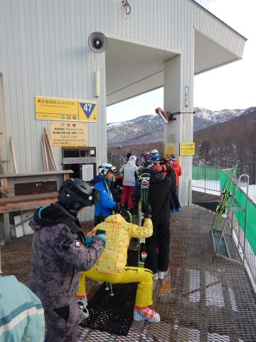
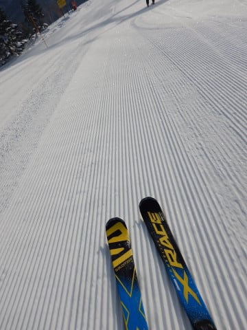
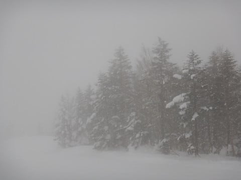

# 2月3日（土）の志賀高原は…朝は晴れて締まった最高圧雪！最高のスキー日和と思ったら，夕方ガス＆雪（涙）

📅 投稿日時: 2018-02-04 00:05:07

🏷️ カテゴリ: [2018スキー滑走日記](c11b88dc181f34079ab41db74a3587646.md)

いやー．2月ですね．

シーズンも中盤，ピークですね…

ってわけで．

いつも通りの志賀高原レポートです．

まず．

志賀高原に登ってくる道ですが…

しばらく本格的に雪が降ってないので．

道路の雪は少なめですね…

うーむ．

今シーズン，12月から正月までは雪が多かったけど，

この1月は雪が少なかったなぁ…

でも．

さすがスキー場のそばまで来ると完全雪道ですので，

ご注意を！

で．

今日は朝早めにスキー場に着いたので…

うむ．

これは，8:30営業開始の焼額ではなく．

8時営業開始の奥志賀スタートだ！！

…と，私にしては珍しく，奥志賀ゴンドラの

営業開始前に並んで…

そして，朝イチの奥志賀山頂へ！

うはーーーー！！

シマシマ！

結構締まってるけど，エッジががっちり効く，

快楽シマシマっ！！

この，官能のシマシマの，ファーストトラックを

いただきま～す！！

天気もいいし，人も少ないし…

うひょひょひょ！！！

シアワセ～っ！！

…って感じで．

ずっとこの奥志賀のシマシマを味わい続けたかったけど．

焼額に戻らないと，

焼額の人たちがザワザワするので．

焼額に戻る第4ペアの営業開始，8:30ぴったりに飛び乗って，

わがホームゲレンデへ戻ります…

そうすると．

焼額の朝イチゴンドラに乗るより早く，焼額山頂へ

着くんだな！

ふはははは！

焼額第1ゴンドラの朝イチ組の皆さん．

今日は皆さんより早く山頂に着きましたよ～！

…で．

山頂の朝イチの気温は-8℃と，

予想通りだし．

コースは，本日2度目のシマシマっ！

Yes！

シマシマアゲインっ！

…と，思いきや．

焼額は別料金のファーストトラックをやっているので．

このファーストトラック人たちにかなりシマシマを

崩された後でした…（ちょい涙）

でも．

ところどころ残っているシマシマを蹴散らしながら，

気持ちのよいバーンを自由落下！

いやー…

か・い・か・ん…

と．

快感を堪能していると．

ありゃ？

やはり午前10時ごろ．

かなりコース上の人口密度があがってきたよ…（涙）

そして．

10時半ごろの一瞬だけ，焼額第1ゴンドラ5分以上待ち（泣）

まぁ，このゴンドラ待ちはすぐ解消して．

1～2分待ちに落ち着きましたが．

うーむ．

まだゲレンデの人は多いなぁ…

コース上の雪質は，うっすらやわらかい雪が乗って

いるものの，下地はしっかり固まった圧雪って感じで

硬め．

天気は，ちょっと雲が増えてきて，

うす曇りって感じでしょうか…

で．

昼間の最高気温は-3度と．

日差しのある昼間でも，雪質は悪くならない程度．

うーむ．

素晴らしい．

昼間の気温-3℃，雲が多めだけど日が差す…

という予想．

ドンピシャじゃないですか！！

さすが私の天気予想！←ここしばらく外してたけど

そして．

昼休みタイムには．

またゲレンデがガラガラになってきましたよ～！！

みよ！

この，最高雪質でガラガラの

ゲレンデを！

…とはいえ．

昼休みタイムを過ぎた午後には．

タイミングによってはちょいと人が多いときもあり．

うーむ．

ちょっと気分を変えて．

奥志賀へ行ってみましょうか…

と，奥志賀へ行ってみると．

ありゃ？？

ゴンドラがゲート近くまで待っていて．

5分待ち…（涙）

そして，山頂に着いた午後2時過ぎには…

空がにわかに掻き曇り．

なんということだっ！！

予想になかった，ガスが…（涙）

なぜ？？

ここまでは天気予想も完全当ててたのに…

なぜさっきまで晴れていたのに，いきなり

ガスるの？？？？（激烈涙）

奥志賀のリフト側，エキスパートコースも．

下半分は見えるものの．

上半分は…

…

何がなんだか，全く見えません（涙）

どこがコースだか，わかりません（泣）．

奥志賀ゴンドラ側のダウンヒルコースも．

もうなにがなんだかわからないほど視界が悪化（泣）．

そして．

午後3時過ぎには．

これも予想には全くなかった，雪まで降り始めました…

…これは．

どうしたことだ．

予想では，こんな事態はないはずだったのだが…

…

…そうか！！

私が大変珍しく，焼額を脱出したりしたから，

それで天の神様がびっくりして，雪を降らしてしまったに

違いない！！←違うから

と，慌てて焼額へ戻ったものの…

結局この雪降りの天気のまま（涙）

神様に，浮気してごめんなさい～！

と，謝りつつ．

いつもより15分遅い，ゴンドラ4:15，リフト4:30の最後まで．

しっかり滑って帰ったのでした…

いやー．

まさか，私が焼額を脱出した瞬間に，ガス＆雪の悪天候に

なるなんて．

やっぱり焼額の呪いはすごいんだなぁ…←だから，違うから

悪天候に巻き込んでしまった皆さん，

すみません！

私が焼額を脱出したせいです！！←絶対違うから

…って感じで．

天気が悪かった午後，ちょっとフラストレーションを

貯めてしまったので．

…そういう時は．

ストレス解消のナイターだ！！！←ストレスなくても絶対ナイター滑るでしょ

今日は，一の瀬ダイヤモンドのナイターです！

…今日はちゃんと圧雪してありますね．

夕方から降った雪で，圧雪の上に

うっすら3～5cmほど積雪があり…

気分はプチ新雪！！

新雪のため，ちょっとスピードは乗りにくかったけど．

でも，ナイターストップまで，たっぷり楽しんだのでした…

今，雪は降ってません．

おそらく，これから明日の朝まで積雪は

なさそうです…

だもんで．

明日の朝は，しっかりぴかぴかの圧雪が楽しめるかな．

明日はいつも通り，焼額スタートの予定です～！！

## 💬 コメント一覧

### 💬 コメント by (はっち)
**タイトル**: 志賀にいたのですが
**投稿日**: 2018-02-04 00:30:37

お会いすることはできませんでしたね。　昨日は奥志賀まで行ったのですが、奥志賀→ヤケビが疲れるので、今日はパスしました。　今はもう自宅です。

次の機会にお会いできることを楽しみにしています。

### 💬 コメント by (しんちゃん)
**タイトル**: 明日の朝礼
**投稿日**: 2018-02-04 00:42:41

今日は横手山のキノコスープを食べに行ってました。

明日はサンデーしんちゃん。ヤケビの朝礼に参加したいと思います。

### 💬 コメント by (Goku)
**タイトル**: Unknown
**投稿日**: 2018-02-04 08:43:23

おはようございます。

インフルエンザは治りましたが、まだ潜伏期間なので本日も欠席です(T_T)

ゴンドラ内で盛り上がって、みなさんに移したら大変ですから…

しかし先週、今週と、一番のハイシーズンに滑れないとは思いものしませんでした。

わたしの分まで、楽しんでくださーい ！

### 💬 コメント by (michi)
**タイトル**: Unknown
**投稿日**: 2018-02-04 11:48:43

お疲れ様です。

朝お見かけしなかったのでどうしたのかと思いましたが奥志賀スタートでしたね。

昨日は朝から天気が良く先週の分まで楽しみました。最後のガスと雪は余計でしたが、楽しくて結局ラスゴンまで滑りました。

午前中のオリンピックコースが最高でした(^^)

KENKENさま

昨日はありがとうございました。また宜しくお願いします。

### 💬 コメント by (Skier_S)
**タイトル**: 今日も夜遅く…眠い
**投稿日**: 2018-02-05 02:40:14

＞はっちさま

あら．

いらしてたのですね…

土曜は奥志賀まで行っていたのですが…

ちょうどガスってきて見つけにくい時間でした．

日曜は滑ってなかったのですか？

また次回のチャンスに！

＞しんちゃんさま

今日はお疲れ様でした～！

あの後，夕方までオリンピックコースは

ずっと超絶に良いままでしたよ！

これでしばらく志賀の朝礼は欠席のようですが，

また次の志賀は朝イチに出席して下さい！

＞Gokuさま

体調は戻りましたか？？

朝イチゴンドラにGokuさんがいないと

にぎやかさが半分くらいになった感じです（笑）．

でも，今日の朝礼は参加者が少なかったです…

しかし．

ゲレンデコンディションは結構締まっていて，

Gokuさんが悶絶しそうないいコンディションでした．

しっかり楽しんできました～！

来週の復帰を願っています…

＞michiさま

土曜は良かったですね～！

…夕方のガスが残念でしたが．

でも，ゲレンデではほとんどお見かけ

しませんでしたね…

次の週末も焼額参加でしょうか？

では，次の朝礼の参加をお待ちしています！

