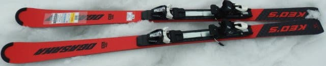
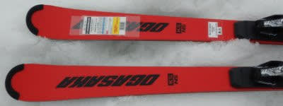
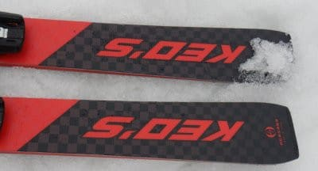
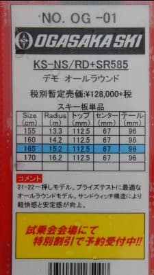
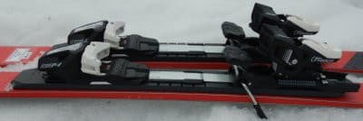
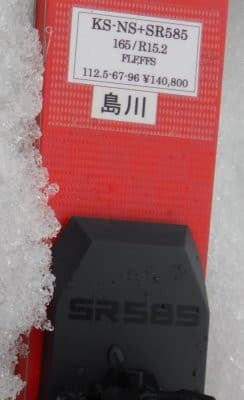

# 2022シーズンモデルのスキー板，試乗レポートその16…OGASAKA Keo's NS + SR585

📅 投稿日時: 2021-07-06 02:04:05

🏷️ カテゴリ: [スキー板試乗](c0bd8048615710cee890e403a36cc9a2b.md)

ということで．

スキー道具が次々死に絶えていく，

スキー用具劣化加速能力装備のSkier_Sです．

…ホントに，スキー道具って寿命が短い（泣）

毎シーズン買わなくて済むのは，ウェアの

ジャケットとストックぐらいですね（涙）

我が家はリビングのテレビも

10年モノのの，古い35インチの小さい

テレビだし．

冷蔵庫も10年超えてるなぁ…

私のデスクトップPCは7年以上，

PCのモニタは12年，

妻のノートPCも10年以上使ってるし．

…もしかしたら，スキー道具以前に

買わなくてはならないものがいっぱい

あるのでは…？？

と，妻の顔を見ながら思ったことは

ナイショにしておこう…

ってなことで．

本日も2022シーズンモデルのスキー板の

試乗レポート．

今日はオガサカ編です．

では，どうぞ～！

○OGASAKA Keo's NS SR585 165cm 

基礎オールラウンド．

オガサカのKEO'ｓシリーズは，

サンドイッチ構造のN○シリーズと

ツインキールのA○シリーズがありますが．

こちらは今シーズンモデルチェンジした，

N○シリーズのトップモデル，NSです．

長さ165cmですが，R=15mとミドルっぽい

ラディウスで，小回りよりもオールラウンド

性を狙った板です．

この板は，

・SR585プレート

・FM585プレート

・プレート無し

が選べますが．

今回試乗したのは，一番強いSRプレート

付きです．

滑ってみると…

お！！これはいい感じ！！

エッジグリップはしっかりしていて，

荒れたバーンでも板が流されず，

叩かれず，しっかり雪面を捉えていく！

そして．

TC-STと全く違って，

すごいオートマチックにターンができる！

板を動かしてたわみを作っていかないと

ターンしないTC-STに対して，

何もしなくてもサイドカーブに乗って

楽にターン始動していきます．

R=15m の板にしてはよく回り，

谷回りでトップがグリップしてからの

旋回力も強いです．

谷回りでオートマチックに板が捉えて

回り始め．

板が回り始めると，強いグリップと

旋回力で気持ちよく回っていきます．

すごい楽です．

165cmだと，ミドルターンから

ショートが気持ちいいかな．

緩斜面でも，レールターン的に簡単に

カービングに入って行けます．

R=15だけど，小回りまで問題なく

行けますね．

ロングもやりたいなら，170cmがいいかも．

普通にゲレンデで履くなら，

TC-STよりこっちの方がよっぽど

気持ちよくて，楽に滑れます．

楽な板だから，スピード耐性が弱かったり，

グリップが甘いのでは？と思うでしょうが．

そんなことはありません．

プレートが強めのSRプレートというのも

あるのか，かなり強めのグリップで，

スピードを出してもしっかりガッツリ

カービングで気持ちよく回っていきます．

山回りの仕上がりもいい感じ．

適度な張り・強さがあり，かなり

スピード耐性も高いです．

急斜面での安定感もいいです．

あ，OGASAKAの板なので，低速で板を

動かして行った時の操作性も，当然のごとく

極めて高いです．

どちらかというと板を動かして

行かないといけないTC-STよりも，

エッジがカッツリグリップして，

エッジの方向に走ってくれる

KS-NSの方が，荒れた斜面で

スピードを出した安定性が高く感じる…

荒れた斜面やコブ斜面でも安定感があり，

スピードを出しても気楽にエッジに乗って

キレていってくれて，

切り替えも谷回りもオートマチックで

楽です．

サイドカーブに乗って，スピードを出して

ガンガンカービングで滑りたい…

という上級レジャースキーヤーには，

私はTC-STよりKS-NS+SRプレートの方を

勧めます．絶対こっちの方が楽です．

かといってカービング特化マシンじゃ

なくて，低速ズラシでも何でもできて，

万能性は高いです．

板をしっかり動かして，技術選で点が

出せる滑りを1本や2本決めたい…ってなら

TC-STの方がいいでしょうが．

私はKEO'Sの方が好きだなぁ…

## 💬 コメント一覧

### 💬 コメント by (ikkun)
**タイトル**: Unknown
**投稿日**: 2021-07-06 14:33:11

お疲れ様です

確かにTCよりケオズが一般的？仕様かもですね？LSがそうだったように❗  使いこなせないmodelは持つには少し考えたりしますからね？

### 💬 コメント by (Skier_S)
**タイトル**: ＞ikkunさま
**投稿日**: 2021-07-07 03:17:54

ここ2年ほど，TCシリーズの手ごわさが上がっているので，

Keo'sの方が普通のゲレンデでは乗りやすいと思います．

### 💬 コメント by (ikkun)
**タイトル**: Unknown
**投稿日**: 2021-07-07 14:46:30

あ19TC所持してますが……講習にLS専門でした(笑) 最上級modelが絶対ではありませんしね  と自分の技術を棚( *´艸｀)

### 💬 コメント by (Skier_S)
**タイトル**: ＞ikkunさま
**投稿日**: 2021-07-08 07:33:30

3シーズン前までは，TCシリーズもオートマチック性があって

そこまで手ごわい感じは受けなかったんですけどね～．

今シーズンのTC-STは，競技用SL板より手ごわいかも．

