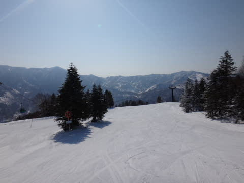
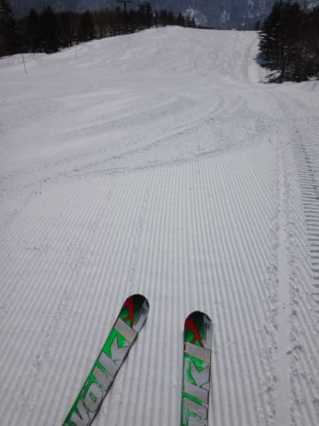
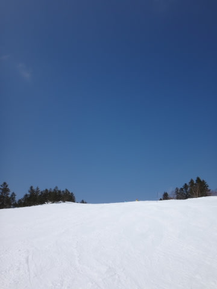
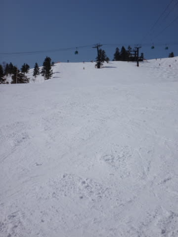

# 3月16日の志賀高原，速報モード

📅 投稿日時: 2014-03-17 01:40:20

あー．

日曜夜の，いつものパターンですが…

本日も，帰宅が遅いので．

速報モードで…

＃いつもながら，何時に帰宅してるんだ…

今朝は，快晴でスタート！

今日も最高のシマシマ大回りデーっ！

昼まで気持ち良い快晴のもと，滑れましたが…

昼間はちょっと気温が上がり，一部雪が緩んだけど．

まぁ，3月半ばの快晴の日に，この程度なら上出来っ！

…って，思っていたら．

快晴だった空に．

午後2時ごろから雲が出てきて．

あれれ？曇り始めたなぁ…

って，思ったところ．

3時ごろから，いきなりガス＆雪に…

いやー．すごい天気の激変だった…

うーむ．

最後はちょっと惜しかったけど．

昼過ぎまで，快晴の中滑れて．

いやーーー．

3月半ばでこれなら，恵まれたコンディションだなっ！！

…詳細レポートは，また明日…←これで十分詳細なレポートでは？と，突っ込んでみる

PS.本日は，いろんな方に発見された一日でした（笑）．

　マルハバさーん，ホントに私を発見しちゃいましたね（^^;

　あと，私の板にメッセージ残してくれた方！

　よく見つけましたね～…

　素敵なメッセージ，ありがとうございました～

　そのほかの方も，ありがとうございます～（感謝）

## 💬 コメント一覧

### 💬 コメント by (マルハバ)
**タイトル**: 突然の声掛け失礼いたしました
**投稿日**: 2014-03-18 09:36:18

一の瀬から奥志賀へのツアー中の

「奇跡のタイミング」でした。

次のゴンドラに乗り込む人物の姿に

Ｓさん使用マテリアルのデータが次々と合致！

最後の決め手となる部分を確認しようと

ゴンドラ降り場で待ち伏せしておりました（笑）

グループ行動中だったため早々に失礼しましたが

ゲレンデの途中で横を滑り抜けて行ったＳさんは

噂どおり、デモ選の選手を見るかのようでしたよ！

私はまた来年まで志賀はありませんが、

夏冬両モード対応ですので

これからも年間を通して楽しませていただきます。

どうぞ宜しくお願いいたします。

### 💬 コメント by (Skier_S)
**タイトル**: マルハバさま
**投稿日**: 2014-03-19 01:02:00

いやー．

そんな偶然のタイミングだったんですか！

お会いできてよかったです…

しかし，最後の決め手がグローブでしたか（笑）．

私はGWまで志賀を滑ってますし，また

合宿ではなく，プライベートで志賀にお越しください（＾＾

では，今後もご愛読のほどを～！

