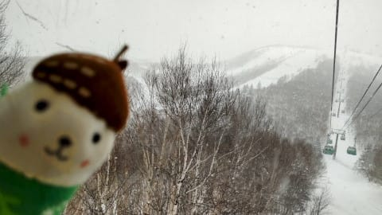
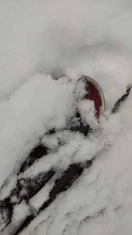
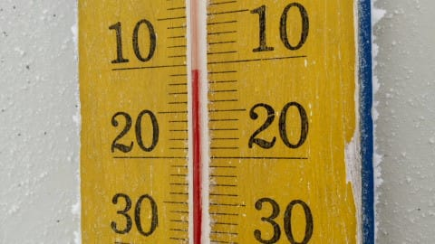
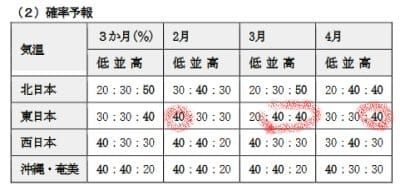
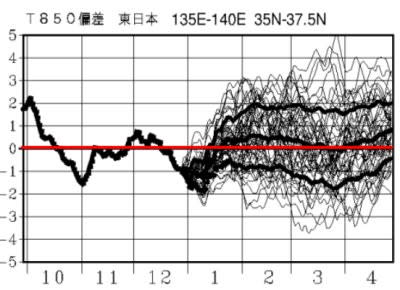
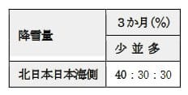
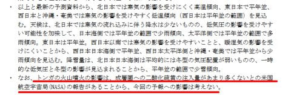

# 気象庁の3か月予報が出たよ…え？3，4月は気温が上がるの！？？

📅 投稿日時: 2022-01-28 02:15:05

マズい．

今さっき，最後の資料を書き終えて

やっと仕事を終えたところで．

そして明日は朝7時から会議なんですけど…

今日も睡眠時間が…（涙）

それでも記事を更新！

えらい！！

とりあえず，本日の志賀高原特派員からの

レポートによると．

志賀高原は朝は雪降り~曇りで．

午前中に10cmくらい積もったみたいで，

意外と降りましたね…！

朝の気温は-11℃と，-10℃を下回るという

予想は当たり！

で，午後はしばらく晴れたようで．

　朝は曇り，午前中は

　時々雪もぱらつく．

　午後は時折日が射すタイミングもあるか？

という予想，まぁまぁ当てたかな…？

で，土日の志賀高原ですが．

昨日の記事では，

どちらかというと晴れベースで

積雪はほとんど無し，

あさイチは締まったバーン

という感じの予想をしましたが…

最新の天気図を見ると，

どちらかというと曇りベース…

朝は薄っすら積雪があって，

あさイチはちょい柔らかめバーンかも？？？

という感じになってます．

また明日，修正予想をしてみます…

で．

天気と言えば．

昨日，気象庁の3か月予想が出ました～！

2，3，4月の3か月の予想なわけですが．

これを見てみると…

うむ．

2月は平年より気温が低い確率が40％と，

冷え気味の傾向になりそうですが．

3月は平年並みかちょい暖かめ，

4月は気温が平年より高くなりそうです…（涙）

あぁ…2月は別に平年並みで十分寒いから，

そんなに冷えなくていいのに…

むしろ，4月にガンガン冷えて，GWまで

しっかり滑れる方が嬉しいんですけど…

まぁ，気温の時系列図を見てみると．

2月以降の真ん中の線は，

平年気温の赤線よりわずかに上回る

程度なので…

雪不足の年みたいな，平年比2-3℃高い

日がひたすら続くってほどは暖かく

ならなさそうなので，ちょっと安心…

そして，降雪量も少なめみたいです（泣）

…1月中旬までは，「これでもか」という

積雪だったけど，これからはそこまで

積もらない感じ…

…で．

この3か月予報の詳細を，いつも通り濃密に

解説したいけど．

…今日はそこまでの長い記事を書く

パワーがないです（涙）

だもんで，今回は[FCXX93](https://www.sunny-spot.net/chart/FCXX93.pdf)の解説文を見て，

ひとつ印象に残った部分を記すだけで…

これまで長きにわたり，1か月予想や3か月予想等を

見てきましたが．

こんな内容が書かれていたのは初めて見ました…！

確かに，トンガの噴火直後，ニュースでは

気象へ与える影響が取りざたされてましたが…

気象庁は，「影響は考えない」と公式に判断した

ようですね…

それも，NASAの情報から判断したようです．

ってなことで．3か月予報に珍しい記載があったことに

「へぇ～…」と思った，Skier_Sだったのでした．

いやー．珍しいものが見れた…

## 💬 コメント一覧

### 💬 コメント by (レインボー74)
**タイトル**: Unknown
**投稿日**: 2022-01-28 13:10:34

金曜日の志賀高原情報

朝の上林-1℃　蓮池-7℃。朝からぱらぱら雪が。

パノラマ、カラマツは数センチ。気持ちいい！

GSサイドは15cm。まずまずかな。

オリンピックは10~15cm。時々ずくっとなるのが怖い。

三高は今週の平日は月金だけの営業。

ダイヤの新雪が本日のベスト。なんと滑りやすい！感動です。

寺子屋で昼食も束の間、身体は勝手にダイヤをぐるぐる。

なお、寺子屋は来週から平日閉鎖とか。

明日は太板の出番が来て欲しいなあ！

### 💬 コメント by (Skier_S)
**タイトル**: >レインボー74さま
**投稿日**: 2022-01-28 23:38:27

意外と昨晩から積もったんですね…

明日も朝はちょっと積もってそうですが，太板の出番ほどには積もらなさそうです…

