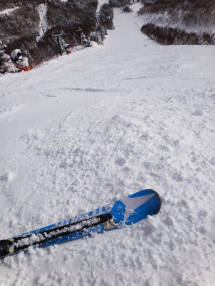

# ATOMIC BLUESTER SXを買って，気づいてしまったこと…

📅 投稿日時: 2013-01-10 00:35:57

ってことで．

何度も書いたように．

今シーズン，[ATOMIC BLUESTER SXを買った](e06ff03392356a872ae2cb4034a92b750.md)わけですが．

この板は[きわめて私との相性がよく](eed01cf53b09cd5f05827d8f9713e78e7.md)，[大変気に入っている](e03a9cb9f07bab79a5035e1b84db307a2.md)のですが．

あまりにも気に入ってしまったがために．

購入直後，この板ばっかり履いて滑ってたんですけど．

あー．

でも．やっぱり．

朝イチはロングの板を履きたいものだよなぁ…

と．

朝イチ焼額専用，'07Nordica Dobermann GS PRO 181cm出動っ！

…

…

う，うむ？？

…

…うむむっ？

こ，これは…

板チェーーーンジっ！

ロングベースオールラウンド，'10 ATOMIC D2 DEMO Type-A 174cm，出動っ！！！

…

…え？

…えええっ？？

…ま，まさか…

これも…

マズイ．

どっちの板も．

雪がやわらかいにもかかわらず．

トップとテールのグリップが．

ありえないほど弱い…

ATOMIC BLUESTER SXを履いたときみたいに，谷回りで安心して軸を倒しこみに行けない！

傾きを深くしていくと板が逃げるので，足元の限界を探りながら

恐る恐る傾きを作って滑っていることに気づいたという…．

…そう．

そうなのだ．

Nordica Dobermann GS-proと，ATOMIC D2 DEMO Type-Aの2セット．

新しい板と履き比べることで．

はっっっっっきりと．

気づいてしまったのだった…

「この板，ヘタってるよ…(激涙)」

Nordicaの板なんて，181cmのGS板なのに…

トップスピード耐性が165cmのBLUESTER SXより低いんですけどっ？？？

(続く)
