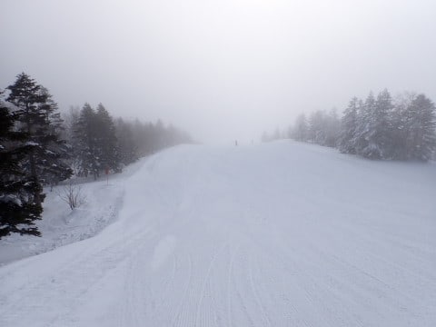
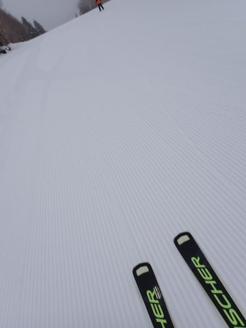
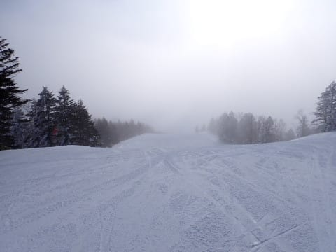
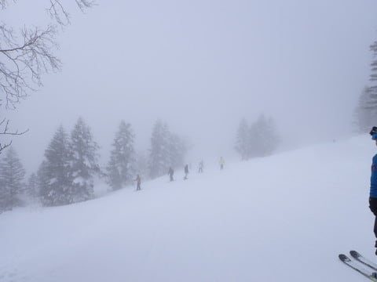
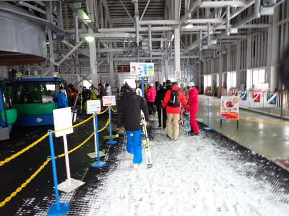
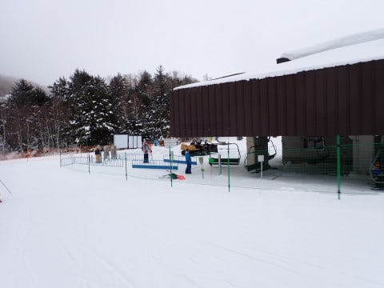
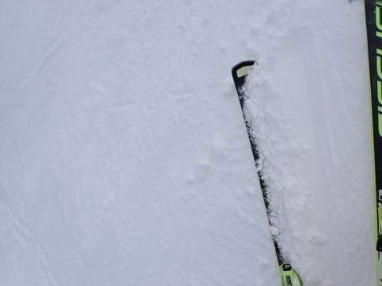
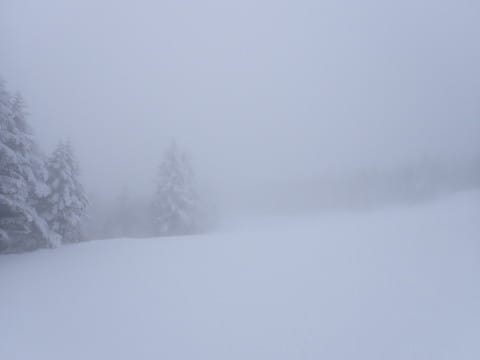
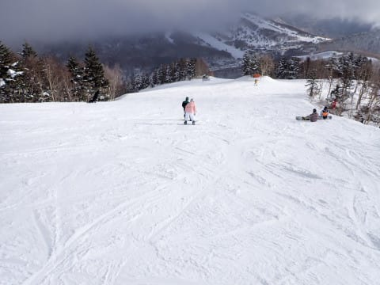
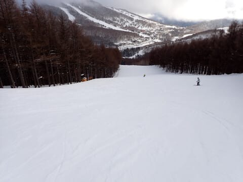

# 2024/2/4(日)の志賀高原焼額山スキー場，速報レポート！…曇り時々小雪，そして午後は晴れ間も．雪はしっかり締まった感じで午後まで荒れなかったよ！

📅 投稿日時: 2024-02-05 01:24:21

ってなことで．

今日も志賀高原で滑ってきました～！！

いつも通り，今日もしっかり営業終了

まで滑ってきたので，帰宅は深夜（涙）

で，昨日もナイター後にBlog更新だり

なんだりして，睡眠時間は6時間程度

だったので，かなり眠い…

だもんで．

本日の志賀高原，いつもの速報モードにて！

えー．

まず．

あさイチはうっすら明るい薄曇りで

スタートした本日．

昨晩からの積雪は1㎝あるかな～…

という微妙な感じでほぼ積雪がなく．

そして気温は-10℃以下に冷え込んだので…

あさイチのバーンは，かなり締まった

ガッツリエッジが食い込むシマシマバーン！

朝のうちは，薄日が差していたので

バーン状況がよく見えて，

それでいて人もそんなに多くなく，

かなり快適に滑れたけど…

朝9時半ごろからは大変残念ながら，

雲が厚くなり，空が暗くなってきて．

さらには山頂付近はガスに覆われて，

なんだか，視界がかなり悪くなっちゃい

ました（涙）

ただ，

ゴンドラもリフトも今日はそんなに混まず．

午前中はぎりぎりゲートの外まで並ぶこと

もあったけど，昼を過ぎると大体こんな

感じの待ち時間で…

リフト待ちもほぼゼロ！！

そして，雪質は．

「硬くて難しい」といっている人もいたけど．

焼額常連メンバーはみな口をそろえて

「締まっていていい感じ！！」

という雪質で．

アイスバーンみたいな硬さはないし．

雪が冷えてしっかり固まっていったような，

固まりかけの粘土というか，

チョークの表面というか…

しっかりエッジが引っかかるのに硬くて

表面が荒れない，

私にとってはかなり大好きな雪質！

これであとは視界さえよければ…

視界よ，よくなってくれ！！！（祈）

という祈りもむなしく，午後になっても

視界は悪いままで．

さらには時折雪が舞う天気となり…

このまま終わっちゃうのかな…？

と思っていたら．

ふははははは．

みごと私の祈りが通じ，

午後3時を過ぎるころには，ガスも晴れて，

時折日が差す程度に天気が回復して

来たのだ…！！

あぁ…

ゲレンデが見えるって素晴らしい…

そして，雪がしっかり締まった雪だったので．

第2高速沿いの唐松コースなんか，

午後3時を過ぎても，

営業開始1時間後くらいですか？

という感じのフラットバーン！！！

もう，あさイチの快楽が夕方までずっと

楽しめる，極楽のスキーを満喫して

きたのでした…

いやーーーーー．

今日も良かった！！！

…でも．

そろそろ積雪が欲しい．

硬い雪もいいけど，やっぱり1，2月と言えば

柔らかい新雪が積持ってもらわないと…

一応，5，6日は南岸低気圧が通過する影響で，

志賀高原もこの2日間，そこそこの雪が

積もりそうです．

ただ，志賀高原のトップシーズンとしては，

ちょいと重めの雪ですが…

でも，雪が少ない今年，風で飛ぶ軽い雪より

しっかり積もってくれる重い雪のほうが

いいかな．

明日明後日で，どっさり積もりますように…

ってなことで，また明日（夜に床で寝なければ）

詳細レポート書きます～！
