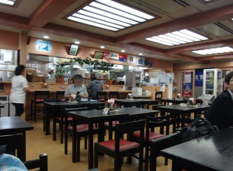

# 2015年10月　子連れで西表へダイビング旅行その１…いざ，出発！

📅 投稿日時: 2016-08-20 00:37:03

ということで．

[モアルボアルに来て，ダイビングしてます](http://yaplog.jp/egmoalboal/archive/1847)が．

本日は，モアルボアル滞在中というのに．

書きためておいた西表旅行記です．

それも，今日から本編スタートという…

…って，もうそろそろ1年前の旅行なので．

記憶があいまいなところもあれど…

思い出しながら書いてます（笑）

では，どうぞ～！

----

ということで．

今回の西表旅行．

飛行機はマイレージ特典の，

那覇乗り継ぎで予約したのですが．

朝早くの便は満席で．

特典航空券で押さえられたのは．

昼羽田発，石垣島にギリギリ最終便で到着…

という飛行機のみ…（涙）．

だもんで．

出発日は石垣島泊まりとし，

翌朝の一番の高速船で西表島入り…

という移動予定．

…この時も，いつもの旅行前のパターンで，

明け方まで仕事をしていたので←こんなのがパターン化しているところがよろしくない気が…

仮眠をとったあと，昼ごろ羽田空港に到着．

ゆったりラウンジでビールなぞ飲んで…

14:30発の那覇行に搭乗！

那覇までの飛行時間，2時間半は

熟睡していると…

あっという間に到着！

那覇到着は午後5時ごろ．

石垣行の便は，午後7時半過ぎ出発予定なので，

時間もたっぷりあることだし，

夕食でも食べますか…

そう．

那覇空港で夕食と言えば，ここ．

[空港食堂](http://www.kukousyokudou.com/)．

見た目は普通ながら．

安くてそこそこおいしい沖縄料理が食べられるので．

（ゴーヤチャンプルー）

我が家では，那覇空港で食事というと

必ずここです…

（フーチャンプルー）

そして．

石垣行出発まで再びラウンジでくつろぎ…

定番の，ビールで乾杯！

夜7時半，石垣行に搭乗です．

…さすが，こんな遅い時間の飛行機はガラガラだの～．

…ってことで．

夜9時近くに，石垣空港に到着！

いつも通り，路線バスで宿のある

市街地へ向かいますが…

うーーーむ．

石垣空港，新しくなってからというもの．

むちゃくちゃ市街地が遠くなったな～（涙）

路線バスだと，50分近くかかるのか…（泣）．

ってことで．

深夜10時過ぎ，ようやっと今晩の宿に到着です…

とりあえず．

今晩は寝るだけなので．

一泊3000円ちょいの安宿にしてみましたが…

うむ．

我が家的には，これで十分だなっ！！

ってことで．

明日の朝，西表行きの高速船はド早朝．

朝早いので，

おやすみなさい～．

## 💬 コメント一覧

### 💬 コメント by (KENKEN)
**タイトル**: モアルボアル楽しんでますか？
**投稿日**: 2016-08-20 08:29:00

自分もいつも空港食堂です（笑）。

モアルボアル旅行記お疲れさまでした。

いやーイワシは圧巻ですね。

Sさんがお薦めしていた理由が分かりました。

行ってみたいところが増えました。

座間味はちょっと(かなり)天候に恵まれなかったようですね。

我が家の西表島訪問は、なぜか今年も快晴＆べた凪の連続でした。

(浅瀬の珊瑚はちょっとやばそうでしたが）

日頃の行いは決して良くないので、妻と娘がよっぽど晴れ女なのでしょう。

自分は9月の飛び石連休でに座間味訪問予定です。

一人ですので今度ばかりは台風が来る気がしてなりません（笑）。

西表島の旅行記も楽しみにしていますが、相変わらずお仕事大変そうなので無理せず続けて下さい。

### 💬 コメント by (Skier)
**タイトル**: KENKENさま
**投稿日**: 2016-08-20 21:40:00

今回，3日間毎日1本ずつイワシポイント

行きましたが．

もう，毎日全ダイブイワシでもいいくらい，

面白かったですよ～！！

次回行くときがあれば，ぜひ！

子連れ乗船OKですので…

今日は日本人スタッフが船に残ってくれたので，

夫婦2人で潜ることができましたよ～１

また，西表＆座間味がどんなだったか

レポートしてください…

私はあと6時間後にホテルを出て帰国の

途につく予定です…

