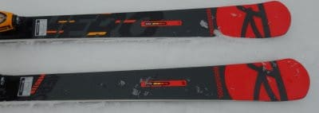

# 2022シーズンモデルのスキー板，試乗レポートその8…ROSSIGNOL HERO MASTER

📅 投稿日時: 2021-06-10 02:05:54

🏷️ カテゴリ: [スキー板試乗](c0bd8048615710cee890e403a36cc9a2b.md)

志賀高原の今シーズンの営業も終わり．

最近，雪景色の写真を載せることもめっきり

減ったこのBlogですが．

…そろそろスキー禁断症状が出つつある

皆さんに←いや，夏になるとほとんどの人はスキーのこと忘れてるから

禁断症状をさらに悪化させるシマシマ写真

をお送りしましょう！！

　

　

　

…ぐ，ぐはあっ！！（吐血）

目の毒！目の毒だ！！

しまった！！

こんな写真を載せたら，自分の禁断症状が

悪化するだけだ…！←だから，夏にスキーの禁断症状が出るのなんてあなたぐらいだってば

ぐおおおおーーー！！

スキーに行きたいっ！！！！

（白い粉中毒の禁断症状で暴れるSkier_S）

…ってことで．

自分の攻撃を自分で食らって

のたうち回っている本日も，

2022シーズンモデルのスキー板試乗レポート．

本日は，ロシニョール編ですが，

ちょっと今回は正しく評価できてない気が…

では，どうぞ～！

○ ROSSIGNOL HERO MASTER 179cm

GS競技用（非FIS）

FIS規定に則らないGS競技用板ですが．

長さによってRが違い，

183cm　R=21 

179cm　R=19

173cm　R=17

となってます．

今回試乗したのは，179cm，R=19のモデル．

プレートは，Super Virage VI Limitedと同じ

R22プレートが着いてます．

で，SPX15ビンディングとセットで

15万3000円ですか…

履いてみた感じ．

ちょっと足元に重さを感じて…

そして，これ，結構強い板ですね！

結構本格的な競技用っぽい感じで，

結構張りが強め．

試乗した日の，雨を吸った柔らかい雪では

板をたわませるのはちょっと難しい感じ．

マスターズ用の板って，結構フレックスを

優しくしているものがありますが．

この板は，サイドカーブがFIS規定を

クリアしてないだけで，かなり本格的な

競技用板っぽい感じ！

フレックスが結構強いので，

私が普段履いている大回り用の

SALOMON GS Masterに比べると，

かなりたわみを出しにくい感じで．

雨で水を吸ったザブザブした雪では，

全く足場が作れずに，この板の本領を

あんまり発揮できない感じで，

かなり縦目に落とされていきました．

ただ，サイドカーブはR=19と，GS板

としては結構きつめなので，強い板ながら

サイドカーブに沿って曲がって

きてくれます．

でも，雨が降った柔らかいゲレンデで

滑るには，サイドカーブなりに落とされて

くるだけの感じ．

多分硬めのバーンをかっ飛ばすと

本領を発揮するんだろうなぁ…

ただ，分かったことは．

ザブザブ雪のゲレンデで滑っても

あんまり楽しくない

というところなので．

普段履きのゲレンデ板として

使うにはつらいかも．

という感じで．

申し訳ないけど，この日の雪の条件では，

私は正しくこの板の性能を見極める

ことはできませんでした…

（ゴメンナサイ）

## 💬 コメント一覧

### 💬 コメント by (なんちゃってレーサー)
**タイトル**: うーむ....
**投稿日**: 2021-06-11 20:49:17

このニックネームではわからないですか.....

2年前のGWに焼額山でお会いして以来だから，しかたないですね．

わたしはSkier_Sさんを上回る異常者なので，オフトレで体を作る時間がもっと欲しいので，春から秋が長い方が嬉しいですね．

ROSSIGNOL HERO MASTERは，FIS規格の板がR35(今はR30ですけど)になってからたくさん出て来たマスターズ用のGS板のはしりで，評判が良い板ですが，あまり良い感覚が得られなかったですか....

もしかしたら，開発の時に基本にして，最もたくさんテストをした板のサイズより短いせいかも知れませんね．183cmに乗ればまた感想がちがったかも．

### 💬 コメント by (Skier_S)
**タイトル**: ＞なんちゃってレーサーさま
**投稿日**: 2021-06-12 21:43:05

いや，この板，結構よさそうな感じはしたのですが．

結構フレックスが強く，雨が降った直後のザブザブ雪では

本領を発揮できなかった感じです…

おそらく，硬めのバーンでスピードを出したら楽しそう，

という予感を受けながらも．

この日の状況では，正しく評価できなかった…

という感じです．

硬い斜面で履いてみたい…

FISCHERのGS MASTERはムチャクチャ硬い斜面で

最高で，買いたい！と

思わせるほどだったのに，柔らかい雪だとたわまなくて残念な板で．

それに近い感じかな…と思いました．

